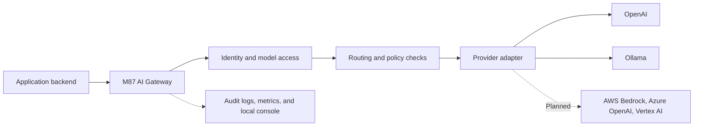

# M87 AI Gateway

A lightweight, self-hostable AI gateway for developers and small organizations.

> Early development. The goal is a public gateway framework with a tested core,
> documented extension points, and straightforward operations. Cloud provider
> coverage and a stable extension contract are planned.

## What it does

Applications call one gateway instead of managing every model provider directly.
The gateway centralizes application authentication, model access, routing, policy
checks, and operational visibility.



## Current status

Implemented foundations include validated YAML/environment configuration, bearer
app keys, requested/resolved-model allowlists, deterministic routing, OpenAI and
Ollama adapters, configured request guardrails, safe provider errors, correlated
JSON outcome events, optional private traffic capture, Prometheus metrics, a
health endpoint, per-app rate limits, opt-in response caching, bounded retries,
and an optional local control plane. The control plane provides
token analytics, inspectable opted-in LLM input/output, runtime application keys,
encrypted OpenAI credentials, log export, and a local operator console.

The native Ollama path is verified with a real local model. The MVP still needs
container and live OpenAI verification. Streaming, model discovery, embeddings,
budget enforcement, response policies, remote log exporters, and major
cloud adapters are not implemented.
See the [roadmap](docs/roadmap.md) for acceptance criteria.

For a Docker-free workstation test, run the
[Windows/WSL flow application](examples/local_test_app/README.md). It starts a
browser relay and gateway in WSL and calls Ollama running on Windows.
The launcher also enables the [local control plane](docs/control-plane.md), so the
same request can be inspected at `http://localhost:8080/admin`.

## Quickstart

Prerequisites: Docker with Compose and either a reachable Ollama service with a
model installed or an OpenAI account with model access.

1. Copy the example environment if you do not already have a local file:

   ```bash
   cp .env.example .env
   ```

2. Edit the ignored `.env` file:
   - Replace `GATEWAY_APP_API_KEY` with a private app key.
   - **Ollama:** keep the default route and set `OLLAMA_BASE_URL` to a URL
     reachable from the gateway container.
   - **OpenAI:** set `OPENAI_API_KEY` and
     `GATEWAY_DEFAULT_MODEL=openai:gpt-4.1-mini`. Use another configured and
     allowed model if needed.

3. Start and check the gateway:

   ```bash
   docker compose up --build -d
   curl --fail-with-body http://localhost:8080/health
   ```

4. Enter the same app key at the prompt and send a synthetic request:

   ```bash
   read -r -s -p "Gateway app key: " GATEWAY_APP_KEY
   printf '\n'
   curl --fail-with-body http://localhost:8080/v1/chat/completions \
     -H "Authorization: Bearer ${GATEWAY_APP_KEY}" \
     -H "Content-Type: application/json" \
     -d '{"model":"auto","messages":[{"role":"user","content":"Explain a network gateway in one sentence."}]}'
   unset GATEWAY_APP_KEY
   ```

The Compose port binds to host loopback. For host-based Ollama,
`host.docker.internal` is mapped, but the service still needs a listener reachable
from Docker. See the [full quickstart](docs/quickstart.md) and
[container runbook](docs/runbooks/container-deployment.md).

## Documentation

- [Documentation index](docs/README.md)
- [Roadmap](docs/roadmap.md) · [Design](docs/design.md) · [Architecture](docs/architecture.md)
- [Glossary](docs/glossary.md) · [Lifecycle](docs/lifecycle.md) · [Stack](docs/stack.md)
- [Configuration](docs/configuration.md) · [Security](docs/security.md) · [Observability](docs/observability.md)
- [Local control plane](docs/control-plane.md) · [Control-plane runbook](docs/runbooks/control-plane.md)
- [Windows/WSL flow lab](docs/runbooks/windows-wsl-flow-lab.md)
- [Worker-to-local inference](docs/integrations/worker-local-inference.md)
- [Operational runbooks](docs/runbooks/README.md) · [Validation status](docs/validation.md)
- [Contributing](CONTRIBUTING.md) · [Security reporting](SECURITY.md) · [Changelog](CHANGELOG.md)

## Repository structure

```text
src/m87_gateway/   Gateway core and provider adapters
tests/            Automated checks
docs/             Product and technical documentation
docs/runbooks/    Operational procedures
examples/         Integration and observability examples
deploy/           Deployment documentation and future assets
.github/          CI, dependency updates, and contribution templates
```

## Versioning and license

Versions follow Semantic Versioning. The historical `v0.1.0` tag is the initial
scaffold; the completed MVP will use a new version. Public preview and stable
release criteria are defined in the [lifecycle](docs/lifecycle.md).

Licensed under [Apache License 2.0](LICENSE).
