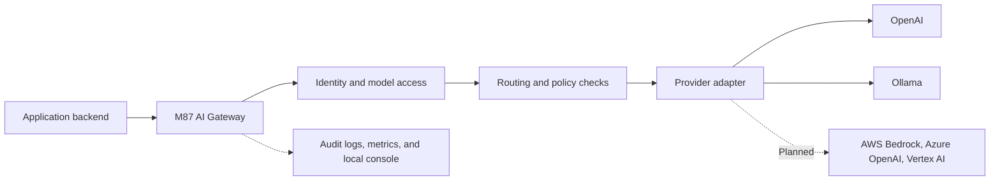

# M87 AI Gateway

A lightweight, self-hostable AI gateway for developers and small organizations.

> Early development. The goal is a public gateway framework with a tested core,
> documented extension points, and straightforward operations. Cloud provider
> coverage and a stable extension contract are planned.

## What it does

Applications call one gateway instead of managing every model provider directly.
The gateway centralizes application authentication, model access, routing, policy
checks, and operational visibility.



## Current status

Implemented foundations include validated YAML/environment configuration, bearer
app keys, requested/resolved-model allowlists, deterministic routing, OpenAI and
Ollama and generic OpenAI-compatible adapters, configured request guardrails, safe provider errors, correlated
JSON outcome events, optional private traffic capture, Prometheus metrics, a
health endpoint, per-app rate limits, opt-in response caching, bounded retries,
and an optional local control plane. The control plane provides
token analytics, inspectable opted-in LLM input/output, runtime application keys,
encrypted provider credentials, log export, and a local operator console with
persistent connection setup and model discovery. Source users can register
[additional adapters](docs/adapters.md).

The console also provides [projects, filtered usage/logs, hourly charts, and an API
tester](docs/runbooks/projects-and-usage.md). The end-product vision includes a
[managed ecosystem](docs/ecosystem.md) for optional Grafana, Prometheus, logging,
Vault, and other service containers. Service provisioning and Docker startup
remain planned; the current dashboard works without them.

The native Ollama path is verified with a real local model. The MVP still needs
live container-to-Ollama and OpenAI verification. Hosted Docker run/Compose flow
is verified with synthetic inference. Streaming, embeddings,
budget enforcement, response policies, remote log exporters, and major
cloud adapters are not implemented.
See the [roadmap](docs/roadmap.md) for acceptance criteria.

For the included setup experience, install the source package and run
`m87-gateway` (or `python -m m87_gateway`). Open the printed console URL, connect
your inference service, choose a model, and create an application key. Follow
[guided setup](docs/runbooks/guided-setup.md) for commands and the experimental
portable Windows/Linux preview build, native lifecycle commands, and encrypted
backup/restore. See [workstation distribution](docs/runbooks/workstation-distribution.md)
for artifacts and verification limits. Windows
Ollama can be reached from a WSL gateway.

After installing in `.venv`, everyday operation from this checkout is:

```bash
./start.sh                 # Background gateway; prints console URL and admin key
./status.sh                # Show the managed instance
./stop.sh                  # Graceful shutdown; preserves saved data
```

No environment activation or Docker is needed. The local gateway tries **8087**,
then **8187, 8287, 8387**, adding 100 until it finds an available port. The selected
console URL is printed. `--port` selects an exact port. These scripts support Linux/WSL and can also use an
existing `dist/m87-gateway` build. See [guided setup](docs/runbooks/guided-setup.md)
for private runtime logs and configuration options.

For a Docker-free workstation test, run the
[Windows/WSL flow application](examples/local_test_app/README.md). It starts a
browser relay and gateway in WSL and calls Ollama running on Windows.
The launcher also enables the [local control plane](docs/control-plane.md), so the
same request can be inspected at `http://localhost:8080/admin`.

To use your existing gateway from a separate application, try the
[chat sample](examples/chat_app/README.md): run `./examples/chat_app/start.sh`,
enter a gateway application key at the hidden prompt, and open the printed URL.
It selects an available port and runs in the background. Use
`./examples/chat_app/status.sh` and `./examples/chat_app/stop.sh` to manage it.
It supports conversations and shows reported tokens,
latency, and request IDs for correlation with gateway logs.

## Quickstart

With a running Docker engine, start the prebuilt development preview:

```bash
docker run -d --name m87-ai-gateway \
  -p 127.0.0.1:8087:8087 \
  --add-host=host.docker.internal:host-gateway \
  --mount source=m87-gateway-data,target=/data \
  ghcr.io/m87techlabs/m87-ai-gateway:preview
docker exec m87-ai-gateway cat /data/gateway/admin.key
```

Open **http://localhost:8087** and enter the retrieved operator key. Connect your
inference endpoint in Setup, select a model, and create an application key.
Provider credentials stay in the gateway. Enable input/output capture in Setup
and inspect Logs and usage after sending a request in the included API tester.

From a checkout, use the root Docker helpers:

```bash
./docker-start.sh           # Check prerequisites, pull image, wait for health
./docker-status.sh          # Show container health and console URL
./docker-stop.sh            # Stop; preserve keys, configuration and logs
./docker-start.sh --build   # Build locally; no private registry login required
./docker-start.sh --update  # Pull a published update; retain the Docker data volume
```

Host Python is not required. Start Docker Engine/Desktop yourself first. If 8087
is occupied, use `./docker-start.sh --port 8187`. Default resume preserves an
existing deployment's image and port. The native `start.sh`/`stop.sh` remain separate.

For Compose, download `docker-compose.yml` from a verified
[preview release](https://github.com/m87techlabs/m87-ai-gateway/releases), then run:

```bash
docker compose up -d
docker compose exec m87-ai-gateway cat /data/gateway/admin.key
```

The source build remains available with
`docker compose -f docker-compose.yml -f docker-compose.build.yml up --build -d`.
Private repository/package access currently requires authentication; public access
follows release review. Images currently target Linux amd64, including Docker
Desktop using Linux containers. Follow the [container runbook](docs/runbooks/container-deployment.md)
for registry login, host inference, ports, lifecycle, backups and upgrades.
The [quickstart](docs/quickstart.md) includes a completion request.

Portable Windows/Linux ZIPs, checksums and Compose are also retained in verified
preview releases. Build scripts and native start/stop helpers are bundled in this
repository; the ZIPs are portable apps rather than OS installers.

## Documentation

- [Documentation index](docs/README.md)
- [Roadmap](docs/roadmap.md) · [Design](docs/design.md) · [Architecture](docs/architecture.md)
- [Glossary](docs/glossary.md) · [Lifecycle](docs/lifecycle.md) · [Stack](docs/stack.md)
- [Configuration](docs/configuration.md) · [Security](docs/security.md) · [Observability](docs/observability.md)
- [Local control plane](docs/control-plane.md) · [Control-plane runbook](docs/runbooks/control-plane.md)
- [Windows/WSL flow lab](docs/runbooks/windows-wsl-flow-lab.md)
- [Worker-to-local inference](docs/integrations/worker-local-inference.md)
- [Operational runbooks](docs/runbooks/README.md) · [Validation status](docs/validation.md)
- [Contributing](CONTRIBUTING.md) · [Security reporting](SECURITY.md) · [Changelog](CHANGELOG.md)

## Repository structure

```text
src/m87_gateway/   Gateway core and provider adapters
tests/            Automated checks
docs/             Product and technical documentation
docs/runbooks/    Operational procedures
examples/         Integration and observability examples
deploy/           Deployment documentation and future assets
.github/          CI, dependency updates, and contribution templates
```

## Versioning and license

Versions follow Semantic Versioning. The historical `v0.1.0` tag is the initial
scaffold; the completed MVP will use a new version. Public preview and stable
release criteria are defined in the [lifecycle](docs/lifecycle.md).

Licensed under [Apache License 2.0](LICENSE).

## Development loop

Use `./start.sh` for routine source development, restart for Python changes and
refresh for console assets. Keep Docker packaging for a functional
release checkpoint using `./docker-start.sh --build`. Routine main pushes run
source/docs/native checks; dispatch CI with `package_container` enabled to build,
test and publish a container preview. Explicit
`--update` consumes a published image; restarting an existing container uses its
existing code. Native and Docker stores are separate; see
[development workflow](docs/runbooks/local-development.md) and
[container data migration](docs/runbooks/container-deployment.md).

Current backend direction: [architecture proposal](docs/backend-architecture.md).
