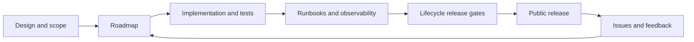

# Documentation

M87 AI Gateway is an early-stage, self-hostable gateway for developers and small
organizations. The product direction is a reusable gateway service with documented
provider and policy extension points. Public availability depends on the release
gates in the lifecycle guide.

## Start here

| Page | Purpose |
| --- | --- |
| [Quickstart](quickstart.md) | Run the current gateway and send a request |
| [Portable workstation preview](runbooks/workstation-distribution.md) | Native artifacts, lifecycle, encrypted backup/restore and upgrade checks |
| [Guided setup](runbooks/guided-setup.md) | Launch, connect a provider in the console, and create an application key |
| [Provider adapters](adapters.md) | Extend the reusable core with trusted source adapters |
| [Ecosystem vision](ecosystem.md) | Full gateway product and planned managed dashboard/logging/secrets services |
| [Gateway controls acceptance](runbooks/gateway-controls-testing.md) | Configure controls and run isolated sample failure/recovery scenarios |
| [Projects and usage](runbooks/projects-and-usage.md) | Group applications, filter dashboards/logs, and test APIs |
| [Roadmap](roadmap.md) | Milestones, acceptance criteria, and provider coverage |
| [Feature backlog](backlog.md) | Missing capabilities broken into scoped, prioritized work items |
| [Design](design.md) | Product scope, boundaries, and design decisions |
| [Backend adapters](backend-adapters.md) | Storage contracts, extension registration and reusable tests |
| [Application-key rotation](runbooks/application-key-rotation.md) | Overlap, expiry, revocation and transactional management audit |
| [Backend storage acceptance](runbooks/backend-storage-testing.md) | Migration, retention, rollback and future adapter gates |
| [Backend architecture](backend-architecture.md) | Storage/service boundaries, logs, secrets, configuration and usage direction |
| [Architecture](architecture.md) | Components and request flow |
| [Glossary](glossary.md) | Shared terminology |
| [Lifecycle](lifecycle.md) | Development, releases, compatibility, and retirement |
| [Stack](stack.md) | Technology choices and infrastructure assumptions |
| [Configuration](configuration.md) | Configuration inputs and current limitations |
| [Security](security.md) | Trust boundaries and security controls |
| [Observability](observability.md) | Current logging and planned operational signals |
| [Local control plane](control-plane.md) | Token analytics, exchange inspection, keys, and persistence |
| [Control-plane runbook](runbooks/control-plane.md) | Operate the local console and key stores |
| [Windows/WSL flow lab](runbooks/windows-wsl-flow-lab.md) | Browser-to-Windows-Ollama testing without Docker |
| [Chat sample](../examples/chat_app/README.md) | Independent conversation app using an existing gateway and an application key |
| [Worker/local inference](integrations/worker-local-inference.md) | Reference tunnel integration and acceptance checks |
| [Runbooks](runbooks/README.md) | Repeatable operational procedures |
| [Validation status](validation.md) | Verified checks, deferred checks, and on-demand Docker policy |

## Read implementation status literally

- **Implemented:** present in the source; verification limits are called out.
- **Partial:** some behavior exists, with specific gaps listed.
- **Planned:** a design target without a supported implementation.
- **Verified:** evidence identifies the version, environment, and check performed.

A configuration field or deployment placeholder does not establish support.
Compatibility claims require tests, documentation, and an operational runbook.

- [Inference API and queue testing](runbooks/inference-api-and-queueing.md): model catalog, options, bounded waiting and recovery.

- [Streaming and cancellation](runbooks/streaming-and-cancellation.md): SSE, sample Stop, partial capture, cleanup and live validation.

- [Configuration recovery and storage health](runbooks/configuration-recovery.md): settings history/restore, management audit and safe storage verification.

- [Logging showcase](runbooks/logging-showcase.md): sample request links, capture/search/retention/export and recording health.

- [Logging development plan](logging-plan.md): current priority, remaining development and exporter/ecosystem stages.
