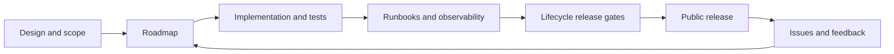

# Documentation

M87 AI Gateway is an early-stage, self-hostable gateway for developers and small
organizations. The product direction is a reusable gateway service with documented
provider and policy extension points. Public availability depends on the release
gates in the lifecycle guide.

## Start here

| Page | Purpose |
| --- | --- |
| [Quickstart](quickstart.md) | Run the current gateway and send a request |
| [Roadmap](roadmap.md) | Milestones, acceptance criteria, and provider coverage |
| [Design](design.md) | Product scope, boundaries, and design decisions |
| [Architecture](architecture.md) | Components and request flow |
| [Glossary](glossary.md) | Shared terminology |
| [Lifecycle](lifecycle.md) | Development, releases, compatibility, and retirement |
| [Stack](stack.md) | Technology choices and infrastructure assumptions |
| [Configuration](configuration.md) | Configuration inputs and current limitations |
| [Security](security.md) | Trust boundaries and security controls |
| [Observability](observability.md) | Current logging and planned operational signals |
| [Local control plane](control-plane.md) | Token analytics, exchange inspection, keys, and persistence |
| [Control-plane runbook](runbooks/control-plane.md) | Operate the local console and key stores |
| [Windows/WSL flow lab](runbooks/windows-wsl-flow-lab.md) | Browser-to-Windows-Ollama testing without Docker |
| [Worker/local inference](integrations/worker-local-inference.md) | Reference tunnel integration and acceptance checks |
| [Runbooks](runbooks/README.md) | Repeatable operational procedures |
| [Validation status](validation.md) | Verified checks, deferred checks, and on-demand Docker policy |

## Read implementation status literally

- **Implemented:** present in the source; verification limits are called out.
- **Partial:** some behavior exists, with specific gaps listed.
- **Planned:** a design target without a supported implementation.
- **Verified:** evidence identifies the version, environment, and check performed.

A configuration field or deployment placeholder does not establish support.
Compatibility claims require tests, documentation, and an operational runbook.

