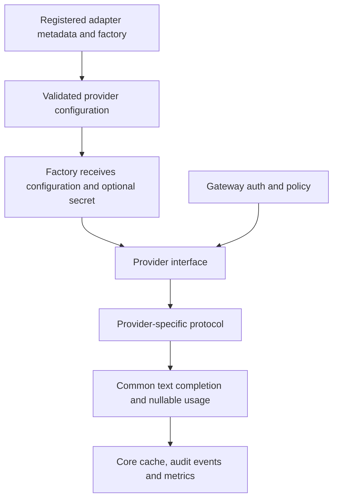

# Provider adapter framework

The adapter interface is an experimental source extension point. Gateway
authentication, model allowlists, guardrails, rate limits, retries, caching, logs,
and metrics wrap the adapter. Extensions do not need to change those components.

## Current contract

Adapters accept `ProviderConfig` and an optional decrypted gateway-stored key.
They implement `async chat_completions(payload, model)` returning the supported
non-streaming text completion shape. Preserve provider-reported usage; use null
when unavailable. Raise safe `GatewayError` messages without upstream response
bodies or secrets. The common HTTP base maps timeouts, 429, transient errors,
rejections, and malformed payloads. Only transient error codes are retried.

`async list_models()` is optional. Its default reports that discovery is unavailable;
users can enter models manually. Built-in discovery uses Ollama `/api/tags` and
compatible `/models` APIs. The UI reports the text/non-streaming contract and model
discovery support. Streaming, tools, embeddings, multimodal input, Anthropic,
Bedrock, Azure-specific authentication, and Vertex-specific authentication remain
unsupported. A compatible wire format does not establish live provider compatibility.

## Minimal source extension

Register a trusted adapter **before** loading configuration or starting the app.
For another service that implements the current compatible text contract:

```python
from m87_gateway.adapters import Adapter, register_adapter
from m87_gateway.providers.openai import OpenAICompatibleProvider
from m87_gateway.config import load_settings
from m87_gateway.main import create_app

class ExampleProvider(OpenAICompatibleProvider):
    prefix = "example"

register_adapter(Adapter(
    name="example",
    label="Example inference",
    factory=lambda config, key: ExampleProvider(config, api_key=key),
    model_discovery=True,
))
app = create_app(load_settings("config.yaml"))
```

Configure it under `providers.custom`; the model prefix must match its registry name:

```yaml
providers:
  custom:
    example:
      enabled: true
      base_url: http://localhost:9000/v1
      api_key_env: EXAMPLE_PROVIDER_KEY
routing:
  default_model: example:small
apps:
  - app_id: sample-app
    api_key: replace-with-a-private-application-key
    allowed_models: [auto, "example:small"]
```

The same registered adapter appears in Setup when the control plane is enabled.
Persisted custom connections require registration again on restart. Adapter names
are unique; registrations cannot replace built-ins. Code extensions are trusted
server code. The UI cannot import modules or install arbitrary plugins. Extensions
must be included when rebuilding a standalone artifact; runtime plugin loading is
not implemented.

## Verification required for an adapter

Use HTTPX MockTransport for repeatable contract tests. Cover message/options
translation, nullable usage, credential isolation, URL and model normalization,
timeouts, rate limits, permanent failures, malformed responses, and optional
discovery. Then exercise the shared gateway path with an app allowlist and inspect
the correlated event. `tests/test_setup.py` demonstrates compatible HTTP and full
setup/chat/store checks. Perform a synthetic live smoke test before advertising
support for a particular service. Do not put credentials in fixtures or recordings.


