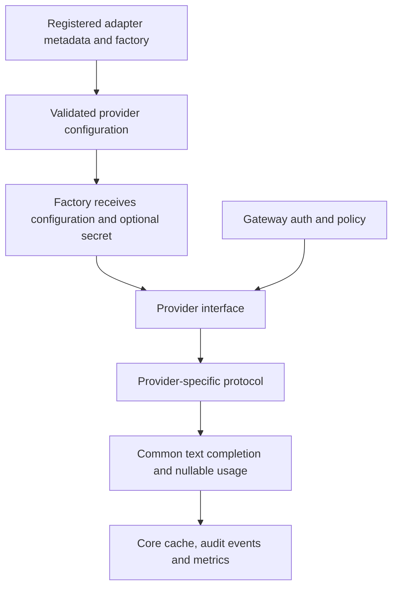

# Provider adapter framework

The adapter interface is an experimental source extension point. Gateway
authentication, model allowlists, guardrails, rate limits, retries, caching, logs,
and metrics wrap the adapter. Extensions do not need to change those components.

## Current contract

Adapters accept `ProviderConfig` and an optional decrypted gateway-stored key.
They implement `async chat_completions(payload, model)` returning the supported
non-streaming text completion shape. Preserve provider-reported usage; use null
when unavailable. Raise safe `GatewayError` messages without upstream response
bodies or secrets. The common HTTP base maps timeouts, 429, transient errors,
rejections, and malformed payloads. Only transient error codes are retried.

`async list_models()` is optional. Its default reports that discovery is unavailable;
users can enter models manually. Built-in discovery uses Ollama `/api/tags` and
compatible `/models` APIs. The setup API reports text/streaming capabilities and model
discovery support. Tools, embeddings, multimodal input, Anthropic,
Bedrock, Azure-specific authentication, and Vertex-specific authentication remain
unsupported. A compatible wire format does not establish live provider compatibility.

## Minimal source extension

Register a trusted adapter **before** loading configuration or starting the app.
For another service that implements the current compatible text contract:

```python
from m87_gateway.adapters import Adapter, register_adapter
from m87_gateway.providers.openai import OpenAICompatibleProvider
from m87_gateway.config import load_settings
from m87_gateway.main import create_app

class ExampleProvider(OpenAICompatibleProvider):
    prefix = "example"

register_adapter(Adapter(
    name="example",
    label="Example inference",
    factory=lambda config, key: ExampleProvider(config, api_key=key),
    model_discovery=True,
))
app = create_app(load_settings("config.yaml"))
```

Configure it under `providers.custom`; the model prefix must match its registry name:

```yaml
providers:
  custom:
    example:
      enabled: true
      base_url: http://localhost:9000/v1
      api_key_env: EXAMPLE_PROVIDER_KEY
routing:
  default_model: example:small
apps:
  - app_id: sample-app
    api_key: replace-with-a-private-application-key
    allowed_models: [auto, "example:small"]
```

The same registered adapter appears in Setup when the control plane is enabled.
Persisted custom connections require registration again on restart. Adapter names
are unique; registrations cannot replace built-ins. Code extensions are trusted
server code. The UI cannot import modules or install arbitrary plugins. Extensions
must be included when rebuilding a standalone artifact; runtime plugin loading is
not implemented.

## Verification required for an adapter

Use HTTPX MockTransport for repeatable contract tests. Cover message/options
translation, nullable usage, credential isolation, URL and model normalization,
timeouts, rate limits, permanent failures, malformed responses, and optional
discovery. Then exercise the shared gateway path with an app allowlist and inspect
the correlated event. `tests/test_setup.py` demonstrates compatible HTTP and full
setup/chat/store checks. Perform a synthetic live smoke test before advertising
support for a particular service. Do not put credentials in fixtures or recordings.




## Capability declarations

Each registered Adapter carries a frozen Capabilities declaration. Setup displays
its matrix. Built-in Ollama, OpenAI and generic compatible adapters support text
chat, streaming, seed and text/JSON object/schema formats. Tools, embeddings,
images and multiple choices remain unavailable. Ollama lacks the penalty
and strict-schema mappings; compatible adapters declare them. Model/server support
may be narrower and must be verified separately.

Custom adapters default to temperature/max_tokens and text format. Add mappings
and tests before declaring more support:

```python
from m87_gateway.adapters import Capabilities

capabilities = Capabilities(
    generation_parameters=frozenset({"temperature", "max_tokens", "top_p"}),
    response_formats=frozenset({"text"}),
)
# Pass capabilities=capabilities to your trusted Adapter registration.
```

The chat route checks declared generation options and formats before constructing
the provider. Request schema restrictions still reject tools, images and multiple choices;
a flag alone does not implement a protocol.
Tests in tests/test_inference_backlog.py exercise each built-in declaration and
provider mapping, including unsupported paths. Reuse these cases for extensions.
Mappings follow the [OpenAI chat reference](https://developers.openai.com/api/reference/resources/chat/subresources/completions/methods/create),
[Ollama chat reference](https://docs.ollama.com/api/chat) and
[Ollama parameter reference](https://docs.ollama.com/modelfile).


## Streaming extension contract

Implement an async generator stream_chat_completions(payload, model) only when
declaring Capabilities(streaming=True). Yield normalized chat.completion.chunk
dictionaries with stable id/created, one index-0 text/refusal delta, finish_reason,
and optional final empty-choices usage. The gateway checks these fields and maps
the model to the authorized route. Use context-managed HTTP streams, safe
GatewayError values and finally cleanup; cancellation must close the upstream
connection. Never catch/suppress task cancellation or leave background generation
running in the adapter. Existing third-party adapters default to streaming false.

Streams bypass gateway cache/retry; admission and logs wrap the iterator through
its complete lifecycle. Reuse tests/test_streaming.py and the real disconnect
cases for new adapters. See the [streaming runbook](runbooks/streaming-and-cancellation.md).
Wire contracts follow the [OpenAI streaming reference](https://developers.openai.com/api/reference/resources/chat/subresources/completions/streaming-events)
and [Ollama chat reference](https://docs.ollama.com/api/chat). Closing HTTP is the
adapter guarantee; generation cancellation/billing must be checked with each server.
