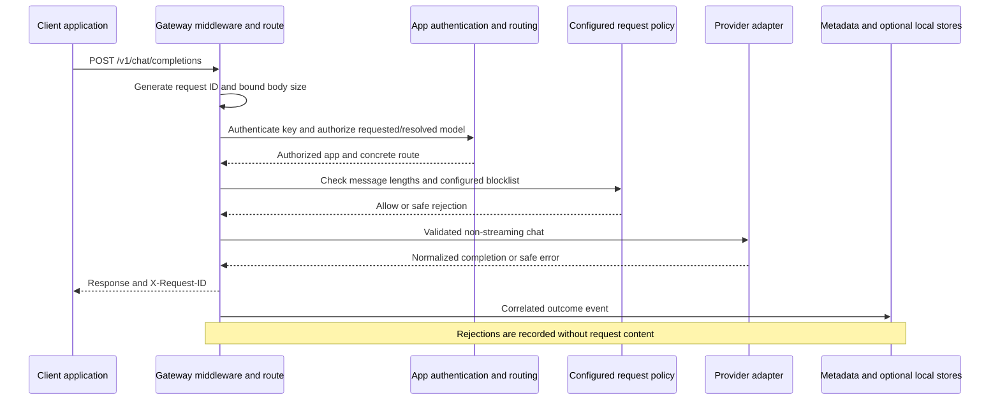

# Architecture

## Current request flow

Middleware also records auth, validation, body-size, and unexpected failures.
The gateway can enable bounded message/completion capture for all authorized apps
in a dedicated local store. Metadata stdout and metrics never contain that text.

## Components

| Component | Source | Responsibility |
| --- | --- | --- |
| Application | `src/m87_gateway/main.py` | Lifespan validation, safe error handlers, health, metrics |
| API | `src/m87_gateway/api/` | Strict text-chat contract and request orchestration |
| Configuration | `src/m87_gateway/config/` | YAML/environment loading and validation |
| Authentication/routing | `auth/`, `routing/` under the package | App key lookup, deterministic auto rules, final-target authorization |
| Guardrails | `src/m87_gateway/guardrails/` | Configured blocklist and message bounds |
| Providers | `src/m87_gateway/providers/` | Configured OpenAI/Ollama calls and safe upstream failures |
| Traffic | `src/m87_gateway/logging/` | Body limits, request IDs, outcome records, redaction, local sink |
| Metrics | `src/m87_gateway/metrics/` | Isolated per-process registry with bounded labels |
| Local control plane | `src/m87_gateway/control/` | SQLite events, runtime keys, admin API, and packaged console |

## Process and failure boundaries

Settings and the metrics registry belong to the application lifespan. Each
provider request currently creates an HTTP client. The traffic sink is local,
rotates under a thread lock, and writes through the thread pool after response
delivery. Use one process per traffic file.

The optional SQLite control plane belongs to one instance and is not a shared
coordination or durable-delivery system. The gateway has no shared limiter or
durable event queue.
If the host is down, it cannot observe requests that fail at the Worker or tunnel.
See [observability](observability.md) for delivery limits and
[Worker/local inference](integrations/worker-local-inference.md) for deployment boundaries.

See [design](design.md) for planned extensions and [stack](stack.md) for technologies.
