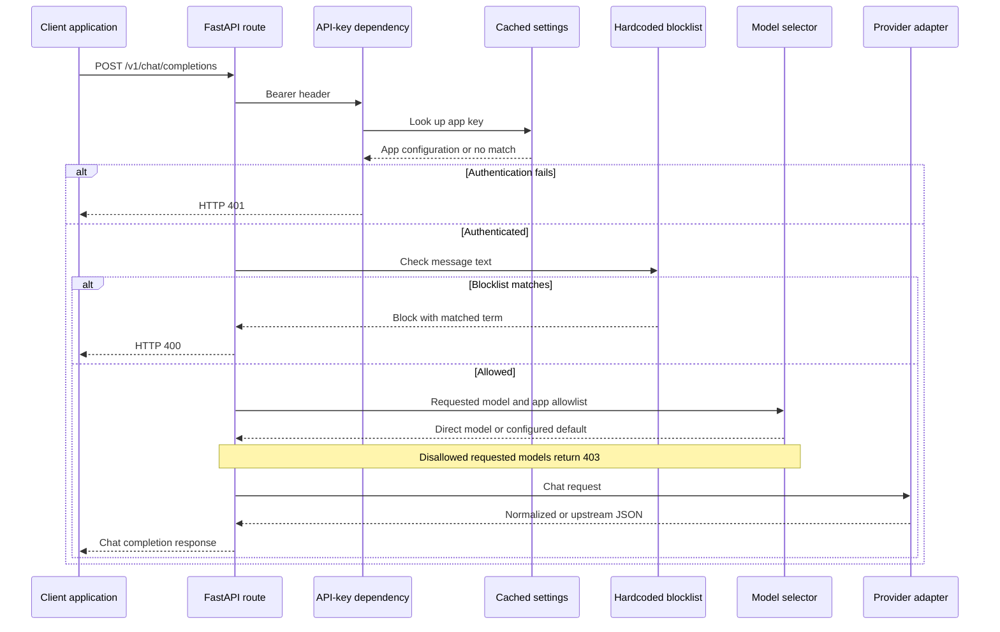

# Architecture

## Current request flow

The service uses FastAPI, a cached Pydantic configuration model, and HTTPX provider
adapters. The following sequence reflects the current source, including limitations.

Provider exceptions are not normalized today. The route logs selected events,
but there is no complete outcome audit trail, request ID middleware, or metrics
endpoint. The current `auto` path does not check the resolved model against the
allowlist. The target flow in [design](design.md) addresses these gaps.

## Component boundaries

| Component | Source | Responsibility |
| --- | --- | --- |
| Application | `src/m87_gateway/main.py` | App construction and health route |
| API | `src/m87_gateway/api/` | Chat request/response schemas and orchestration |
| Configuration | `src/m87_gateway/config/` | YAML loading, environment overrides, cached settings |
| Authentication | `src/m87_gateway/auth/` | App bearer-key lookup |
| Routing | `src/m87_gateway/routing/` | Requested-model allowlist and default resolution |
| Guardrails | `src/m87_gateway/guardrails/` | Hardcoded request blocklist |
| Providers | `src/m87_gateway/providers/` | Adapter interface, factory, OpenAI/Ollama HTTP calls |
| Audit | `src/m87_gateway/logging/` | Selected events with top-level key redaction |
| Metrics | `src/m87_gateway/metrics/` | Placeholder |

## Process and deployment boundaries

Configuration is cached in memory. Each provider call currently creates its own
HTTP client. There is no database, background worker, shared limiter, or control
plane. The Docker image runs one Uvicorn process.

See [stack](stack.md) for technologies, [design](design.md) for the intended
architecture, and [runbooks](runbooks/README.md) for operational procedures.
