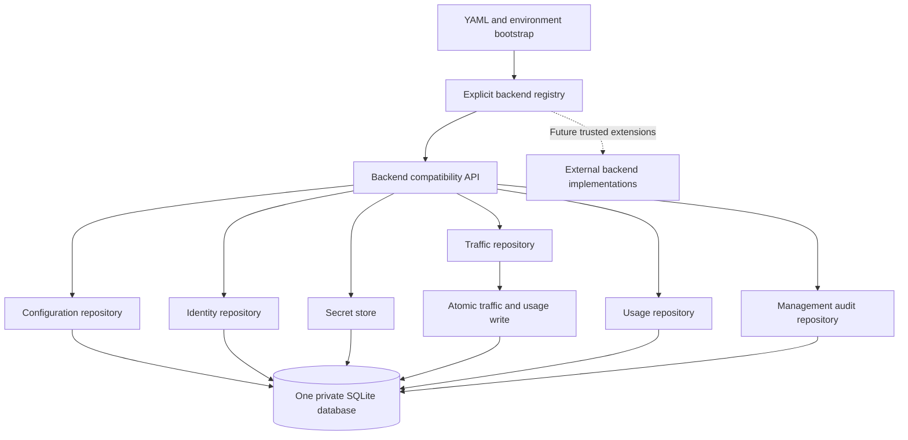

# Backend adapters

## Available implementation

The bundled backend is `sqlite`. One private database stores configuration,
projects/application-key digests, encrypted provider keys, traffic and independent
usage records. Six repositories implement the contracts in
`src/m87_gateway/control/repositories/contracts.py`. `LocalControlStore` preserves
existing callers through `BackendFacade`.



Configure the embedded backend before startup:

```yaml
control_plane:
  enabled: true
  backend_adapter: sqlite
  database_path: var/lib/m87-gateway/control.db
  master_key_path: var/lib/m87-gateway/master.key
  retention_days: 30
  usage_retention_days: 365
  management_audit_retention_days: 365
```

Set a strong operator key through the existing private bootstrap or
`GATEWAY_ADMIN_API_KEY`. `GATEWAY_BACKEND_ADAPTER` and
`GATEWAY_USAGE_RETENTION_DAYS` override these YAML values. Backend selection and
usage retention are bootstrap settings, outside the current Controls form.
YAML applies to the YAML-configured server entry point. The native/source local
launcher uses its private data directory and accepts these environment
variables and `GATEWAY_MANAGEMENT_AUDIT_RETENTION_DAYS`; it does not load the YAML file. No database server, container engine or
additional storage package is required.

Unknown adapter identifiers fail before creating a SQLite database or master key. The local launcher may already
have prepared its operator key and lifecycle files.
Configuration accepts identifiers, never Python module paths or executable code.
Only SQLite is bundled; PostgreSQL, Vault and remote exporters remain planned.

## Trusted source extensions

Register factories through `register_backend(name, factory)` from
`m87_gateway.control.backends` before gateway startup. Identifiers are lowercase
letters/digits/underscores/hyphens, start with a letter, and contain at most 64
characters. Built-in and duplicate identifiers cannot be replaced. The registry
exposes `backend_adapters()` for discovery.

A factory accepts `ControlPlaneConfig` and returns a backend with:

- `configuration`, `identities`, `secrets`, `traffic`, `usage_repository` and `management_audit`
  implementing the corresponding repository protocols;
- the compatibility methods in those protocols, normally delegated by inheriting
  `BackendFacade`;
- `config`, `check_storage()`, `storage_health(verify=False)` and `close()` for existing runtime lifecycle callers.

Factories for registered extensions are checked for these method/attribute
contracts. These checks establish interface presence; the shared behavioral tests
establish semantics. A failing contract closes the constructed backend when a
close method is available. Factory initialization failures must clean up their
own resources. `close()` should be safe to call after partial initialization.

An extension may supply adapter-specific typed bootstrap settings in its own
source. Integrating them with bundled CLI/backup/native distribution requires
additional work and testing: the current backup/restore implementation assumes
SQLite and matching local keys. A registered identifier alone does not establish
support for an external service.

### Transaction and security requirements

Keep configuration and its changed credential atomic. Keep traffic and usage
atomic locally; external implementations must document any different failure
boundary before they are supported. Duplicate request delivery must not increase
usage within the retained usage window. Preserve project attribution, unknown
usage, cache behavior and existing public responses.

The secret-store protocol does not require enumerating remote secrets. The local
backend retains an optional `provider_secret_values()` compatibility hook for
startup redaction. A future remote secret implementation must register resolved
credentials with redaction before use and test that path, without bulk-reading a
remote vault. Standalone Vault substitution, secret references, master-key version
migration and outbox exporters are subsequent milestones. Do not mix stores in a
way that silently breaks the configuration/credential transaction.

## Shared testing contract

`tests/backend_contracts.py` supplies `BackendContract`. The SQLite suite in
`tests/test_backend_contracts.py` subclasses it and supplies a `backend_factory`
fixture. Future adapters can subclass the same contract and supply an isolated
factory that can reopen its own test store. Use synthetic credentials and a unique
namespace/database for each test; never use a live gateway data directory.

The shared suite checks restart persistence, key revocation, safe credential
metadata, request content retrieval, usage after log deletion, duplicate delivery,
cache accounting, unknown tokens, project isolation in reporting and key
overlap/revocation with audit references. SQLite tests
add migrations, transaction rollback, content-free usage tables, independent
retention, registry rejection and configuration validation.

Additional external-adapter gates remain: unavailable service, authentication and
TLS failures, reconnect/timeout behavior, transaction/concurrency races, backup
and recovery, resource cleanup, schema compatibility, packaging and clean-host
installation. Add optional dependency/test groups when a real adapter exists;
keep ordinary local tests independent of remote services and Docker.

See [backend acceptance](runbooks/backend-storage-testing.md) and
[backend architecture](backend-architecture.md).

Application policies now live in `applications`; digests and independent key
lifecycle timestamps live in `app_keys`. Backend extensions must implement the
key lifecycle and management-audit contracts as well. See
[rotation acceptance](runbooks/application-key-rotation.md).


Configuration extensions must implement `initialize_history`, `list_config_revisions`,
`config_revision` and transactional save options (`snapshot`, `action`, `restored_from`,
`expected_revision`, `clear_providers`). Preserve atomic settings/revision/credential/
audit writes and stale revision rejection. Store only safe console-managed snapshots;
exclude secrets, application keys, bootstrap paths and operator credentials. Initial
history must not rewrite bootstrap/runtime overrides. The shared suite now exercises
revision reopen/restore and provider-key audit. SQLite-specific failure, encryption,
bounds and migration cases live in `tests/test_configuration_history.py`.

Storage extensions return safe check names/status/actions, backend identity and
optional size information. Explicit verification must be reversible, preserve keys/
usage/audit and never expose raw database errors, secrets or filesystem paths.
These new methods extend the development-preview interface; third-party source
adapters must update before registration succeeds. See [recovery operations](runbooks/configuration-recovery.md).


Traffic extensions now accept request_id/before cursor filters and include_content
export options, supply explicit per-field capture status in detail, and implement
project-scoped delete_content. Preserve metadata/content/usage write atomicity,
independent read-time content expiry, deterministic (created_at, request_id) order,
and audited deletion without removing usage. The shared suite includes content
lifecycle/search/export privacy/reopen. SQLite migration and failure tests live in
`tests/test_logging_showcase.py`. These extend the preview interface; registered
third-party backends must update their implementation and contracts.
