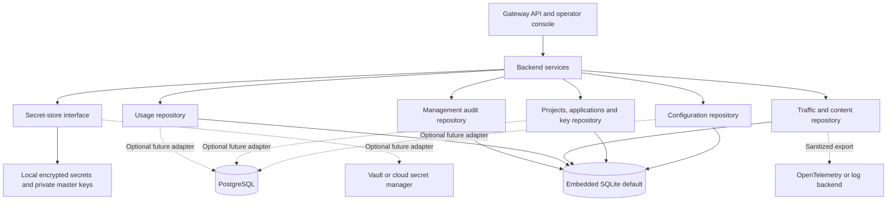

# Backend architecture

## Direction and status

Keep the gateway as one application with an embedded SQLite default and clear
backend interfaces. Source development is the current priority. Docker files and
helpers remain available; further container work is deferred until a functional
release candidate needs packaging verification.

Repository separation, explicit backend registration/configuration and independent
usage accounting are implemented with SQLite. Encrypted provider keys, application-key
digests, private files and encrypted backups remain available. Multiple application keys, optional replacement expiry, individual revocation and
transactional identity audit are implemented in schema 3. Configuration revisions/rollback and configuration/provider-key audit are implemented
in schema 6, along with explicit storage health and reversible write/integrity probes.
Snapshots retain 100 encrypted console-managed settings revisions, excluding secrets.
Master-key version migration, stable multiple connection identities, content encryption/access roles and remote implementations remain planned.
Schema 4 adds nullable queue wait/outcome and hashed user-attribution fields to traffic;
existing keys, usage and audit remain preserved. Schema 5 adds stream/outcome,
wire-status and partial-content fields, with schema-3/4 preservation tests.
See [backend adapters](backend-adapters.md) for contracts and testing.

## Current implementation

`LocalControlStore` now composes configuration, identity, secret, traffic, usage and management-audit
repositories behind a compatibility facade. SQLite uses WAL,
private files and a schema version. Provider secrets use Fernet; application keys
use an HMAC digest derived from the same local master key. Operator access uses a
separate bootstrap key file. Captured request/response text is bounded and redacted
in the separate exchange_content table, without individual content encryption. Filesystem privacy is the
current local access boundary.

The recorder already has an `EventSink` interface. Writes run through a thread pool
and are best effort: a failed sink increments an error metric and emits a safe
failure notice. Remote export, durable delivery queues and accounting guarantees
are not implemented. Usage is stored independently in schema-2 `usage_records`,
without captured content; deleting traffic does not change those aggregates.
Traffic/usage writes share a transaction, and repeated request IDs do not add usage.
Usage retention defaults to 365 days independently of 30-day traffic retention.

Native and Docker instances select different storage directories by default.
That is a storage-selection difference, not a different gateway data model. A
backup must retain the database and matching local keys; sharing a live SQLite
folder between two instances is unsupported.

## Separate responsibilities, retain one default database

Start with narrow interfaces and SQLite implementations. Keep `LocalControlStore`
as a compatibility facade while moving business rules into services and SQL into
repositories. Use a shared database/transaction boundary for local operations that
must succeed together. Do not split these into separately deployed services merely
to separate their code. Avoid a generic key/value interface that hides domain rules.

### Configuration and connections

- Separate bootstrap settings from UI-managed operational configuration. Bootstrap
  selects storage, listening address and initial operator access; it must work
  before the database and secret store can be opened.
- Store connection records with a stable ID, adapter type, endpoint, credential
  reference and capabilities. Support multiple connections of one adapter later;
  preserve current provider:model identifiers through a documented migration.
- Keep raw provider secrets out of configuration documents, exports and history.
- Validate a complete configuration revision before activation. Commit it and its
  local credential changes transactionally, then activate the immutable snapshot.
- Reject stale updates using a revision/ETag; retain a safe configuration history
  and management audit trail. A secret change is audited by reference/version.
- Document precedence explicitly. Operators must be able to see which values are
  managed by bootstrap/environment and which can be edited in the UI.

### Identities and secrets

- Keep projects, applications and application keys as separate records. Multiple
  keys per application allow overlapping rotation, expiry and independent revocation.
- Store verification digests for application keys, never recoverable raw values.
  Keep provider credentials encrypted because the gateway needs their plaintext
  when making an authorized upstream request.
- Separate operator authentication, application authentication and provider access.
  Project grouping is not a tenant-isolation guarantee without tested access rules.
- Introduce secret references and encryption-key versions. Separate the encryption
  key lifecycle from the application-key digest lifecycle; current digests depend
  on the master key and require an explicit compatibility/migration plan.
- Preserve credential-to-endpoint binding. A changed endpoint cannot silently
  receive an old stored credential; the existing draft connection test enforces this.
- Resolve external secrets only for authorized connections. The audit recorder
  must not enumerate an external vault to obtain redaction values.
- Keep the local encrypted secret store as the default. Vault/cloud secret managers
  are later adapters, with scoped identity, outage semantics and recovery contracts.
- Test encryption-key rotation and backup/restore before enabling it. Fernet supports
  rotation through MultiFernet, but that does not automatically migrate application
  key digests. See [Fernet rotation](https://cryptography.io/en/latest/fernet/).

### Logs, content and usage

Use distinct record types even when stored in the same SQLite database:

| Record | Purpose | Retention and access |
| --- | --- | --- |
| Operational logs | Startup, errors and component diagnostics | Safe structured stdout; no credentials or prompt bodies |
| Traffic metadata | Request ID, project/app, route, status, timing, cache/retries and reported usage | Searchable request records with configurable retention |
| Exchange content | Opted-in LLM input/output | Separate bounded/redacted content records and shorter independent retention |
| Usage records | Provider-reported token usage and request/cache counters | Independent retention; deleting content/traffic must not erase accounting |
| Management audit | Key/configuration/project changes and actor identity | No raw secrets; defined retention and restricted operator access |

Traffic retains its existing 30-day default; independent usage defaults to 365
days. Content-specific retention is implemented with a 30-day default, independently
configurable. Identity management audit defaults to 365 days. Add content encryption and content access roles as
explicit features; current event bodies have filesystem protection and redaction.

Usage records need unique request/attempt identifiers for duplicate prevention.
Keep absent provider counts unknown. Cache hits count as gateway requests without
adding new provider token usage. A retry can incur additional provider work; do not
claim exact billing for attempts whose usage the provider does not report. Historical
project attribution should remain stable when an application moves projects.

Persist a small local event/outbox transaction before remote delivery. Background
exporters read sanitized records with bounded queues, retries, delivery state and
observable failures. Define outage/backpressure behavior; do not promise lossless
capture before crash and disk-failure tests pass. A network outage must not cause
unbounded memory growth or indefinite inference blocking. Keep optional strict
accounting behavior separate from best-effort diagnostic content capture.

Use a versioned event envelope compatible with OpenTelemetry trace/request
correlation. See the [OpenTelemetry log data model](https://opentelemetry.io/docs/specs/otel/logs/data-model/).
Prometheus exports aggregate numeric metrics; request IDs, API keys and prompt text
must not become metric labels. Log browsing uses the included UI or a log backend,
with Grafana as an optional visualization surface. See
[Prometheus label guidance](https://prometheus.io/docs/practices/naming/).

### Storage lifecycle and operations

- One canonical data-directory setting, stable store identity, schema version and
  backup status. Make the selected store visible to operators so an empty new
  instance can be distinguished from the existing native store.
- Explicit ordered migrations and transactional rollback where supported. Verify
  old applications, digests, provider secrets, projects and logs survive migration.
- Consistent encrypted backups, fresh-destination restore and verified export/import.
  Do not auto-merge databases or regenerate missing encryption keys.
- Paginated queries and indexes before adding heavier infrastructure.
- Disk limits, retention jobs, storage health, failed-write metrics and recovery
  controls. Capture/content deletion and usage retention are separate decisions.
- PostgreSQL is an optional future implementation for shared deployment. Redis is
  optional only if shared cache/rate enforcement is required. Neither is a default
  workstation prerequisite. Multi-instance correctness requires additional tests.

## Proposed implementation sequence

1. Repository extraction is implemented. Continue service boundaries behind the
   existing SQLite facade; preserve behavior, data and keys.
2. Independent content and usage records, content retention and recording health
   are implemented. Continue content encryption/access roles and durable export. Backfill
   only from retained evidence; already deleted history cannot be reconstructed.
3. Application/key separation, rotation/revocation and identity audit are implemented.
   Configuration/provider-key audit is implemented; continue encryption/digest key-version migration.
4. Validated configuration revisions and atomic activation are implemented. Add stable connection IDs and remaining audit actions.
5. Add a durable export outbox and one exporter through the existing sink boundary.
6. Add PostgreSQL or external secret-store adapters only with a demonstrated use case
   and a shared contract suite. Validate container/native packaging for the final
   functional scope before publishing a release.

Each step needs a migration, compatibility tests and an operational runbook. These
steps include implemented foundations and remaining planned scope. Existing user
stores migrate only when started with the new version; development tests use
isolated stores. Follow the [upgrade runbook](runbooks/backend-storage-testing.md).

## Configuration recovery and storage diagnostics — implemented

Schema 6 commits console settings, encrypted revision snapshots, changed local
credentials and management audit in one transaction. Runtime activation follows
commit without an asynchronous yield; existing requests retain arrival snapshots.
Restore requires the current revision, validates against current adapters and
clears cache/catalog. Changed endpoint or environment credential bindings require
explicit removal of every affected stored alias and disable historical environment
bindings; unchanged bindings preserve current credentials. Bootstrap and arbitrary
file edits are outside this history. See [recovery operations](runbooks/configuration-recovery.md).

Storage health checks private files, database access and matching/decryptable
credentials. Explicit verification also checks SQLite/foreign-key integrity,
revision encryption and a rolled-back write. It runs in a worker thread and never
repairs the database or rotates keys. SQLite opens existing files with `mode=rw`;
missing files fail instead of silently creating replacement stores. `/ready` remains
configuration/read-access readiness, with upstream connectivity separate.

Schema 7 moves retained content into exchange_content in the migration transaction.
Traffic/content/usage emit together, metadata deletion cascades to content, and
explicit content deletion preserves metadata and usage with transactional audit.
Legacy content columns remain empty for compatibility. Read-time expiry prevents
exposing expired text between prune runs. See [logging showcase](runbooks/logging-showcase.md).
