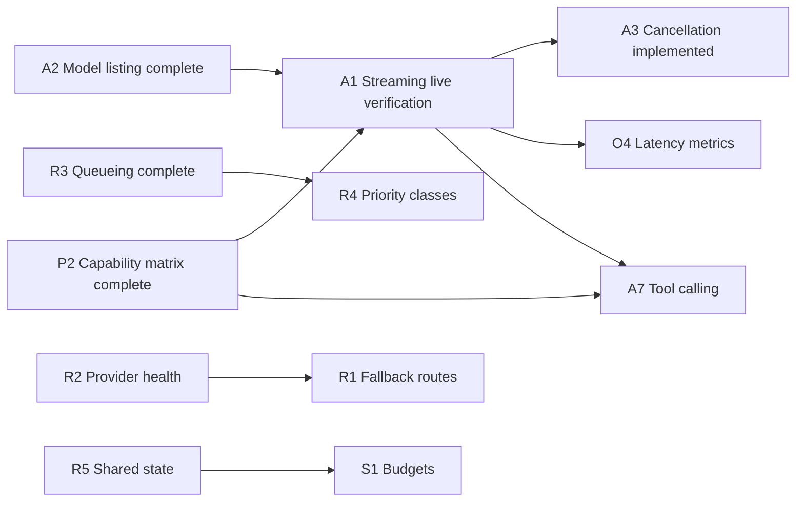

# Feature backlog

This page lists gateway capabilities that are **not implemented yet**, grouped by
area, with the scope and acceptance criteria for each. It complements the
[roadmap](roadmap.md): the roadmap sets milestones and release gates, and this page
breaks the missing work into items that can be picked up one at a time.

Status terms follow the [documentation conventions](README.md#read-implementation-status-literally).
Every item here is **planned**. When an item is implemented, remove it from this page
and record its tests and verification in the roadmap, [validation](validation.md) and the relevant runbook.

Completed first batch: **A2 model listing, A4 generation parameters, P2 adapter
capabilities, R3 bounded queueing**. A3 disconnect cancellation and the streaming
runtime are also implemented; live streaming verification remains below. See [roadmap](roadmap.md#backlog-first-batch--implemented)
and the [testing runbook](runbooks/inference-api-and-queueing.md).

The authenticated inference API exposes `GET /v1/models` and
`POST /v1/chat/completions` (complete or streaming text). Operator APIs live under `/admin`; `/health`,
`/ready` and `/metrics` provide operational endpoints. Supported fields are
documented in [configuration](configuration.md#chat-generation-parameters).

## Priority summary

| Priority | Item | Area | Size |
| --- | --- | --- | --- |
| P1 | [A1 Streaming live verification](#a1-streaming-live-verification) | API | L |
| P2 | [R1 Fallback routes](#r1-fallback-routes) | Routing | M |
| P2 | [R4 Priority classes](#r4-priority-classes) | Routing | M |
| P2 | [S1 Budget enforcement](#s1-budget-enforcement) | Security | M |
| P2 | [S2 Response policies](#s2-response-policies) | Security | M–L |
| P2 | [O1 Dashboards and alerts](#o1-dashboards-and-alerts) | Observability | S–M |
| P2 | [A5 Multiple choices (`n`)](#a5-multiple-choices-n) | API | S |
| P3 | [A6 Embeddings](#a6-embeddings) | API | M |
| P3 | [A7 Tool calling](#a7-tool-calling) | API | L |
| P3 | [P1 Cloud and vendor adapters](#p1-cloud-and-vendor-adapters) | Providers | L each |
| P3 | Remaining items below | — | — |

Sizes are rough: S ≈ days, M ≈ one to two weeks, L ≈ several weeks.

---

## A. Inference API surface

### A1 Streaming live verification

The streaming runtime, adapter contracts and browser Stop flow are implemented;
see [streaming and cancellation](runbooks/streaming-and-cancellation.md). Remaining
work is live evidence before the original A1 acceptance gate is satisfied.

**Scope:** run text streaming against Windows/local Ollama, OpenAI and a compatible
server; inspect final usage, bounded capture and initial/terminal errors. Verify
Stop closes HTTP and that each backend actually stops generation. Repeat through
the Worker/tunnel/proxy path with buffering and timeout checks. Preserve unknown
counts when no provider usage arrives; do not introduce token estimates.

**Acceptance:** record provider/model versions and successful completion, token
accounting, truncation and disconnect recovery in [validation](validation.md).
Local Ollama discovery was unavailable on 2026-10-06, so this gate remains planned.

### A5 Multiple choices (`n`)

**Why:** callers that want several samples for voting or ranking currently have
to send separate requests.

**Scope:** accept `n` up to a configurable maximum. Use the provider's native
support where it exists; otherwise fan out inside the gateway under the same
concurrency controls. Record one outcome event with combined usage.

**Acceptance:** usage equals the sum over all choices, limits apply, and the maximum `n` is enforced.

### A6 Embeddings

**Why:** retrieval-augmented generation and semantic search need embeddings, and
Ollama and OpenAI both provide them.

**Scope:** `POST /v1/embeddings` with per-application model authorization, usage
accounting, size limits and adapter support.

**Acceptance:** contract tests and a live Ollama embedding check pass. Embedding
usage is shown separately from chat usage in the console.

### A7 Tool calling

**Why:** agent-style applications need function/tool calling.

**Scope:** `tools`, `tool_choice`, assistant `tool_calls` and `tool`-role messages,
both non-streaming and streaming. Capture and guardrails cover tool arguments and results.

**Acceptance:** the round trip passes tests on each adapter that declares the
capability. Adapters without it reject tool requests with a 422.

### A8 Multimodal input

**Why:** vision models need image content parts.

**Scope:** accept image content parts with size, count and MIME-type limits, and
define how captured content handles images (store a reference or hash, never the
raw data by default).

**Acceptance:** limits fail closed, capture never stores raw images by default,
and a vision model passes a live check.

---

## R. Routing, reliability and traffic shaping

### R1 Fallback routes

**Why:** when the primary provider is unreachable (for example, a workstation GPU
is switched off), requests fail even when another authorized provider exists.

**Scope:** ordered fallback targets per route, triggered only on retryable failure
classes (connection refused, timeout, 5xx, provider 429) and never on client
errors. Each fallback target must be authorized for the application. The outcome
event records which target served the request.

**Acceptance:** tests cover each trigger class, rejection of an unauthorized
fallback target, attribution in logs and usage, and recovery once the primary returns.

### R2 Provider health and circuit breaking

**Why:** `/ready` checks configuration and storage, not whether providers can be
reached. Repeated calls to a dead provider waste time before each failure.

**Scope:** optional background health probes, provider status in the console, and
a circuit breaker that opens after repeated failures and probes again half-open.
Keep `/ready` semantics unchanged, or add a separate endpoint for provider health.

**Acceptance:** the breaker opens, half-opens and closes under test, the console
shows status, and probes never send captured content or completions.

### R4 Priority classes

**Why:** interactive and batch traffic share the same capacity, and batch jobs
can starve interactive users.

**Scope:** a priority class on each application (for example, interactive/batch),
scheduled in priority order from the queue, with starvation protection for lower classes.

**Acceptance:** under saturation, interactive requests get ahead of batch requests,
and batch requests still progress within a documented bound.

### R5 Shared state for multiple processes

**Why:** rate limits, concurrency, cache and (later) budgets are kept per process,
so running several gateway processes multiplies every limit.

**Scope:** a shared-state backend interface for counters, semaphores and cache,
with an in-process default and one external implementation (for example, Redis or PostgreSQL).

**Acceptance:** with two processes behind one load balancer, the combined limits
match the configuration in both functional and load tests.

### R6 Load balancing and weighted routing

**Scope:** several targets per route, using weighted round-robin or least-busy
selection, with health awareness (needs [R2](#r2-provider-health-and-circuit-breaking)).

**Acceptance:** traffic is distributed within tolerance and unhealthy targets are removed.

### R7 Semantic cache

**Scope:** an optional cache keyed by embedding similarity, scoped per application
and model, with a similarity threshold, TTL and exclusions. Needs [A6](#a6-embeddings).

**Acceptance:** cache hits never cross applications and are labelled as cache hits
in usage. An opt-out works for each request.

---

## S. Security and governance

### S1 Budget enforcement

**Why:** `monthly_budget_usd` is validated but not enforced.

**Scope:** budgets per application and per project in tokens, in estimated cost,
or both, over daily or monthly windows. Choose soft (warn) or hard (reject)
behaviour. Show remaining budget in the console.

**Acceptance:** a hard budget fails closed at the limit, a soft budget emits events,
and windows reset correctly. Cache hits do not consume budget.

### S2 Response policies

**Why:** guardrails check requests only. Outputs are not checked for secrets,
personal data or blocked content.

**Scope:** a pluggable output policy chain (redact, block or flag), with built-in
secret and PII pattern detectors. Policy outcomes appear in events and metrics.
Define how this works with streaming, for example chunk buffering or
check-on-completion.

**Acceptance:** each action is tested for non-streaming and streaming responses.
Policies never write the matched sensitive content to logs.

### S3 Prompt-injection detection

**Scope:** an optional request detector (heuristic or model-based) that can flag
or block, plus a documented test corpus.

**Acceptance:** precision and recall on the corpus are recorded, and flag-only mode
never blocks traffic.

### S4 Key versions and full management audit

**Why:** application-key rotation, expiry, revocation and identity audit are in
place. Encryption/digest key versions and auditing of configuration and provider-key
changes are not.

**Scope:** versioned master/digest keys with re-encryption, and audit records for
configuration, control, connection and provider-key changes. Add
configuration revisions with atomic activation and rollback.

**Acceptance:** a master key can be rotated without downtime, every management
change appears in the audit log, and a previous configuration revision can be restored.

### S5 Operator roles

**Scope:** multiple operator identities with at least an admin role and a read-only
role. Optionally add OIDC sign-in for the console.

**Acceptance:** negative tests show that read-only operators cannot change state
or read secrets.

### S6 Project policy and tenant boundaries

**Scope:** per-project model allowlists, limits, budgets, retention and capture
policy, with tested isolation between projects.

**Acceptance:** cross-project access tests fail closed before any tenant-isolation
claim is made.

---

## O. Observability

### O1 Dashboards and alerts

**Scope:** Grafana dashboards for the existing Prometheus metrics (requests,
latency, outcomes, provider errors, guardrails, tokens, cache), plus example
alert rules and a runbook.

**Acceptance:** dashboards import cleanly into a stock Grafana, and alerts fire in a
documented failure exercise.

### O2 Remote log exporters

**Scope:** an exporter interface with OTLP logs, Loki and webhook implementations,
bounded durable delivery (an outbox with retry), and sanitized events by default.

**Acceptance:** delivery survives restarts and provider outages without duplicates
beyond the documented semantics, and no captured content is exported unless explicitly enabled.

### O3 Distributed tracing

**Scope:** OpenTelemetry spans for authentication, policy, routing, each provider
attempt, retries and cache. Propagate `traceparent` from callers.

**Acceptance:** one trace shows every attempt of a request that was retried or fell back.

### O4 Latency and throughput metrics

**Scope:** time to first token, tokens per second and queue wait, broken down by
provider, model and application. Needs [A1](#a1-streaming-live-verification) and [implemented queueing](runbooks/inference-api-and-queueing.md).

### O5 Cost and resource estimates

**Scope:** cost estimates per model from a maintained, labelled price table,
and GPU-seconds or token throughput for self-hosted providers.

**Acceptance:** estimates are clearly marked as estimates, and maintaining the price table is documented.

---

## P. Providers

### P1 Cloud and vendor adapters

Anthropic, AWS Bedrock, Azure OpenAI and Google Cloud Vertex AI. Each needs
credential configuration (workload identity where supported), model mapping, error
normalization, a declared capability set, the shared contract suite and an
opt-in live smoke check.

### P3 Live verification of existing adapters

OpenAI, generic OpenAI-compatible servers (vLLM), Ollama from a container, and the
Worker/tunnel path still need recorded live evidence in [validation](validation.md).

---

## D. Platform, storage and distribution

| Item | Scope |
| --- | --- |
| D1 Backend storage | Store captured content separately from metadata; storage health reporting; PostgreSQL and Vault adapters behind the existing contracts |
| D2 Managed ecosystem services | Service profiles, container-engine detection, lifecycle controls for Grafana/Prometheus/log storage/Vault, backups and recovery (see [ecosystem](ecosystem.md)) |
| D3 Workstation release gates | Clean Windows/Linux host checks, native Windows Ollama and browser checks, OS service installation, code signing, rollback between released versions |
| D4 Cloud deployment | Container deployment tested on each major cloud; runnable Kubernetes and Terraform examples only once tested |
| D5 Developer experience | JavaScript and Python client examples, configuration validation tooling, a stable published adapter interface with a minimal example adapter |

Each item keeps the acceptance criteria already defined in the [roadmap](roadmap.md)
and [lifecycle](lifecycle.md) release gates.
