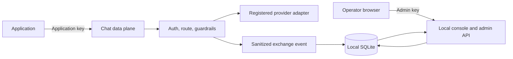

# Local control plane

The optional local control plane makes the gateway's core activity visible on a
single self-hosted instance. It adds an operator console and authenticated admin
API while leaving `POST /v1/chat/completions` as the application data plane.

## Implemented capabilities

- 24-hour request, error, latency, and provider-reported token totals.
- Searchable recent LLM exchange metadata and JSON export.
- Prompt and completion inspection when both capture permissions are enabled.
- Runtime application-key creation and revocation.
- Encrypted registered-provider key storage and rotation.
- Persistent provider connections, model discovery, default model selection,
  and global content-capture configuration through Setup.
- A destination inventory for SQLite, JSON stdout, private JSONL, and `/metrics`.



This is a developer-preview, single-instance control plane. It does not provide
hosted tenancy, SSO, distributed coordination, billing, or a durable remote event
queue. Fallback, budget enforcement, cost estimation, and additional
cloud providers remain roadmap work.

See [traffic controls](runbooks/traffic-controls.md) for implemented per-app rate
limits, exact-response caching, and bounded retries.

## Enable it

Set these values in the gateway process environment:

```bash
GATEWAY_CONTROL_PLANE_ENABLED=true
GATEWAY_CONTROL_PLANE_DATABASE_PATH=var/lib/m87-gateway/control.db
GATEWAY_CONTROL_PLANE_MASTER_KEY_PATH=var/lib/m87-gateway/master.key
GATEWAY_ADMIN_API_KEY=<random-operator-secret>
```

The admin key must contain at least 24 non-whitespace characters. Open
`http://localhost:8080/admin` and enter it when prompted. The browser keeps the
key in JavaScript memory for that page; it is not written to HTML, browser
storage, or the database.

The Windows/WSL Flow Lab enables this configuration automatically. Its launcher
prints the console URL and a new admin key at startup.

For normal local use, `m87-gateway` creates private operator access and starts the
console without demo app keys or enabled providers. See [guided setup](runbooks/guided-setup.md).
Its operator key is a private local file, distinct from app-key digests and encrypted
provider keys. The existing Flow Lab and Uvicorn entry points remain available.

## Content capture

Full payload storage is off by default. It requires both:

1. `GATEWAY_CAPTURE_CONTENT=true`, the equivalent YAML setting, or the Setup capture option.
2. `capture_content: true` on the authenticated application.

The control plane records only bounded, redacted content after application auth,
model authorization, and request guardrails pass. Metadata and Prometheus labels
never contain prompts or completions. Use synthetic content until access and
retention rules are established.

## Key storage

Application keys are generated by the gateway, displayed once, and stored as
keyed SHA-256 digests. They cannot be recovered from SQLite. Revoking an app
deletes its runtime key immediately.

Provider keys are encrypted with Fernet before SQLite storage. The encryption
key lives in the separate `master.key` file. Database, sidecar, and master-key
files use owner-only permissions. Encryption protects database copies that do
not include the master key; host filesystem access remains the primary security
boundary. Back up or migrate the database and master key together, through a
private channel, or stored provider credentials will be unrecoverable.

## Persistence and retention

The default database retains events for 30 days. Set
`GATEWAY_CONTROL_PLANE_RETENTION_DAYS` from 1 through 3650. Expired events are
pruned at gateway startup. The implementation uses SQLite WAL mode and targets
one gateway instance. PostgreSQL and multi-instance migrations are planned.

UI-managed provider connections and the selected default/capture settings are
stored alongside events and keys. They override the corresponding startup values
while that database is in use. Other YAML and environment settings remain startup
configuration. Updates clear the response cache and apply to new requests.

See the [control-plane runbook](runbooks/control-plane.md) for startup, rotation,
export, and recovery procedures.
