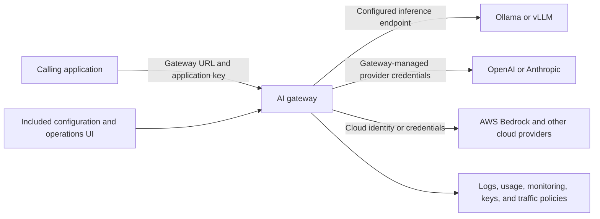
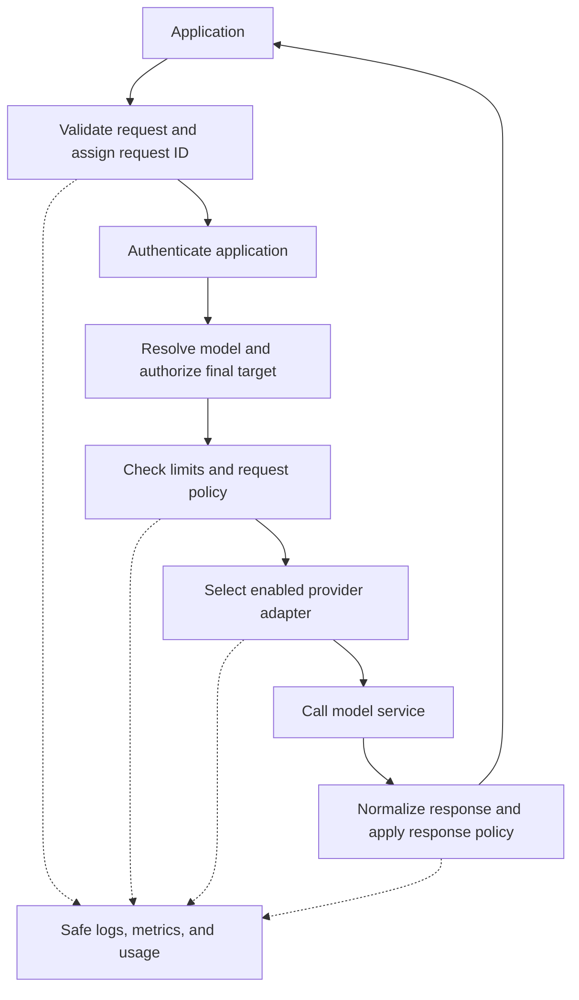
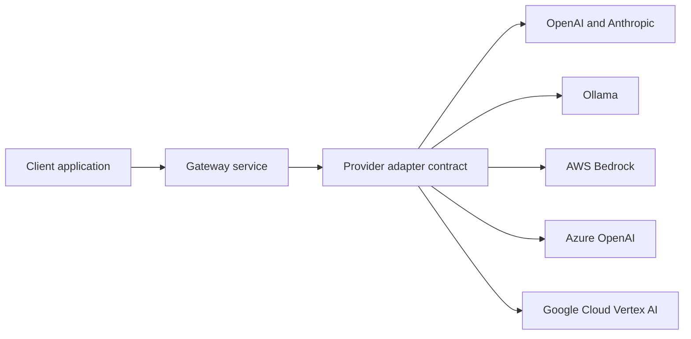

# Product design

## Purpose and audience

M87 AI Gateway is a self-hostable gateway framework for developers and small
organizations that need a consistent way to call language models. Applications
should integrate once, while operators control credentials, model access,
provider selection, policy checks, and operational visibility.

The initial product is a deployable HTTP service. Its framework capabilities are
documented adapter and policy interfaces, reusable configuration, and deployment
examples. A separately supported embedded SDK is a future decision.

## Plug-and-play product vision

The intended experience is one self-hosted application with an included browser
UI, usable on a workstation or a cloud server. Users retain control over provider
connections, credentials, application access, logs, retention, and traffic policies.
The gateway owns the operational controls for requests routed through it.

The target first-run procedure is:

1. Download and launch the gateway application for the chosen platform.
2. Open its local setup UI and establish operator access.
3. Select a provider: enter an inference endpoint for an existing local service,
   or configure upstream credentials or cloud identity for a hosted service.
4. Test connectivity, choose a model, and create an application key.
5. Set the calling application's gateway base URL and application key.

Applications hold gateway-issued app credentials; upstream provider secrets stay
in gateway-controlled storage. Cloud workload identity should be preferred where
available. Local endpoints may also require credentials. Restrict direct backend
access when policy enforcement must cover all inference traffic.

Aim for native distributions that bundle the runtime, backend, UI, and embedded
database. Users should not install Python, Node, Docker, PostgreSQL, or Grafana
for the default single-instance experience. Produce and test separate artifacts
for supported operating systems and architectures. A container image is an
additional deployment option for existing cloud/container environments.

Model servers, model downloads, accelerator drivers, cloud accounts, and network
access remain prerequisites supplied by the user. Multi-instance deployments
may need shared storage and platform services. Built-in request logs and usage
views should be useful without external collectors; remote exporters are optional.

Provider support is delivered through tested adapters and explicit capability
reporting. Ollama, OpenAI, and generic OpenAI-compatible servers have initial
adapters. Live vLLM compatibility, Anthropic, and Bedrock remain unverified or
planned. Streaming, tools,
and other provider differences must be declared rather than silently dropped.

The console now includes persistent provider connection setup, model discovery,
default routing and content-capture choices, inspection, and key operations. A
loopback launcher starts without demo credentials. A Linux standalone build is
experimental. Complete policy editing, native Windows packaging, cross-platform
secret protection, and production service management remain planned. See
[guided setup](runbooks/guided-setup.md) and the [adapter contract](adapters.md).

## Product principles

1. Make the first successful local request straightforward and reproducible.
2. Enforce application identity and model authorization before spending provider resources.
3. Define a small, explicit API compatibility contract and test it across providers.
4. Keep provider credentials on the server and sensitive content out of default logs.
5. Make failures understandable through stable errors and correlated operational signals.
6. Keep the default service lightweight; add infrastructure when a demonstrated need requires it.
7. Publish only the capabilities that a release actually supports.

## Core scope

| Capability | Product expectation | Current state |
| --- | --- | --- |
| API | Documented chat completion contract; explicit handling of unsupported options | Partial: text requests and non-streaming responses |
| Identity | Per-app authentication and model authorization, including resolved routes | Implemented for bearer app keys and model allowlists |
| Routing | Deterministic selection, aliases, configuration validation | Implemented for direct models, `auto`, and task rules |
| Providers | Common adapter contract with declared capabilities and safe failure handling | Partial: non-streaming OpenAI and Ollama text chat; native Ollama flow verified |
| Policy | Configurable request/response checks with bounded request sizes | Partial: request bounds and configured blocklist; response checks planned |
| Reliability | Timeouts, cancellation, bounded retries, explicit fallback policy | Partial: timeouts and opt-in bounded retries; fallback planned |
| Observability | Request IDs, outcome logs, latency, usage, cost estimates, metrics | Partial: correlated events, metrics, and optional local traffic capture; cost/export planned |
| Resource controls | Per-app rate limits and documented budget semantics | Partial: single-process rate enforcement and opt-in response cache; budgets planned |
| Operations | Local and container setup, health/readiness, upgrade and rollback procedures | Partial: health endpoint, Docker files, and runbooks |

## Target request path

This diagram describes the intended design. See [architecture](architecture.md)
for the current implementation.

## Provider access and cloud hosting

Provider integration and deployment are separate commitments:

- **Provider integration:** call model services offered by OpenAI, Ollama,
  Anthropic, AWS Bedrock, Azure OpenAI, and Google Cloud Vertex AI.
- **Cloud hosting:** run the gateway on AWS, Azure, and Google Cloud using the
  same container and documented platform configuration.

All three major cloud integrations are planned. The initial runtime does not
implement their adapters, credential handling, or deployment automation.
Provider-specific capabilities must be declared explicitly; compatibility does
not imply every model offers the same features.

## Extension contract

Before treating adapters as a public extension API, define and test:

- Provider identity, supported model identifiers, configuration, and credential sources.
- Supported request fields, response shape, streaming, tools, and multimodal capabilities.
- Safe errors for unsupported features, invalid configuration, throttling, and outages.
- Timeout, cancellation, connection reuse, retry, and usage-reporting behavior.
- Contract tests, a configuration example, and a troubleshooting runbook.

Providers must not own application authorization or silently bypass policy.
Normalize the common subset and document provider-specific options. Never invent
usage data when a provider does not supply it.

## Reliability and isolation decisions

- Resolve a route before final authorization. Every fallback target also needs authorization.
- Validate configuration at startup and fail closed on invalid identity or policy settings.
- Treat retries as potentially billable duplicate work; retry only under a documented policy.
- Do not retry a stream after response bytes have reached the client.
- Keep application credentials, provider credentials, and operator access separate.
- Establish single-instance limit semantics before promising limits across replicas.
- Report estimated costs separately from provider billing; pricing requires a maintained source.

Final-target authorization and startup validation are enforced. Fallback,
shared limits, and maintained cost estimation remain acceptance requirements.

## Deployment assumptions

The first supported deployment is one gateway instance behind a trusted network
boundary or TLS reverse proxy. Applications call it from their backend. Operators
supply model access, credentials, connectivity, and model availability.

The data plane remains stateless unless the optional local control plane is
enabled. That developer-preview feature uses SQLite for single-instance events
and key metadata. Shared rate limiting, durable multi-replica accounting, and
coordination require a separate PostgreSQL or shared-cache design.

## Scope boundaries

The initial releases do not include a model training platform, model registry,
RAG orchestration system, billing platform, hosted control plane, or multi-tenant
administration. The implemented local console is an operator surface for one
self-hosted instance. New features need a demonstrated gateway use case and a
place in the roadmap.

## Decision records

Record substantial choices in short documents under `docs/decisions/` when needed.
Include context, the decision, alternatives, consequences, and acceptance checks.
Update this page when a decision changes the product contract.
