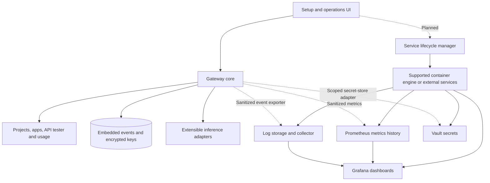
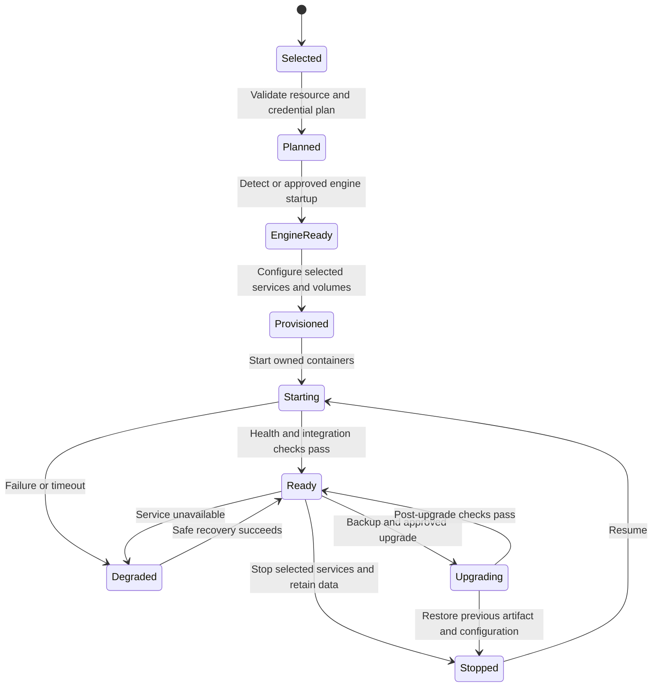

# Full gateway ecosystem

## Product vision and status

The end product is a full AI gateway ecosystem that users can set up and operate
from one application. It includes project/application access, provider connections,
API testing, request/response inspection, token/usage dashboards, and policy controls.
It should be able to configure, start, monitor, stop, and recover optional Grafana,
Prometheus, logging, Vault, and future service containers. Starting a supported
container engine is also a planned platform integration when authorized.

The current core provides the console, project grouping, API tester, usage/logs,
encrypted local keys, and an experimental Linux bundle. Managed companion services,
engine startup, Vault integration, remote exporters, and Grafana provisioning are
**planned**. This page defines their design and acceptance criteria; it does not
claim those services are running or supported today.

## One setup experience, selectable service profiles

The included dashboard and SQLite remain usable without Docker. Users who want
the expanded ecosystem choose a service profile. Setup should explain downloads,
CPU/memory, ports, storage, credentials, and retention before starting services.
Profiles can use gateway-managed containers or connect existing external services.
Container profiles require a supported installed engine; the application will
guide prerequisites and provide approved startup on supported platforms.

| Profile / component | Intended purpose | Current status |
| --- | --- | --- |
| Included gateway | API, project dashboard, keys, test console, local logs/usage | Implemented local developer preview |
| Grafana + Prometheus | Metrics history, dashboards and alerts | Managed setup and dashboards planned |
| Loki + collector/exporter | Sanitized correlated log browsing and retention | Remote delivery and provisioning planned |
| Vault or external secret store | Scoped provider-credential retrieval and rotation | Adapter and managed lifecycle planned |
| Shared persistence | Coordinated usage/configuration for replicas | Planned; SQLite currently targets one process |

Grafana's container documentation describes persistent volumes and Compose
deployment. Our intended profile will provision storage and configuration as
part of gateway setup. [Grafana Docker documentation](https://grafana.com/docs/grafana/latest/setup-grafana/installation/docker/).
Loki can receive logs through Alloy; selecting a collector or direct exporter
requires testing the gateway's sanitization and delivery contract.
[Loki ingestion with Alloy](https://grafana.com/docs/loki/latest/send-data/alloy/).

## Extension boundaries

- **Provider adapter:** inference protocol and safe response/usage normalization.
- **Secret-store adapter:** read/rotate credential references using scoped identity;
  local encrypted storage remains an available implementation.
- **Event exporter:** sanitized events and delivery/backpressure semantics. Network
  delivery must not block the inference request indefinitely.
- **Service lifecycle adapter:** generate a reviewed resource plan, validate engine
  availability, provision selected services, inspect readiness, stop, and recover.
  Use a fixed action contract rather than arbitrary shell commands from browsers.

Each service definition needs a supported version/image digest, license review,
configuration template, resource limits, persistent volumes, access rules,
health probes, backups, and upgrade/rollback tests. The manager must identify its
own services and leave unrelated containers and data intact. A remote inference
caller must never gain host container-management access through the data plane.

## Secrets, logs, and usage

Vault container startup and provider-secret integration are separate steps. A
normal Vault server requires initialization and unsealing; dev mode is unsuitable
for production. The planned profile must define operator recovery and protect
bootstrap credentials rather than storing a root token in a generated manifest.
[Vault server modes](https://developer.hashicorp.com/vault/docs/commands/server).

Prometheus receives numeric metrics; log events go to an event/log backend. Prompt
and response capture remains opt-in, bounded, redacted, and access-controlled.
Grafana views must follow the same data access and retention rules as source stores.

Each authenticated request takes its project identity from its application key.
Events retain that identity when the app moves projects. Current usage sums retained
provider-reported tokens and excludes cache hits from new provider consumption.
This is operational reporting, not authoritative billing: missing usage, retries,
retention, and external inference traffic constrain accounting. Project roles,
budget enforcement, and multi-instance accounting remain separate milestones.

## Planned service lifecycle

## Implementation order and acceptance

1. Complete project attribution and built-in dashboard/API testing.
2. Add service planning, engine diagnostics, and a first bounded observability profile.
3. Add lifecycle controls and verify provisioning, readiness, persistent data, and
   clean shutdown under the on-demand Docker policy.
4. Add sanitized log export and configured Grafana views.
5. Add secret-store adapters and Vault lifecycle/recovery.
6. Extend to supported cloud hosts and verify upgrades, access controls, and resource limits.

Service-specific runbooks will accompany runnable implementations. Container
image/Compose/readiness/networking/data/cleanup checks must be recorded in
[validation](validation.md). The [roadmap](roadmap.md) tracks release gates.
