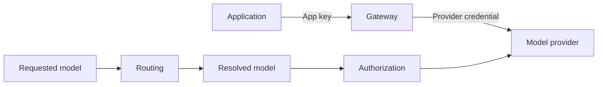

# Glossary

| Term | Meaning in this project |
| --- | --- |
| Gateway | The service applications call to access model providers through shared controls. |
| Framework | The gateway core plus documented interfaces and tools for extending it. The public extension contract is planned. |
| Application / app | A calling backend or service with its own identity and access policy. |
| App API key | A bearer credential used to authenticate an app to the gateway. |
| Provider credential | A secret or workload identity used by the gateway to authenticate upstream. It is separate from the app key. |
| Authentication / AuthN | Establishing which application is calling. |
| Authorization / AuthZ | Deciding which models and operations that application may use. |
| Allowlist | The explicit set of models or capabilities an app may access. |
| Provider | A model service exposed through an adapter, such as OpenAI or Ollama. |
| Adapter | Code translating the gateway contract into a provider request and normalizing its response and errors. |
| Model identifier | A configured name such as `ollama:llama3`; the prefix selects the provider. Cloud naming rules remain to be specified. |
| Requested model | The model or alias supplied by the client. |
| Resolved model | The concrete provider/model selected by routing. It requires authorization. |
| `auto` | The current alias for the configured default model; it does not perform intelligent model selection. |
| Route | A deterministic decision connecting a request to a provider/model. |
| Fallback | A planned policy that chooses another authorized target after a defined failure. |
| Guardrail | A bounded policy check that may allow, block, or eventually redact content. A keyword blocklist is not a complete prompt-injection defense. |
| API compatibility | Support for a documented subset of request, response, streaming, and error behavior. It is not a claim of full feature parity. |
| Capability | A feature an adapter/model combination explicitly supports, such as streaming or tools. |
| Streaming | Sending incremental response events before generation finishes; not currently implemented. |
| Request ID | A correlation identifier used across response headers, logs, and traces; planned. |
| Audit event | A structured record of a request or policy outcome without sensitive content by default. |
| Metric | An aggregate operational measurement. Labels must avoid secrets and unbounded values. |
| Trace | Related spans describing work across components; a future observability option. |
| Token usage | Provider-reported input/output token counts. Missing counts must not be fabricated. |
| Estimated cost | An estimate derived from usage and maintained prices, separate from an invoice. |
| Rate limit | A policy restricting request volume over a period; currently a configuration field only. |
| Budget | A spending policy whose accounting and enforcement semantics remain to be implemented. |
| Liveness | Whether the process can respond; the current `/health` endpoint is a basic liveness signal. |
| Readiness | Whether an instance is ready to receive traffic under a documented policy; planned. |
| Workload identity | Credentials supplied by the hosting platform to a running service, avoiding static cloud keys where supported. |
| Provider integration | Calling a model service. This does not imply a supported gateway deployment on that provider's cloud. |
| Cloud deployment | Running the gateway on a cloud platform. This does not imply support for that cloud's model APIs. |
| Contract test | A reusable test checking the behavior every supported adapter must satisfy. |
| Smoke check | A small end-to-end check against a real configured service; it may incur usage charges. |
| Release gate | Evidence that must exist before publishing a declared release scope. |
| Runbook | A repeatable procedure with prerequisites, checks, expected outcomes, and recovery steps. |

