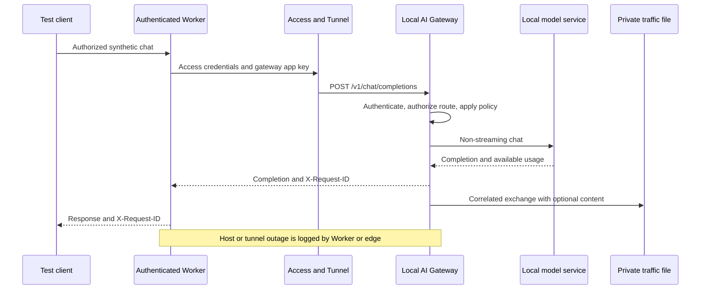

# Cloudflare Worker to local inference

## Reference use case

An authenticated Worker calls a local model through Cloudflare Access and a
Tunnel. The host and its model containers are available only while the machine
is running. The gateway provides model access controls and LLM traffic records
at the local origin.

## Compatibility boundary

The inspected reference Worker relays `/v1/chat/completions`, `/v1/models`,
and `/v1/embeddings` and can pass streaming responses. This gateway currently
supports only non-streaming text chat. It rejects `stream: true` and unsupported
fields; models and embeddings endpoints are not implemented.

Use a separate test Worker/origin or a dedicated chat test route first. Preserve
existing user authentication, Cloudflare Access, origin authentication, rate
limits, and concurrency controls. This gateway does not yet replace all of those
controls. Existing app/tunnel deployments are not changed by this example.

The reference Worker does not currently forward `X-Request-ID` to its client.
That response-header mapping will be needed during a later app integration.
Raw model names may also need mapping to the gateway's `provider:model` format,
or to an authorized `auto` route.

## Test setup

Use the [end-to-end flow testing runbook](../runbooks/end-to-end-flow-testing.md)
for the ordered procedure, evidence to retain, stop conditions, and cleanup. The
steps below summarize the integration-specific setup.

1. Configure the gateway's Ollama endpoint for the network where it runs.
2. Create a dedicated `worker-test` app with a private key and an allowlist
   containing both `auto` and its concrete model.
3. Optionally enable traffic capture only for this app using the
   [logging runbook](../runbooks/traffic-logging.md).
4. Arrange an on-demand Docker session. Verify local health/auth/chat first.
5. Route a separate Access-protected test hostname through the tunnel to the
   gateway. Keep `/metrics`, files, and unrelated app routes private.
6. Use the [Worker example](../../examples/cloudflare-worker/README.md). Its
   caller test key, gateway app key, and Access service credentials are separate.
   Store them as Worker secrets; never forward browser/user bearer tokens upstream.
7. Send synthetic text with `model: auto` and `stream: false`. Match the
   returned request ID to the local traffic event.

## Integration acceptance checks

| Scenario | Expected evidence |
| --- | --- |
| Host, gateway, model, and tunnel available | Completion returns and a correlated local event exists |
| Bad gateway app key | Gateway 401 and metadata-only rejection event |
| Disallowed requested/resolved model | Gateway 403 before provider invocation |
| Configured blocklist hit | Safe 400; metadata-only event |
| Local model offline | Safe gateway 502/504 and provider-error metrics |
| Host or tunnel offline | Worker/edge failure; no gateway event is expected |
| Content capture disabled | Metadata exists without messages or completion text |
| Streaming or embeddings requested | Explicit unsupported behavior; existing app routes remain on their current origin |

All live tunnel, Worker, Docker, and model checks remain deferred. Unit tests use
mocked providers. See [validation status](../validation.md).

## Rollback

Restore the test Worker's previous origin/key mapping or stop the test route.
Keep the established application origin untouched during the first test. Disable
content capture and apply the private-file retention policy when finished.
