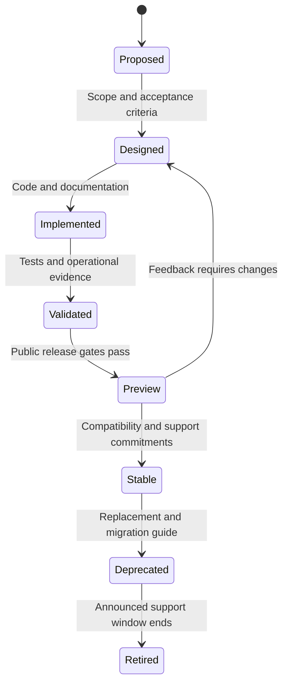
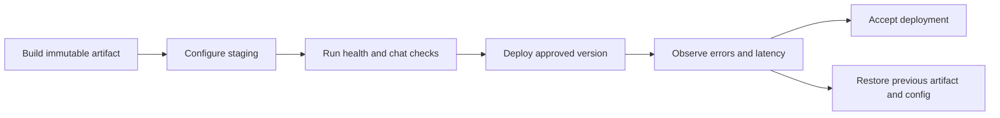

# Project lifecycle

## Status and release intent

The project is in early development. The intent is public availability once a
declared preview scope is usable, documented, and supportable. A public preview
may precede full cloud coverage; its limitations must be explicit.

The historical `v0.1.0` tag describes the initial scaffold. Preserve that tag and
use a new version for subsequent releases. Read [roadmap](roadmap.md) for the
next milestones rather than treating that tag as proof that the MVP is complete.

## Feature lifecycle

1. Describe the user problem, affected contract, and success criteria in an issue.
2. Record substantial design choices and update the roadmap status.
3. Implement a focused change with tests, configuration examples, and docs.
4. Review behavior, failure handling, privacy, and operational implications.
5. Record validation against the exact commit and supported environment.
6. Update the changelog, commit and push to `main`, then verify hosted CI.
7. Publish only after release gates pass; collect feedback for the next milestone.

A new provider additionally needs shared contract tests, an opt-in live smoke
check, a capability table, credential guidance, and a troubleshooting procedure.

## Public release gates

| Gate | Evidence required |
| --- | --- |
| Core path | Clean setup, valid auth, allowed route, real provider response, and documented errors |
| Policy | Negative checks for auth, model access, configured guardrails, and any advertised limits |
| Compatibility | Explicit supported request/response features and provider matrix |
| Operations | Health behavior, safe logs, required metrics, configuration change and rollback procedures |
| Packaging | Clean install/build and container smoke check for the release commit |
| Documentation | Quickstart, configuration, design, glossary, lifecycle, stack, roadmap, and applicable runbooks agree |
| Repository hygiene | Generic examples and project identity; no personal contact details, secrets, local paths, or tool attribution in new content |
| History review | Review tracked history, tags, release assets, and commit metadata before changing visibility; resolve findings deliberately |
| Governance | License, contribution guide, code of conduct, private vulnerability reporting, and issue/PR templates are usable |
| Automation | Required CI checks pass; dependency and action updates are configured |
| Release | Version/changelog agree, tag is new, release notes state limitations, rollback target is available |

Public availability is a release decision. Routine documentation work does not
change repository visibility or publish packages/images. Never imply that a
planned cloud integration passed these gates.

## Git and review policy

- Commit and push directly to `main` for the current development workflow.
- Do not open pull requests unless explicitly requested; temporary branches are optional.
- Use Conventional Commits describing the change and its reason.
- Use a generic project identity for new commits; keep personal identity and
  generated-tool attribution out of commit messages and repository content.
- Run relevant local checks before pushing and verify hosted CI afterward.
- Fetch and preserve remote changes; never force-push the default branch.
- Preserve existing tags and published history. Any history cleanup needs a
  separate, reviewed plan because it changes commit identifiers and downstream clones.

## Repository hosting settings

The repository currently remains private. Squash merging, automatic deletion of
merged branches, dependency alerts, and automated dependency security fixes are
enabled. Workflow permissions are restricted to read-only repository contents.
The current hosting plan does not permit private-repository branch protection;
local checks and hosted CI remain required under the direct-to-main workflow.
Before public release, reassess the review workflow and enable appropriate
protection against force pushes/deletion and required `test` and `docs` checks
when available. Verify private vulnerability reporting separately.

Docker is an on-demand validation dependency, not a prerequisite for ordinary
documentation work. See [validation status](validation.md) for completed checks,
deferred container/provider checks, and their prerequisites.

## Compatibility and maintenance

- `0.x` releases may change APIs/configuration, but document breaking changes and migration steps.
- `1.x` establishes the documented API, configuration, and adapter compatibility contract.
- Patch releases fix compatible defects; minor releases add compatible behavior;
  major releases may remove or change established contracts.
- Until a broader policy is published, fixes target the latest released version;
  do not promise long-term support for older versions.
- Deprecations must name a replacement, migration procedure, and planned removal release.

## Deployment lifecycle

Use the [release runbook](runbooks/release.md) for publication and the
[configuration runbook](runbooks/configuration-changes.md) for runtime changes.
Local SQLite persistence and additive migrations are implemented for configuration,
keys, projects, and events. Tested backup/restore and upgrade/rollback procedures
remain release requirements.
