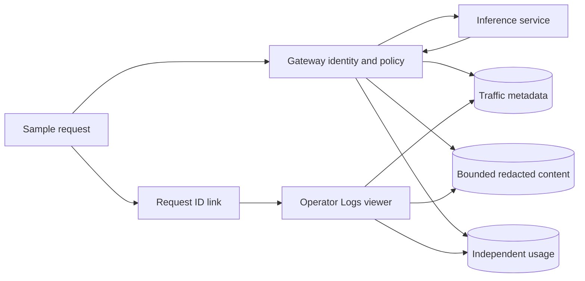

# Logging priority and development plan

## Product decision

Logging is the next product priority. The main showcase is an application calling
an inference service through the gateway, then finding its request ID in the console
and inspecting input, output, tokens, route, latency and final outcome. The default
SQLite application must deliver this without installing external services.

## Stage 1: local showcase — implemented

- Gateway-wide capture, bounded redaction and complete/streaming/partial outcomes.
- Schema-7 separate exchange content, metadata and usage with independent retention.
- Request-ID/application/outcome search, deterministic cursor pagination and readable
  input/output with captured JSON available in detail.
- Explicit disabled/expired/deleted/not-captured/not-produced/partial/truncated states.
- Metadata-only exports by default; explicit captured-content inclusion.
- Project-scoped content deletion preserving metadata/usage, and audited content/log deletion.
- Recording health showing failed/successful destination writes and recovery.
- Sample request link, 16 isolated HTTP scenarios and extended native package smoke.

Follow [logging showcase](runbooks/logging-showcase.md). Automated synthetic evidence
and remaining live/manual checks are recorded in [validation](validation.md).

## Stage 2: durable optional export — planned

Add a bounded SQLite outbox and exporter contract, then implement one exporter at a
time. Start with a testable webhook or Loki destination; OTLP follows its own adapter
and operations contract. Default exports contain sanitized metadata. Content export
needs an explicit setting and tested access/retention. Define delivery IDs,
at-least-once semantics, retry/backoff, capacity/expiry, restart recovery and failure
visibility. Remote failures must not block inference indefinitely or grow memory/disk
without bounds. Test crashes, disk failures, duplicate delivery and outages before
making durability claims. Current local sinks remain best effort.

## Stage 3: observability ecosystem — planned

Supply Grafana views, Prometheus alerts and correlated Loki browsing, then optional
managed profiles with provision/start/stop/readiness/backup/rollback. Docker remains
on demand until these service-specific checks are needed. Metrics contain aggregates;
request IDs and prompt text are not metric labels. See [ecosystem](ecosystem.md).

## Other development remains tracked

| Area | Remaining scope |
| --- | --- |
| Reliability | Provider health/circuit breaking, fallback, priorities/load balancing and multiple connections per adapter |
| Governance | Budgets, output policies, operator roles, project boundaries, master-key versions and remaining audit actions |
| Inference | Embeddings, tool calling, multimodal input and multiple choices |
| Providers | Anthropic, Bedrock, Azure OpenAI, Vertex AI and live evidence for existing adapters |
| Scaling/storage | Shared counters/cache/accounting, PostgreSQL and Vault adapters, content encryption/access roles |
| Framework | Stable extension interface/example adapter, client examples and configuration tooling |
| Distribution | Clean hosts, services/signing, cross-version rollback, final Docker packaging and tested cloud deployment |
| Public release | Provider support evidence, security/history/artifact review, reproducible builds and maintenance/release commitments |

These items remain in [backlog](backlog.md), [roadmap](roadmap.md) and
[lifecycle](lifecycle.md). Logging is the current sequence; this decision does not
remove other scope or treat deferred provider/release checks as completed.
