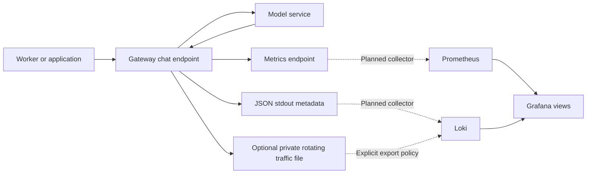

# Observability and LLM traffic

## What is recorded

Every POST to `/v1/chat/completions` produces one `llm_exchange` outcome event,
including auth failures, schema errors, policy rejections, provider errors, and
successful completions. A gateway-generated `X-Request-ID` links the response to
the event. Incoming IDs are not trusted or reused.

Events include schema version, start timestamp, project/app IDs, requested/resolved model,
provider, status, duration, guardrail action/reason, provider attempt, token usage,
and safe error category. Missing usage and unimplemented cost estimates are
`null`. Auth/validation failures may have no known app or model.

Project attribution comes from the authenticated app key, with a default project
for existing apps. A client cannot select a project through headers. Request-time
membership stays in events even if an app moves projects. The console adds project
filters, hourly UTC charts, and application/model breakdowns; cache hits do not
add provider-token consumption. Reports cover independently retained usage records and known usage,
with a separate count for provider requests without usage. They are not billing.
See [projects and usage](runbooks/projects-and-usage.md).

Metadata goes to JSON stdout when `observability.json_logs` is enabled.
Headers, credentials, client IPs, prompts, completions, and upstream exception
bodies are absent from this stream. Framework/server access logs are separate;
disable access logging or configure the proxy when URL privacy is required.

## Optional local traffic storage

A rotating JSONL file can retain metadata and, with explicit permission, the
request messages and returned completion choices. Each line is a complete event;
content fields contain bounded JSON text strings. A truncated field is marked
and may no longer be independently parseable as JSON.

Merge this example into your ignored configuration; retain each app's key,
allowlist, and other required settings:

```yaml
apps:
  - app_id: worker-test
    api_key: replace-with-a-private-app-key
    allowed_models: [auto, "ollama:llama3"]

observability:
  json_logs: true
  prometheus_metrics: true
  traffic_log:
    path: var/log/gateway/traffic.jsonl
    capture_content: true
    max_content_chars: 16384
    max_bytes: 10485760
    backup_count: 3
```

`traffic_log.capture_content` controls capture for all authenticated applications.
Legacy app capture fields do not gate logging.
Content capture also requires a private JSONL path or the enabled local control
plane. The shipped example leaves it disabled.
Content is retained only after authentication, final-model authorization, and
request guardrails pass. Failed upstream calls can retain the permitted request,
but do not store upstream error bodies.

The sink creates owner-only files (0600) and new leaf directories (0700) on
POSIX systems. It rejects existing broadly readable log files and symlink targets.
Rotation retains the active file plus the configured number of backups; this
bounds file count/size, not age. Use one gateway process per file. A record can
exceed the rotation threshold, so size is an approximate disk bound.

Known configured app/provider credentials and common bearer/key patterns are
redacted before truncation. This is not general PII or arbitrary-secret detection.
Free-form prompts and responses can still contain sensitive text: enable capture
only when the operator intends to capture authorized gateway traffic, and use
synthetic data during initial tests.

Native runs can use the relative `var/log/gateway/` path, ignored by Git and
Docker builds. Container files are ephemeral unless that path is mounted on a
private host directory or volume. No volume or remote collector is provisioned
automatically. See the [traffic logging runbook](runbooks/traffic-logging.md).

## Metrics

`GET /metrics` exposes:

- `m87_gateway_requests_total`
- `m87_gateway_request_latency_seconds`
- `m87_gateway_provider_requests_total`
- `m87_gateway_provider_errors_total`
- `m87_gateway_guardrail_blocks_total`
- `m87_gateway_tokens_total`
- `m87_gateway_log_sink_errors_total`
- `m87_gateway_cache_requests_total`
- `m87_gateway_provider_retries_total`
- `m87_gateway_rate_limit_rejections_total`
- `m87_gateway_concurrency_limit_rejections_total`

Events and console rows include cache status, provider attempts, and retries.
Cache hits retain original response usage for inspection but do not increment
provider token metrics or control-plane token totals. Failed retry attempts can
consume upstream tokens that are unavailable to the gateway.

Labels use configured app IDs, known providers, status codes, fixed guardrail
reasons, and token kinds. Request IDs, message text, and arbitrary model strings
are not labels. Adapter-attempt counters include calls that fail before sending
HTTP, such as missing provider credentials. Metrics are per process and reset
on restart; missing token usage contributes no token increments.

Set `prometheus_metrics: false` to disable recording and return 404 from the
endpoint. Keep the endpoint on the operator network; do not expose it through the
public tunnel route.

## Grafana, Loki, and future exporters

Prometheus collects numeric time-series metrics. Loki stores logs; Grafana can
query both. See the official [Prometheus overview](https://prometheus.io/docs/introduction/overview/)
and [Loki overview](https://grafana.com/docs/loki/latest/get-started/overview/).



The in-process `EventSink` protocol is the initial extension boundary. Implemented
sinks are rotating JSONL and the local SQLite control store. A later collector such as
Grafana Alloy or an OpenTelemetry Collector can ship sanitized events without
coupling provider requests to a remote logging service. Exporting captured content
needs a separate explicit destination, access, retention, and redaction policy.

## Reliability limits

Sink writes run in the thread pool after the response is sent. A write failure
increments the sink-error metric and emits a safe metadata error; it does not
turn a successful model response into a failed request. Logs are best effort:
disk failure, abrupt termination, or cancellation can lose an event. There is no
durable queue, replay, remote delivery, or exactly-once delivery. The local
SQLite store and search UI target one instance; provider credentials are encrypted,
while captured LLM content is protected by filesystem permissions rather than
field-level encryption.

The [local control plane](control-plane.md) provides request/token summaries,
event detail, bounded JSON export, key operations, and a destination inventory.

The gateway sees only traffic that passes through it. If the local machine,
Docker, or tunnel is down, a Worker/edge failure occurs before the gateway and
must be recorded at that layer. Streaming, embeddings, traces,
cost estimation, Loki/OTLP and remote content export remain planned. Optional sanitized
metadata webhook delivery is implemented.


## Stream and cancellation outcomes

Schema-5 traffic stores streaming, request_outcome, http_status_code and
response_content_partial. One outcome is emitted after the response lifecycle;
status_code is the final gateway status (including 499 cancellation), while
http_status_code is the actual committed wire status or null before headers.
A terminal SSE error can have wire 200 and final 502/504. Captured stream prefixes
are redacted before truncation and marked partial when interrupted; no partial
content enters stdout or metric labels. Missing final usage stays unknown.

m87_gateway_streams_total counts completed/failed/cancelled streams by provider;
m87_gateway_cancellations_total counts cancellations. Client cancellations are
excluded from provider-error counts. Usage received before interruption remains
charged to provider accounting. See [streaming operations](runbooks/streaming-and-cancellation.md).


## Management and storage visibility

Management audit includes configuration, controls, setup, connections, restore and
provider-key changes with safe provider/alias/revision references. Select All projects
to see gateway-wide actions; actor remains the shared operator role. No credential
values, settings bodies or inference content are stored in this audit.
Storage health provides basic access/privacy/credential checks and operator-triggered
SQLite integrity/reversible write verification, sizes and free space. It does not
repair data or prove upstream connectivity. See [recovery operations](runbooks/configuration-recovery.md).


## Local logging showcase

Schema 7 separates exchange content from traffic metadata and usage. Logs now
provide exact request/application/outcome filters, deterministic cursor paging,
readable input/output with captured JSON, separate token counts and explicit capture
states. Metadata-only exports are the default; content requires explicit inclusion.
Content retention defaults to 30 days and is independent of metadata/usage.
`/admin/api/logging-health` reports private destination write failures/recovery even
when metrics are disabled. Process counters reset on restart; recording remains best
effort. See [showcase runbook](runbooks/logging-showcase.md) and [logging plan](logging-plan.md).

## Persistent metadata webhook export

An optional bounded SQLite outbox stores allowlisted redacted metadata alongside the
traffic/usage transaction. A background webhook worker uses stable delivery IDs,
leases and persisted backoff; failures do not wait on inference. Queue counts and
last success/failure times appear in Logs and `/admin/api/logging-health`, without
endpoints or credentials. Input/output remain local. At-least-once delivery within
capacity/expiry requires receiver deduplication. See [export runbook](runbooks/log-export.md)
for the example receiver, both launcher configurations and backup/replay boundaries.
