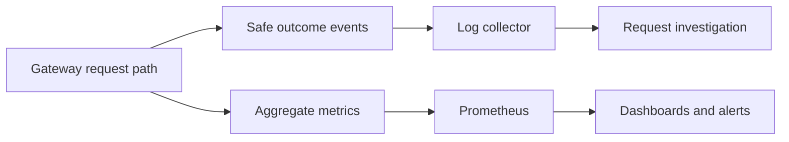

# Observability

## Current behavior

The gateway emits `request_received` and `guardrail_block` audit events. The
standard Python logging formatter wraps a JSON-serialized message, so the complete
output line is not yet plain JSON. Redaction checks selected top-level field names.

There are no request IDs, full outcome logs, latency/usage metrics, cost estimates,
traces, or `/metrics` endpoint. Observability configuration flags are currently
unused. Do not deploy collectors assuming these interfaces already exist.

## Target signals

| Signal | Intended use | Milestone |
| --- | --- | --- |
| Request ID | Correlate client response and internal events | Local MVP completion |
| Outcome log | App, provider, requested/resolved model, status, latency, policy result, safe error category | Basic MVP; complete in 0.2 |
| Prometheus metrics | Request counts/latency, provider failures, guardrail blocks, token usage | Minimal MVP; complete in 0.2 |
| Usage/cost estimate | Understand usage with explicit missing-data and pricing semantics | 0.2 |
| Distributed traces | Diagnose multi-service latency | Evaluate after core signals |

Do not place API keys, prompt text, completion text, or personal data in default
logs. Keep metric labels bounded; request IDs belong in logs/traces, not labels.
Distinguish estimated costs from provider billing and unavailable usage from zero usage.

This diagram is a target design. The Grafana example remains a placeholder.
Use [provider troubleshooting](runbooks/provider-troubleshooting.md) and
[incident response](runbooks/incident-response.md) for current diagnostic steps.
