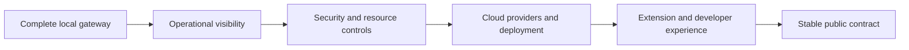

# Roadmap

The destination is a public, self-hostable gateway framework with a stable core
and supported provider adapters. Releases follow acceptance criteria rather than
calendar promises. See [design](design.md) for scope and [lifecycle](lifecycle.md)
for release gates.

## End-product vision: full gateway ecosystem

Deliver a full AI gateway ecosystem through one setup and operations experience.
Users should connect inference, manage projects and application keys, test APIs,
browse exchanges, inspect tokens/usage, and use dashboards. The application should
also configure and manage selected Grafana, Prometheus, logging, Vault, and future
service containers rather than requiring users to assemble the ecosystem manually.
Detect/start supported container engines through explicit platform integration
when authorized; keep the built-in local features usable without containers.
Source users can extend providers, secret stores, exporters, and service lifecycle
adapters. See [ecosystem design](ecosystem.md).

### Projects and built-in operations

- [x] Add persistent projects and application-key membership.
- [x] Attribute events from authenticated keys and preserve historical project usage.
- [x] Filter dashboard, logs, and exports by project; show hourly requests/tokens
  and per-application/per-model breakdowns without counting cache hits as new tokens.
- [x] Add a console API tester using the normal authenticated gateway path.
- Add project policy/budget controls, longer-term accounting, operator roles,
  and tested access boundaries before promising tenant isolation or billing.

### Managed ecosystem services — planned

- Define extensible service profiles and lifecycle adapters with versioned images,
  resource/storage plans, credentials, readiness, and upgrade/rollback contracts.
- Add container-engine detection and approved platform startup, then start/status/
  stop controls for only the gateway-owned services. Existing engines can be reused.
- Provision Grafana/Prometheus and log collection/storage, with preconfigured
  dashboards, request correlation, sanitized events, and tested retention behavior.
- Add a secret-store adapter for an existing or managed Vault service, including
  secure initialization/unseal or workload identity, scoped access, and recovery.
- Add browser service links, health/resource reporting, backups, selective shutdown,
  and clear recovery for unavailable services without disrupting core inference.
- Verify workstation/cloud behavior and publish service-specific runbooks before
  advertising automatic setup. Docker-in-WSL checks remain on demand.

**Exit:** a user can choose a supported service profile in setup, see its resource
requirements, provision and start it, use configured dashboards/logs/secrets,
restart without losing data, stop only that profile, and recover or roll back
through documented procedures. No plaintext secrets or captured prompts appear
in metrics, process arguments, generated manifests, or default logs.

## Phase 1: gateway controls and sample acceptance — implemented locally

- [x] Edit managed application rate and concurrency limits without replacing keys.
- [x] Add a gateway concurrency cap and configurable request/message bounds.
- [x] Manage cache, retry, SQLite retention, and capture limits through Controls.
- [x] Persist controls and use them after restart; clear cache on configuration updates.
- [x] Separate `/health` liveness from `/ready` configuration/storage readiness.
- [x] Show actionable checks and keep live connectivity discovery explicit.
- [x] Add confirmed, project-scoped SQLite log deletion and truncation indicators.
- [x] Exercise nine isolated sample → gateway → synthetic inference scenarios.

See [controls acceptance runbook](runbooks/gateway-controls-testing.md). Live Ollama
failure/recovery exercises, visual browser checks, Docker and cloud validation
remain separate evidence requirements. Limits/cache are per process; budgets,
shared enforcement and remote exporters are follow-up milestones.

## Phase 2: portable workstation preview — implementation and verification

- [x] Build native Linux and Windows preview executables, ZIPs, manifests and checksums.
- [x] Add portable start/stop/status helpers and optional browser launch.
- [x] Add private platform storage, a data-directory lock, and verified instance identity.
- [x] Add encrypted offline backup and restore into a fresh directory.
- [x] Version the database schema and reject newer schemas before migration.
- [x] Document upgrade verification and backup-based rollback.
- [x] Add native executable backup/restore/inference and platform safety CI checks.
- [x] Verify native Windows/Linux CI builds, platform safety and packaged recovery smoke.
- Verify clean Windows/Linux workstations and native Windows Ollama/browser behavior
  before declaring general workstation support.
- Verify rollback across distinct released artifacts and complete signing/release review.

Version `0.1.1.dev0` identifies this development preview. The historical `v0.1.0`
tag is unchanged; no public release is created by these builds. See
[workstation runbook](runbooks/workstation-distribution.md) and validation records.

## Phase 3: single-container distribution — implemented and verified in hosted CI

- [x] Run the gateway, setup UI and embedded persistence in one non-root image.
- [x] Provide image-based Docker run and Compose startup on localhost:8087.
- [x] Keep credentials and logs in a private persistent volume; hide operator keys from stdout.
- [x] Document host/network/remote inference endpoints, lifecycle and recovery.
- [x] Gate immutable image publication and durable preview downloads on CI checks.
- [x] Verify hosted Docker run/Compose, host inference, completion/token/capture,
  recreation and graceful shutdown; exact commit recorded in validation.
- Verify Windows Docker Desktop with live Ollama, container backup/restore,
  clean-host pull and setup, signing, ARM and cloud hosting separately.

This phase is an additional setup option. It does not provision model servers or
managed Grafana/Vault profiles. See [container runbook](runbooks/container-deployment.md)
and [validation](validation.md). Current private access is preserved until public
release review; development preview publication does not establish production readiness.

## Next product milestone: guided setup and standalone distribution

Prioritize the first-run experience alongside completion of core controls:

- [x] Add draft connection testing with safe reachability/timeout/rejection feedback,
  no persistence changes and stored-credential endpoint protection.
- [x] Add guided console setup for provider connections, model discovery, default
  selection, and application-key creation; launcher supplies private operator access.
- [x] Add a generic OpenAI-compatible text adapter and source adapter registration;
  live vLLM verification and Anthropic/Bedrock adapters remain follow-up work.
- [x] Manage provider connections, models, app rate/concurrency policies, retention,
  and traffic controls through the included UI with validated, persistent updates.
- [x] Show the current text/non-streaming contract, configuration readiness, and
  explicit model-discovery connectivity diagnostics.
- Build the runtime, UI, and embedded persistence as native platform artifacts;
  native preview builders and CI paths exist, with clean-host verification pending.
- [x] Implement platform-private credentials, encrypted backup/restore, native lifecycle
  and artifact checksums. OS services, signing and cross-release rollback remain gates.
- Publish short workstation and single-server cloud setup instructions.

**Exit:** on a clean supported workstation without Python or Docker, a user can
launch the gateway, connect an existing supported model service through the UI,
create an app key, send a request, and inspect usage and logs. The same application
can run on a supported cloud host with documented networking and credentials.
External inference services and cloud accounts are user-supplied prerequisites.

## Current baseline

The repository contains validated configuration, bearer-key authentication,
requested/resolved-model authorization, deterministic rules, non-streaming
OpenAI/Ollama text chat, configured request guardrails, safe upstream errors,
request IDs, JSON outcome events, an optional private rotating traffic file,
Prometheus metrics, and a local SQLite control plane with token analytics,
opted-in exchange inspection, application keys, encrypted provider keys, and an
operator console. The repository also includes Docker files and an expanded test suite. A
native Windows/WSL flow has also returned a real Ollama completion. Mocked tests
alone do not establish provider compatibility, and live tunnel/container-provider
behavior remains unverified. Hosted container flow is verified with synthetic inference.

The historical `v0.1.0` tag points to the initial scaffold. Preserve published
tags. The next release must use a new version and document the capabilities it
actually verifies. Package metadata alone does not indicate release readiness.

## Local MVP completion — next 0.1.x release

- [x] Wire provider and guardrail configuration into runtime behavior.
- [x] Validate provider/model identifiers and authorize resolved `auto` targets.
- [x] Define the supported text chat API subset and reject unsupported options clearly.
- [x] Normalize provider errors and define missing-credential behavior.
- [x] Preserve message semantics and supported generation settings in both initial adapters.
- [x] Add request IDs, outcome logs, optional traffic capture, and `/metrics`.
- [x] Add a local console for request/token analytics and opted-in exchange inspection.
- [x] Add runtime application-key lifecycle and encrypted local OpenAI-key storage.
- [x] Verify the native gateway path against a reachable Ollama model.
- Verify the documented Docker quickstart against a reachable Ollama endpoint and an OpenAI route.
- Verify a Worker/tunnel/non-streaming Ollama request using the reference integration.
- [x] Add guardrail, provider, failure, configuration, logging, and packaging checks.

**Exit:** a new user can follow the quickstart, authenticate, receive a real model
response, inspect safe logs and metrics, and reproduce the documented failure
cases. CI and the release runbook pass. Provider smoke checks are opt-in and use
maintainer-supplied credentials; ordinary tests make no billable calls.

## 0.2 — Operational visibility

- Stabilize the audit event schema and request ID propagation contract.
- Evolve the local console and event store from developer preview using operator feedback.
- Add dashboard/alert guidance for the implemented latency, outcome, provider
  error, guardrail, token usage, and log-sink metrics.
- Add explicitly labeled cost estimates with documented pricing maintenance.
- Supply a usable Grafana example and structured log ingestion guidance.
- [x] Define configuration/storage readiness separately from liveness; keep live
  provider connectivity and completion checks explicit.

**Exit:** operators can trace a failed request and distinguish gateway failures
from provider failures without accessing full prompts or credentials.

## 0.3 — Security and resource controls

- [x] Enforce configured request size and message limits.
- [x] Enforce per-app rate limits within one process; shared enforcement remains planned.
- Define budget accounting and enforcement before claiming budget support.
- Add key rotation guidance and configuration validation at startup.
- Introduce additional identity or policy mechanisms only with a concrete use case.
- Document trust boundaries, sensitive-data handling, and security reporting.

**Exit:** negative tests show that authorization, size limits, and configured
resource controls fail closed. Operators can rotate an app key and investigate
rejections using documented procedures.

## 0.4 — Cloud providers and deployment

- Add AWS Bedrock, Azure OpenAI, and Google Cloud Vertex AI adapters.
- Add Anthropic access through its own adapter.
- Define capability reporting and credential configuration for every adapter.
- Prefer platform workload identity where the chosen service supports it.
- Validate a container deployment path on each major cloud.
- Turn Kubernetes and Terraform placeholders into runnable examples only when tested.

**Exit:** every advertised integration passes shared contract tests, an opt-in
live smoke check, and documented configuration/error cases. Every advertised
deployment has recorded startup, health, request, and rollback evidence.

## 0.5 — Framework and developer experience

- Stabilize the provider extension interface and publish a minimal adapter example.
- Add configuration validation tooling and JavaScript/Python client examples.
- Introduce streaming, tools, or multimodal support through explicit capability contracts.
- [x] Add opt-in exact-response caching and bounded transient retries.
- Add authorized fallback routes and shared state.
- Document migration paths and extension compatibility.

**Exit:** an external developer can implement an adapter and validate it using
the documented contract suite without changing gateway routing or authentication.

## 1.0 — Stable public contract

- Stabilize the API, configuration schema, and extension interface.
- Complete provider/deployment support tables with versioned evidence.
- Publish upgrade, rollback, security, and operational guidance.
- Resolve release-blocking defects and complete a security review.
- Document supported versions and a realistic maintenance policy.

**Exit:** all [public release gates](lifecycle.md) pass. Public preview releases
may happen earlier when the same gates are satisfied for a smaller declared scope.

## Provider support targets

| Integration | State | Next requirement |
| --- | --- | --- |
| OpenAI | Partial adapter | Live compatibility checks and capability matrix |
| Ollama | Partial adapter | Live/container/tunnel checks and streaming later |
| OpenAI-compatible server | Partial text adapter | Live vLLM/server checks; non-streaming only |
| Anthropic | Planned | Adapter, contract tests, credential and operations guide |
| AWS Bedrock | Planned | Adapter, cloud credentials, contract and live smoke checks |
| Azure OpenAI | Planned | Adapter, deployment/model mapping, contract and live smoke checks |
| Google Cloud Vertex AI | Planned | Adapter, project/location configuration, contract and live smoke checks |

No cloud platform or additional provider is supported merely because it appears
in this table. Deployment coverage is tracked separately in [stack](stack.md).
