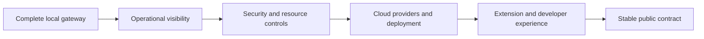

# Roadmap

The destination is a public, self-hostable gateway framework with a stable core
and supported provider adapters. Releases follow acceptance criteria rather than
calendar promises. See [design](design.md) for scope and [lifecycle](lifecycle.md)
for release gates.

## Current baseline

The repository contains validated configuration, bearer-key authentication,
requested/resolved-model authorization, deterministic rules, non-streaming
OpenAI/Ollama text chat, configured request guardrails, safe upstream errors,
request IDs, JSON outcome events, an optional private rotating traffic file,
Prometheus metrics, and a local SQLite control plane with token analytics,
opted-in exchange inspection, application keys, encrypted OpenAI keys, and an
operator console. The repository also includes Docker files and an expanded test suite. A
native Windows/WSL flow has also returned a real Ollama completion. Mocked tests
alone do not establish provider compatibility, and tunnel behavior and container
deployment remain unverified.

The historical `v0.1.0` tag points to the initial scaffold. Preserve published
tags. The next release must use a new version and document the capabilities it
actually verifies. Package metadata alone does not indicate release readiness.

## Local MVP completion — next 0.1.x release

- [x] Wire provider and guardrail configuration into runtime behavior.
- [x] Validate provider/model identifiers and authorize resolved `auto` targets.
- [x] Define the supported text chat API subset and reject unsupported options clearly.
- [x] Normalize provider errors and define missing-credential behavior.
- [x] Preserve message semantics and supported generation settings in both initial adapters.
- [x] Add request IDs, outcome logs, optional traffic capture, and `/metrics`.
- [x] Add a local console for request/token analytics and opted-in exchange inspection.
- [x] Add runtime application-key lifecycle and encrypted local OpenAI-key storage.
- [x] Verify the native gateway path against a reachable Ollama model.
- Verify the documented Docker quickstart against a reachable Ollama endpoint and an OpenAI route.
- Verify a Worker/tunnel/non-streaming Ollama request using the reference integration.
- [x] Add guardrail, provider, failure, configuration, logging, and packaging checks.

**Exit:** a new user can follow the quickstart, authenticate, receive a real model
response, inspect safe logs and metrics, and reproduce the documented failure
cases. CI and the release runbook pass. Provider smoke checks are opt-in and use
maintainer-supplied credentials; ordinary tests make no billable calls.

## 0.2 — Operational visibility

- Stabilize the audit event schema and request ID propagation contract.
- Evolve the local console and event store from developer preview using operator feedback.
- Add dashboard/alert guidance for the implemented latency, outcome, provider
  error, guardrail, token usage, and log-sink metrics.
- Add explicitly labeled cost estimates with documented pricing maintenance.
- Supply a usable Grafana example and structured log ingestion guidance.
- Define readiness separately from liveness; document incident diagnosis.

**Exit:** operators can trace a failed request and distinguish gateway failures
from provider failures without accessing full prompts or credentials.

## 0.3 — Security and resource controls

- [x] Enforce configured request size and message limits.
- [x] Enforce per-app rate limits within one process; shared enforcement remains planned.
- Define budget accounting and enforcement before claiming budget support.
- Add key rotation guidance and configuration validation at startup.
- Introduce additional identity or policy mechanisms only with a concrete use case.
- Document trust boundaries, sensitive-data handling, and security reporting.

**Exit:** negative tests show that authorization, size limits, and configured
resource controls fail closed. Operators can rotate an app key and investigate
rejections using documented procedures.

## 0.4 — Cloud providers and deployment

- Add AWS Bedrock, Azure OpenAI, and Google Cloud Vertex AI adapters.
- Add Anthropic access through its own adapter.
- Define capability reporting and credential configuration for every adapter.
- Prefer platform workload identity where the chosen service supports it.
- Validate a container deployment path on each major cloud.
- Turn Kubernetes and Terraform placeholders into runnable examples only when tested.

**Exit:** every advertised integration passes shared contract tests, an opt-in
live smoke check, and documented configuration/error cases. Every advertised
deployment has recorded startup, health, request, and rollback evidence.

## 0.5 — Framework and developer experience

- Stabilize the provider extension interface and publish a minimal adapter example.
- Add configuration validation tooling and JavaScript/Python client examples.
- Introduce streaming, tools, or multimodal support through explicit capability contracts.
- [x] Add opt-in exact-response caching and bounded transient retries.
- Add authorized fallback routes and shared state.
- Document migration paths and extension compatibility.

**Exit:** an external developer can implement an adapter and validate it using
the documented contract suite without changing gateway routing or authentication.

## 1.0 — Stable public contract

- Stabilize the API, configuration schema, and extension interface.
- Complete provider/deployment support tables with versioned evidence.
- Publish upgrade, rollback, security, and operational guidance.
- Resolve release-blocking defects and complete a security review.
- Document supported versions and a realistic maintenance policy.

**Exit:** all [public release gates](lifecycle.md) pass. Public preview releases
may happen earlier when the same gates are satisfied for a smaller declared scope.

## Provider support targets

| Integration | State | Next requirement |
| --- | --- | --- |
| OpenAI | Partial adapter | Live compatibility checks and capability matrix |
| Ollama | Partial adapter | Live/container/tunnel checks and streaming later |
| Anthropic | Planned | Adapter, contract tests, credential and operations guide |
| AWS Bedrock | Planned | Adapter, cloud credentials, contract and live smoke checks |
| Azure OpenAI | Planned | Adapter, deployment/model mapping, contract and live smoke checks |
| Google Cloud Vertex AI | Planned | Adapter, project/location configuration, contract and live smoke checks |

No cloud platform or additional provider is supported merely because it appears
in this table. Deployment coverage is tracked separately in [stack](stack.md).
