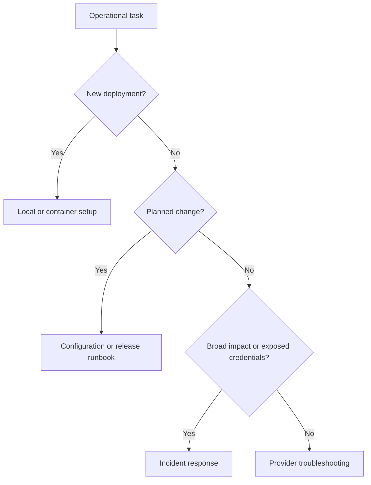

# Runbooks

These procedures describe the current gateway unless a step is explicitly marked
as a release requirement. Run commands from the repository root. Use synthetic
prompts and private credentials; redact logs before attaching them to issues.

| Runbook | Use when |
| --- | --- |
| [Local development](local-development.md) | Installing, testing, or starting a development instance |
| [Container deployment](container-deployment.md) | Starting a single gateway container and checking provider connectivity |
| [Configuration changes](configuration-changes.md) | Changing routes or rotating an app key |
| [Provider troubleshooting](provider-troubleshooting.md) | A chat request fails or returns unexpected behavior |
| [Traffic logging](traffic-logging.md) | Enable and inspect bounded private LLM request/response records |
| [Incident response](incident-response.md) | Requests fail broadly or credentials may be exposed |
| [Release](release.md) | Preparing, publishing, or rolling back a version |

## Runbook standard

Each procedure must state its trigger, prerequisites, steps, success checks, and
recovery path. Update it in the same change as the behavior it describes.
Cloud-specific deployment, data migration, backup, and restore runbooks will be
added when those capabilities exist.

