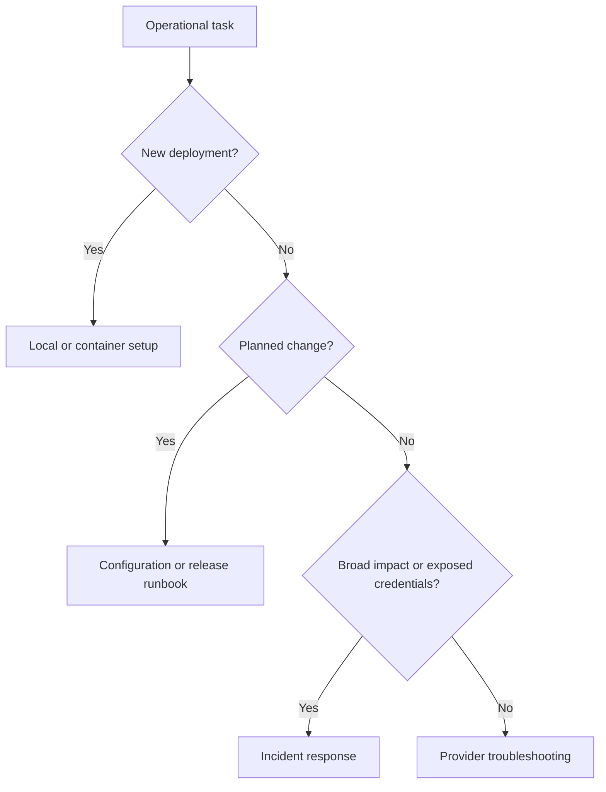

# Runbooks

These procedures describe the current gateway unless a step is explicitly marked
as a release requirement. Run commands from the repository root. Use synthetic
prompts and private credentials; redact logs before attaching them to issues.

| Runbook | Use when |
| --- | --- |
| [Local development](local-development.md) | Installing, testing, or starting a development instance |
| [Portable workstation preview](workstation-distribution.md) | Native artifacts, lifecycle, encrypted backup/restore and upgrade checks |
| [Guided setup](guided-setup.md) | Start the included console, configure inference, or build the experimental Linux executable |
| [Gateway controls acceptance](gateway-controls-testing.md) | Configure controls and run isolated sample failure/recovery scenarios |
| [Projects and usage](projects-and-usage.md) | Create projects, inspect usage, move applications, and use the API tester |
| [Windows/WSL flow lab](windows-wsl-flow-lab.md) | Exercise browser, relay, gateway, and Windows Ollama without Docker |
| [Container deployment](container-deployment.md) | Starting a single gateway container and checking provider connectivity |
| [Configuration changes](configuration-changes.md) | Changing routes or rotating an app key |
| [Provider troubleshooting](provider-troubleshooting.md) | A chat request fails or returns unexpected behavior |
| [Traffic controls](traffic-controls.md) | Configure and verify per-app limits, cache, and retries |
| [Traffic logging](traffic-logging.md) | Enable and inspect bounded private LLM request/response records |
| [Local control plane](control-plane.md) | Inspect usage and exchanges; manage local application/provider keys |
| [End-to-end flow testing](end-to-end-flow-testing.md) | Verify Worker, Access, Tunnel, gateway, Ollama, logs, and metrics |
| [Incident response](incident-response.md) | Requests fail broadly or credentials may be exposed |
| [Release](release.md) | Preparing, publishing, or rolling back a version |

## Runbook standard

Each procedure must state its trigger, prerequisites, steps, success checks, and
recovery path. Update it in the same change as the behavior it describes.
Cloud-specific deployment, data migration, backup, and restore runbooks will be
added when those capabilities exist.

- [Backend storage acceptance](backend-storage-testing.md): repository contracts,
  independent usage, schema upgrades and future external-adapter gates.

- [Application-key rotation](application-key-rotation.md): key overlap, expiry,
  revocation and management audit.

- [Inference API and queueing](inference-api-and-queueing.md): catalog, parameter mapping, admission/recovery and test commands.

- [Streaming and cancellation](streaming-and-cancellation.md): SSE, sample Stop, partial capture, cleanup and live validation.

- [Configuration recovery and storage health](configuration-recovery.md): settings history/restore, management audit and safe storage verification.
