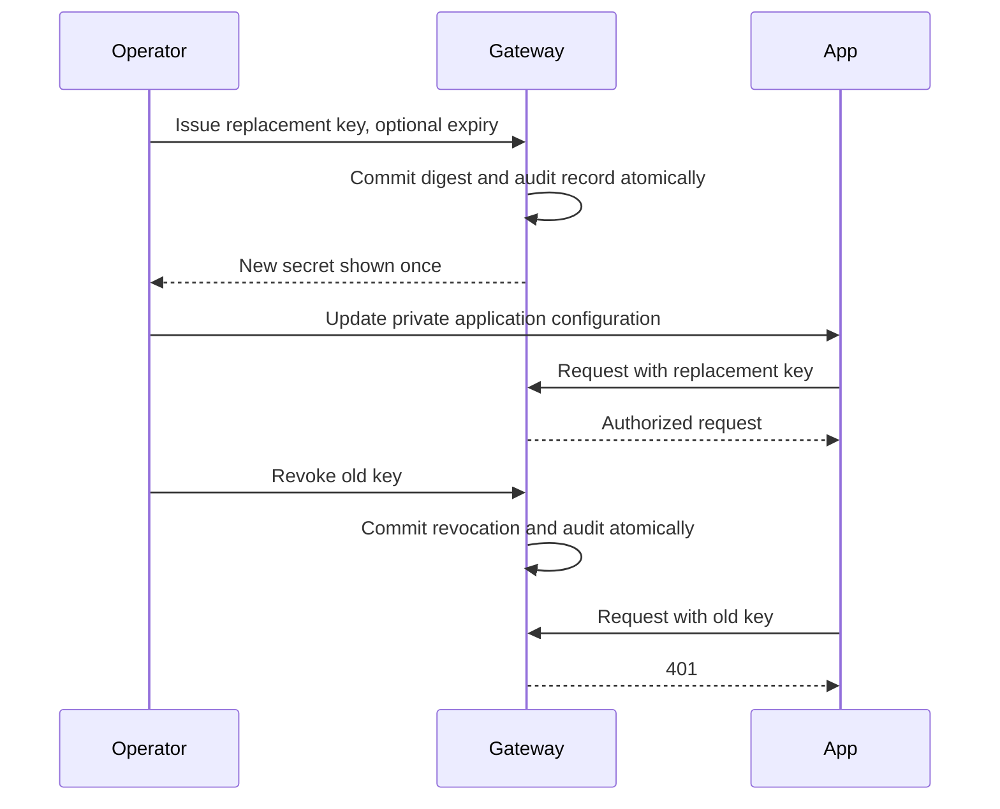

# Application-key rotation and management audit

## Requirements and scope

Use the included console with its operator key. These operations manage database
applications created under Applications. YAML/environment application keys remain
bootstrap configuration; remove or replace those keys in their source settings.
Provider keys and the local master/operator keys have separate lifecycles.

## Planned replacement with overlap

1. Open **Applications → Manage keys** for the calling application.
2. Enter optional expiry in days (1–3650). Leave immediate revocation unchecked.
3. Create the replacement and copy the secret displayed once. Store it in the
   calling application's private configuration. The gateway stores its digest.
4. Update/restart the caller and send a synthetic request with the replacement.
5. Revoke the old key from the application's key list. Confirm another request
   with that old key is rejected while the replacement still works.
6. Open **Management audit** to inspect the issuance/revocation references.



All keys share application model permissions, project attribution, rate limits and
concurrency limits. Rotation does not reset application counters or duplicate
usage. Up to ten unrevoked, unexpired keys may coexist. Expired keys do not consume
that bound. The last key can be revoked; the application and its settings remain,
and an operator can issue a new key later. Deleting the application removes all
its keys while retaining logs, usage and administrative audit records.

## Immediate replacement and expiry

Immediate revocation creates the replacement and revokes existing active keys in
one transaction. The console requires confirmation because callers using those
keys lose access on their next authentication. Already admitted requests continue.
A failed transaction leaves existing keys valid. Expiry uses gateway UTC time and
is checked at authentication; no background job is needed to reject an expired key.
Initial and migrated keys have no expiry. New replacement keys expire only when
requested; expiry is relative to creation time. Revocation retries are idempotent.

If the response containing a secret is lost, the secret cannot be retrieved.
Inspect the new key's metadata, revoke it, and issue another. Repeating issuance
creates another key; issuance does not yet support an idempotency token. The UI
clears secrets when locked and ignores late responses from a prior session.

## Operator API

All endpoints below require the operator bearer key. Use a client that reads
credentials from private configuration; do not place them in shell history.

| Method and path | Result |
| --- | --- |
| `GET /admin/api/apps/{app_id}/keys` | IDs, prefixes, timestamps and active/revoked/expired state; no secrets/digests |
| `POST /admin/api/apps/{app_id}/keys` | New key; optional `expires_in_days` and `revoke_existing` (default false) |
| `DELETE /admin/api/apps/{app_id}/keys/{key_id}` | Revoke that app's key; repeated revocation returns success |
| `DELETE /admin/api/apps/{app_id}` | Delete the application and all credentials |
| `GET /admin/api/management-events` | Recent identity changes; optional `project_id` and `limit` (1–1000) |

Unknown applications/keys return 404. Invalid issuance settings return 422; the
active-key bound returns 409. Admin responses have `Cache-Control: no-store`.

## Management audit

SQLite records successful project creation and managed application creation,
project/model/limit changes, key issuance/revocation, and application deletion.
Changes and audit entries commit together. Entries contain a generated event ID,
UTC timestamp, action, project/app/key references and the shared `operator` actor.
The actor is a role, not an individual identity. Records exclude raw credentials,
digests, prompts and completions. Migration does not invent historical actions.

Audit retention defaults to 365 days. Set
`control_plane.management_audit_retention_days` in YAML or
`GATEWAY_MANAGEMENT_AUDIT_RETENTION_DAYS` for YAML/native startup. Pruning runs at
startup and audited writes. The current UI displays the latest 250 entries in the
selected project scope. There is no idle pruning timer. Traffic deletion preserves
these records. Audit is local administrative history, not a tamper-proof ledger.
Configuration/provider-key changes, failed admin attempts, individual operator
identity and remote export remain future work. Revoked key metadata remains until
application deletion; key-history pagination/retention is also future work.

## Verification and upgrade

Run isolated synthetic acceptance tests:

```bash
.venv/bin/pytest -q tests/test_application_keys.py tests/test_backend_contracts.py tests/test_gateway_controls.py tests/test_backup_workstation.py
.venv/bin/python -m examples.chat_app.scenarios
node --test tests/console/*.test.mjs
```

The sample suite exercises replacement access, overlap, old-key revocation and
continued inference without changing a running gateway. Repository/HTTP tests
cover expiry, shared rate limits, concurrent issuance bounds, scoped revocation,
secret-free metadata, transactional rollback, restart and schema migration.

Before upgrading an existing store, stop its gateway and take an encrypted backup
with the current binary. Schema 3 migrates combined application/key records into
separate `applications` and `app_keys` tables, preserving digests, policies, project
membership, provider credentials and usage. A migrated active key stays active;
inactive applications remain inactive. Schema-1/2 binaries reject schema 3. Restore
an earlier backup into a fresh private directory for rollback; see
[backend storage acceptance](backend-storage-testing.md). Native and Docker stores
remain separate, and Docker packaging is deferred.
