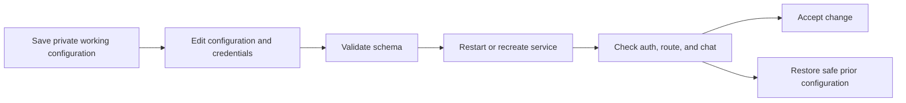

# Configuration changes and app-key rotation

## Trigger and prerequisites

Use this procedure for changing an app key, allowlist, default model, or provider
endpoint. Keep a private copy of the known working configuration. Know which
clients use the key and which providers/models are reachable.

Settings are cached per process. Changes require a restart; changing a file alone
does not reload the running service.

## Procedure

1. Identify the actual configuration file and environment overrides using
   [configuration](../configuration.md). Do not print the full runtime environment.
2. Edit the ignored configuration or secret source. For the shipped
   `auth.api_keys` example, `GATEWAY_APP_API_KEY` overrides the first entry's `key`.
   The alternative `apps`/`api_key` spelling has override limitations; edit that
   entry directly until override behavior is corrected.
3. For a model change, put both `auto` and the concrete target in the app's
   allowlist. The runtime does not yet re-authorize the resolved `auto` target.
4. Validate the configuration in the same environment as the application. For a
   local virtual environment, load `.env` without printing settings:

   ```bash
   python - <<'PY'
   from dotenv import load_dotenv
   from m87_gateway.config import load_settings

   load_dotenv()
   load_settings()
   print("Configuration schema accepted")
   PY
   ```

   Validation errors may include input values; review them locally. Schema
   acceptance does not prove that every setting is enforced or a provider is reachable.
5. Coordinate app-key updates with callers. There is no dedicated key-rotation
   API or automatic grace period; a single-key change can interrupt old clients.
6. Restart the process, or recreate the Compose service to apply environment changes:

   ```bash
   docker compose up -d --force-recreate
   ```

## Success checks

- Health returns 200 and a request with the new key succeeds.
- An invalid key returns 401; after rotation, the retired key also returns 401.
- A disallowed concrete model returns 403.
- `auto` reaches the intended provider/model.

## Rollback

Restore the previous configuration and recreate/restart the service. Coordinate
any credential rollback with clients. Never restore a key that was rotated because
it was exposed; use a new key and follow [incident response](incident-response.md).


