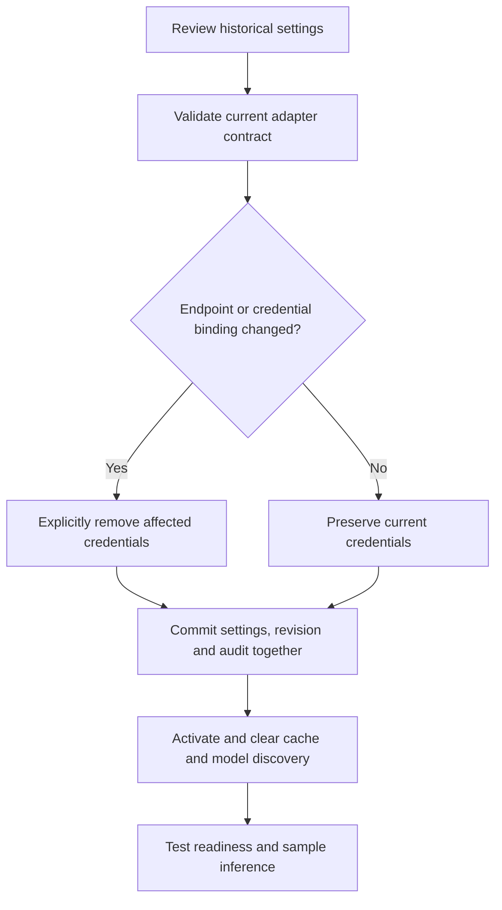

# Configuration history and storage recovery

## Trigger and prerequisites

Use this procedure to undo a console settings change, inspect management changes,
or investigate local storage failures. Start the source gateway with `./start.sh`,
open the printed console URL, and use the private operator key. These operations
require operator access; application keys cannot use them. Keep Docker deferred
unless explicitly testing container packaging.

Before upgrading, stop the gateway and create an encrypted backup using the
[workstation procedure](workstation-distribution.md). Schema 6 adds encrypted
configuration revisions, a reversible write-probe table and optional audit reference
columns. Existing keys, traffic, usage and audit records are preserved. An older
binary rejects schema 6; binary rollback requires restoring its compatible backup
into a fresh private destination. Never delete the master key to fix a startup error.

## Review and restore settings

1. Open **Configuration history**. The gateway retains the latest 100 revisions,
   with creation time, action and the original revision when restored.
2. Choose **Review and restore**. Inspect the displayed settings before activating.
   History covers provider configuration, default model, gateway-wide capture,
   cache/retry/queue/limits, request bounds, traffic retention and capture bounds.
3. If provider endpoints or credential environment bindings change, select the
   explicit credential-removal checkbox. Every stored alias for affected providers
   is deleted; historical environment bindings are disabled. Re-enter credentials
   in **Setup** afterward. No old provider key or revoked application key is restored.
4. Type `RESTORE`, then choose **Restore settings**. A new revision is committed
   with settings, any credential removal and audit records in one SQLite transaction.
   New requests use the restored settings; arrival snapshots of existing requests
   remain in use. Cached responses and discovered model snapshots are cleared.
5. Check **Setup**, **Controls** readiness and the sample app. Submit a synthetic
   prompt and inspect its logs and reported token usage.

Unchanged endpoint/binding settings preserve the current provider credentials,
including keys rotated after the historical revision. This is settings rollback,
not secret rollback. Application policies/keys, logs, usage, bootstrap listening
address/storage/operator identity and arbitrary YAML edits are outside this history.
The initial baseline captures effective settings when history is first initialized;
it does not rewrite the source configuration. Subsequent edits outside the console
are not audited by this feature.

Restore does not recover deleted logs or undo provider work. Restoring retention
settings may cause pruning on subsequent traffic or restart. A disk/key/database
failure requires offline backup recovery, not configuration rollback.



## API and concurrent edits

Operator API endpoints:

| Endpoint | Purpose |
| --- | --- |
| `GET /admin/api/configuration/revisions` | Latest 100 metadata records and current revision |
| `GET /admin/api/configuration/revisions/{id}` | Review settings and affected provider bindings |
| `POST /admin/api/configuration/revisions/{id}/restore` | Validated restore with confirmation and revision precondition |
| `GET /admin/api/storage` | Basic private-file, database and credential checks with sizes/free space |
| `POST /admin/api/storage/check` | Also verify SQLite integrity, foreign keys, revision encryption and reversible write access |
| `GET /admin/api/management-events` | Bounded operator audit with optional project filter |

A restore body is:

```json
{
  "expected_revision": 7,
  "confirmation": "RESTORE",
  "clear_changed_credentials": false
}
```

`expected_revision` must match the current revision; an intervening save returns
409 without activation. `GET /admin/api/setup` and `/controls` also return an ETag.
Pass it as `If-Match` to settings/controls/connection PUTs for the same protection.
The console does this automatically. Older clients that omit the header keep
last-write-wins behavior. On conflict, cancel the review, refresh, inspect the
latest values and retry intentionally. Missing/pruned history returns 404;
unreadable snapshots return safe 503 responses. Incompatible revisions are rejected.

## Audit and storage checks

Open **Management audit**, select **All projects** to include gateway-wide changes.
Configuration, controls, setup, connection updates, restore and provider-key save/
delete records include safe provider/alias/revision references. Existing identity
changes remain available. Actor identifies the shared `operator` role. Records
exclude credential values, settings bodies and inference content. Retention uses
`management_audit_retention_days`; history separately retains 100 revisions.
Individual operator identity, crypto key versions and audit for cache-clear/log-
deletion actions remain planned. This audit is local and is not tamper-proof.

Open **Storage health** for basic checks. Choose **Verify integrity and write access**
when investigating storage or validating an upgrade. Verification runs off the API
event loop and may briefly contend with other writes; SQLite busy waits are bounded
at five seconds per connection. The test write is rolled back and does not create
usage, traffic or management audit records. Basic checks do not prove write access.
Reports give generic recovery advice, database/WAL sizes, schema and free disk space;
they exclude filesystem paths, key values and raw database errors. Disk below 10 MiB
produces a warning. This is an observation, not a reservation or quota guarantee.
`/ready` keeps its configuration/local-access semantics and does not run these
integrity/write probes or verify upstream inference.

If a check fails:

- **Busy/write failure:** free disk space, check filesystem permissions and stop
  competing writers. Retry; do not run multiple gateway instances on one live store.
- **Private-file failure:** restore owner-only access using documented platform
  controls; do not grant broad access or substitute a symlink.
- **Encryption/key failure:** stop the gateway and recover the matching database
  and key from a known-good encrypted backup.
- **Integrity failure:** preserve the failed store for diagnosis, then restore a
  known-good backup into a fresh directory and verify before resuming traffic.

## Acceptance tests and evidence

From the repository root:

```bash
.venv/bin/pytest -q tests/test_configuration_history.py tests/test_backend_contracts.py
.venv/bin/python -m examples.chat_app.scenarios
cd tests/console
npm test
```

The 15 isolated sample scenarios include settings restore/stale rejection followed
by real sample-to-gateway synthetic inference, plus storage verification preserving
keys, usage and audit. Repository tests cover audit-write rollback, current-secret
preservation, changed-endpoint/all-alias removal, environment-binding safety,
100-entry encrypted history, ETag conflicts, missing/corrupt data and schema-5
migration. Browser tests cover safe review rendering, confirmation, stale feedback,
late responses after lock and explicit verification. Native smoke verifies restore,
storage and revision preservation through encrypted backup/recovery.

Live Windows Ollama, visual browser review, clean-host distribution, cross-version
rollback and final Docker packaging remain separate manual/release checks. Record
results in [validation](../validation.md); automated synthetic checks do not establish
those environments.
