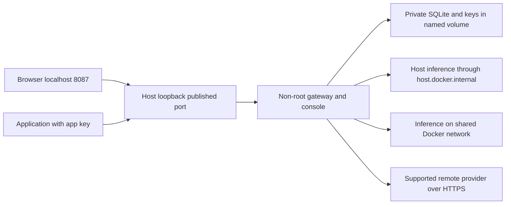

# Container deployment

## Trigger, scope and prerequisites

Use Docker as an additional way to run the gateway, included console and SQLite
in one application container. Bring an existing inference service or provider
account. The image does not install models, Docker, Grafana or Vault. Optional
managed ecosystem profiles remain planned.

Use a running Docker Engine with Compose v2 for the Compose option. Docker Desktop
on Windows/macOS must use Linux containers. Current preview architecture is Linux
amd64; ARM and cloud deployment checks are pending. Local WSL Docker integration
is on demand. The repository and package currently remain private; authorized
users need repository access and a GitHub token with `read:packages` to pull GHCR
images. Log in interactively with `docker login ghcr.io` and use the token at the
password prompt. Avoid putting tokens in command arguments or shared logs.
Public packages support anonymous pulls when deliberately made public after review.
See [GitHub registry authentication](https://docs.github.com/en/packages/working-with-a-github-packages-registry/working-with-the-container-registry).

## Root start, stop and status scripts

From a repository checkout on Linux/WSL (Bash):

```bash
./docker-start.sh
./docker-status.sh
./docker-stop.sh
```

These helpers work from any directory, check a usable Docker CLI, Compose v2,
Docker engine access, Linux amd64 platform and Compose configuration. Startup also
checks health-wait support before building/pulling or starting a container. Host
Python, curl and a virtual environment are not prerequisites. Docker and the
Compose plugin must already be installed; start the engine yourself. If WSL
integration is unavailable, the scripts explain how to enable it and exit.

`docker-start.sh` pulls the private prebuilt preview for a new deployment. If
registry access is unavailable, run `docker login ghcr.io` or build locally:

```bash
./docker-start.sh --build
./docker-start.sh --port 8187
./docker-start.sh --help
```

Source builds require a complete checkout and base-image/dependency network access.
No host Python installation is required. Explicit ports must be free. A new
deployment defaults to 8087; use 8187/8287/8387 if the native gateway already runs
on 8087. Without a port/build override, an existing container is resumed with its
saved image and port, avoiding an unexpected image update or registry requirement.
Use `./docker-start.sh --update` to pull the selected published image and recreate
the gateway while keeping its current port and volume. Use `--build` for source
changes or `--port` to change the host port. `--build` and `--update` are mutually
exclusive. A plain start never automatically updates an existing image. Startup
waits up to 90 seconds for container health and reports failures with next steps.
Configuration readiness can remain 503 until a provider is configured.

Helpers use the fixed Compose project `m87-ai-gateway` and target only its gateway
service. They manage the checkout's Compose deployment, not containers started
separately with `docker run` or another Compose project. Stop keeps the named volume
and never stops Docker Engine/Desktop. Status exits 0 when healthy, 1 on a failed
check/unhealthy container and 3 when no container is running. The scripts print the
console URL and a command to retrieve the operator key; they never print the key.
The existing native workstation scripts remain independent.

## Start with Docker run

```bash
docker pull ghcr.io/m87techlabs/m87-ai-gateway:preview
docker run -d --name m87-ai-gateway \
  --restart unless-stopped \
  -p 127.0.0.1:8087:8087 \
  --add-host=host.docker.internal:host-gateway \
  --mount source=m87-gateway-data,target=/data \
  --read-only --tmpfs /tmp:rw,noexec,nosuid,size=64m \
  --cap-drop ALL --security-opt no-new-privileges:true \
  ghcr.io/m87techlabs/m87-ai-gateway:preview
docker exec m87-ai-gateway cat /data/gateway/admin.key
```

Open **http://localhost:8087**, which redirects to `/admin`, and enter the operator
key. Retrieve it in a private terminal; it never appears in default container logs.
Connect an inference endpoint in Setup, discover/select a default model, create an
application key, then use the API tester. No `.env`, demo credentials, Python,
external database or configuration file is required. Enable gateway-wide content
capture if you want retained LLM input/output. Metadata logs and metrics exclude
prompt text and credentials.

The gateway listens on `0.0.0.0:8087` inside the container; host publishing is
loopback-only. If 8087 is occupied, explicitly publish `127.0.0.1:8187:8087` or
8287/8387. Docker reports collisions and leaves unrelated services intact; the
native launcher's automatic port selection cannot change Docker port mappings.
Applications on the workstation use `http://localhost:8087/v1`; applications on a
shared Docker network use `http://m87-ai-gateway:8087/v1` with a configured service
name or network alias. They receive application keys, never operator/provider keys.

## Start with Compose

Download `docker-compose.yml` from a verified
[preview release](https://github.com/m87techlabs/m87-ai-gateway/releases), or use
the existing repository file. In that directory:

```bash
docker compose config --quiet
docker compose up -d
docker compose exec m87-ai-gateway cat /data/gateway/admin.key
docker compose ps
```

Compose applies persistent storage, host mapping, read-only root filesystem,
private loopback publishing and a 60-second shutdown allowance. Change host port
with `GATEWAY_PORT=8187 docker compose up -d` in Bash, or set the environment
variable using your shell's syntax. `GATEWAY_IMAGE` selects an immutable tag or
digest. A small optional `.env` may set those two non-secret variables; it is not
required and is not used as a container secret store.

Source build option from a checkout:

```bash
docker compose -f docker-compose.yml -f docker-compose.build.yml up --build -d
```

## Reach inference endpoints

| Inference location | Gateway connection URL | Requirements |
| --- | --- | --- |
| Ollama on Docker Desktop host | `http://host.docker.internal:11434` | Host model service and host firewall permit Docker traffic |
| Ollama on native Linux host | `http://host.docker.internal:11434` | Included host-gateway mapping; listener reachable on host bridge interface |
| Same Docker network | `http://ollama:11434` or `http://inference:8000/v1` | Shared user-defined network and service name; configure the appropriate adapter |
| Remote compatible server | `https://inference.example.invalid/v1` | DNS, egress, trusted TLS and credentials where required |
| OpenAI | `https://api.openai.com/v1` | Supported model, account quota and provider key saved through Setup |

`localhost` inside the gateway means the gateway container. Docker does not bridge
a loopback-only Linux host listener automatically. Bind inference to an appropriate
reachable interface and restrict firewall access to trusted clients. On Windows,
verify Docker Desktop access to the actual Windows inference listener; WSL reachability
alone does not prove it. For vLLM use the generic OpenAI-compatible adapter; live
vLLM verification remains pending. Bedrock/Anthropic/Azure/Vertex adapters are planned.
See [Docker Desktop networking](https://docs.docker.com/desktop/features/networking/).



## Persistence and lifecycle

The image runs as UID/GID 10001. A new named volume receives the image's private
`/data/gateway` directory, and that directory stores SQLite, master key, operator
key and instance state. Keep the database and keys together. Docker host/daemon
administrators can access volumes; container isolation does not protect against
an administrator. No Docker socket mount or privileged mode is needed.

```bash
docker stop --time 60 m87-ai-gateway
docker start m87-ai-gateway
docker logs --tail 50 m87-ai-gateway
```

For Compose use `docker compose stop`, `start`, or `down --timeout 60`.
`down` keeps the data volume; `down --volumes` deletes its keys, configuration and
logs. Docker run and Compose use different named volumes by default. Keep using
the same deployment/volume to retain state. Use one gateway process per volume;
SQLite, rate limits and caches currently support one instance, not replicas.

Named volumes persist independently of containers; see
[Docker volume lifecycle](https://docs.docker.com/engine/storage/volumes/).
Bind mounts are advanced: precreate the private data directory with UID/GID 10001
and 0700 access on a compatible Linux filesystem. Windows bind-mount permission
semantics are unverified; prefer named volumes. Do not use `volume-nocopy` for a
fresh volume, because the precreated writable directory is needed.

## Native and Docker data are separate

The source/portable CLI uses its workstation data directory. Docker uses
`/data/gateway` in a named volume. An empty Docker console does not mean the native
applications/logs were deleted. Image rebuilds and container recreation retain the
same Docker volume; changing runtimes does not import native state automatically.
Earlier YAML-managed source instances may instead use `var/lib/m87-gateway`.
Use the data directory that belongs to the instance you intend to migrate.

To migrate native history, first stop that source instance and create an encrypted
backup with its database, master key and operator key using the
[workstation backup procedure](workstation-distribution.md). Restore into a fresh
private directory in a new Docker volume, using a compatible image. For example,
with an encrypted archive already copied into a dedicated `gateway-migration`
volume at `/data/backups/native.m87backup`:

```bash
docker run --rm -it --mount source=gateway-migration,target=/data \
  ghcr.io/m87techlabs/m87-ai-gateway:preview \
  --data-dir /data/recovered --restore /data/backups/native.m87backup
```

Start that restored directory with the same image, a separate host port and the
same volume, including `--data-dir /data/recovered --host 0.0.0.0 --port 8087
--hide-admin-key` after the image name. Verify old applications, logs, credentials
and a completion before switching clients. Retrieve the restored operator key
from `/data/recovered/admin.key`. An Ollama URL from native operation may need to
change from `localhost` to `host.docker.internal` in the container.

Do not overwrite the current Docker volume or merge SQLite files. Restore refuses
nonempty destinations, and automatic data merging is not implemented. Preserve
both original stores until migration is verified. Cross-runtime encrypted recovery
needs its own acceptance evidence; container startup alone does not verify it.

## Backup, upgrade and rollback

Stop the instance before backup. For Docker run, retain an encrypted archive in
the existing private volume, then copy it to a private host backup location:

```bash
docker stop --time 60 m87-ai-gateway
docker run --rm -it --mount source=m87-gateway-data,target=/data \
  ghcr.io/m87techlabs/m87-ai-gateway:preview \
  --data-dir /data/gateway --backup /data/backups/before-upgrade.m87backup
docker cp m87-ai-gateway:/data/backups/before-upgrade.m87backup ./before-upgrade.m87backup
```

Use a new archive filename; password entry is interactive and hidden. Protect the
host copy and keep the password separately. The archive includes the database,
local keys, controls and logs, with the limits documented in
[workstation recovery](workstation-distribution.md). Compose can use
`docker compose run --rm m87-ai-gateway --data-dir /data/gateway --backup /data/backups/before-upgrade.m87backup`
after stopping the service. Copy its archive from the stopped service with
`docker compose cp`. Container backup/restore needs separate verification evidence.

Record the current image digest and preserve a pre-upgrade backup. Pull the chosen
new immutable image, recreate the container against the same volume, and check
readiness, application authentication, completion and logs. For Compose:

```bash
docker compose pull
docker compose up -d
```

If verification fails, stop the new container and restore the encrypted backup
with the previous compatible image into a fresh volume/private directory. Copy
the encrypted archive into that volume, use `--data-dir /data/recovered --restore`
with an explicit archive path, then start the prior image with that data directory.
Do not run an older image against a database already migrated by a newer image.
Cross-version rollback remains a release gate.

## Success checks and automation

- `/health` returns 200 and Docker reports healthy even before configuring inference.
- `/ready` initially returns 503; after setup it checks configuration/credentials and
  storage, not live provider connectivity. Model discovery and a completion check egress.
- Operator API access without a key fails; calling apps need their own valid keys.
- A completion shows provider-reported tokens and, when capture is enabled, input/output.
- Container recreation keeps operator/app keys, connections and logs.
- Stop exits gracefully; no secrets or captured prompt/response appear in stdout.

CI builds and runs `python scripts/smoke_container.py m87-ai-gateway:check` on a
Docker-capable Linux runner, using a synthetic host inference server and isolated
volumes/ports. It checks Docker run and Compose, non-root permissions, health,
setup, auth, model discovery, completion, tokens, content capture, persistence and
shutdown. It removes its own containers and volumes. It never calls a paid cloud
API or starts the workstation Docker engine. Record exact verified/deferred scope
in [validation](../validation.md).

Only after source, docs, native bundles and container checks pass does CI publish
`ghcr.io/m87techlabs/m87-ai-gateway:sha-<full-commit>` and update `:preview`.
The tested image is transferred between jobs rather than rebuilt before publishing.
Each successful main push also creates an immutable `preview-<commit-prefix>`
GitHub prerelease with Windows/Linux ZIPs, checksums and Compose, retained until
explicit deletion. The historical `v0.1.0` tag and repository visibility stay intact.
Use immutable image tags or digests for repeatable deployments. No stable `latest`
tag is claimed. Public availability, signing, ARM, Docker Desktop live Ollama,
cloud deployment and distinct-version rollback remain separate gates.
