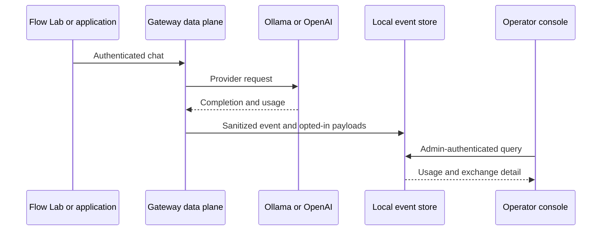

# Local control-plane runbook

Use this runbook to start and operate the developer-preview console on one
gateway instance.

## Start

1. Create a private storage directory and ignored environment file.
2. Generate separate random application and admin keys.
3. Enable the control plane and start the gateway.
4. Open `/admin` on the operator network and enter the admin key.

For the Docker-free Ollama path, the Flow Lab performs those steps:

```bash
. .venv/bin/activate
LOCAL_TEST_MODEL='ollama:gemma3:1b' python -m examples.local_test_app.start
```

The launcher prints the Flow Lab URL, console URL, and one-time admin key. Send a
synthetic chat in the Flow Lab, open the console, and confirm:

- Overview token totals increased by the provider-reported usage.
- Logs contain the same `X-Request-ID` shown by the Flow Lab.
- Request detail shows the selected route, status, latency, input, and output.
- Destinations shows SQLite, stdout, JSONL, and Prometheus state.



## Create an application key

Open **Applications**, enter a generic app ID and explicit model allowlist, and
choose whether payload capture is permitted. Copy the generated key immediately;
the console cannot show it again. Place it only in the application's server-side
secret storage. Revoke the row to invalidate it.

## Store or rotate an OpenAI key

Open **Provider keys**, select OpenAI, retain the `default` alias, and enter the
new key. Saving the same provider and alias atomically replaces the encrypted
value. Run a synthetic OpenAI request before retiring the old credential at the
provider. The UI and list API never return the secret.

## Export and retention

Use **Logs → Export JSON** for a bounded operator export. Exports can contain
captured prompts and completions. Store them as sensitive data and delete them
under the same retention policy as the source events.

The gateway prunes expired events at startup. To change retention, set
`GATEWAY_CONTROL_PLANE_RETENTION_DAYS` and restart. Back up `control.db` and
`master.key` together while access is restricted. Keep the master key separate
from ordinary database-only backups when possible.

## Recovery

- Lost admin key: set a new `GATEWAY_ADMIN_API_KEY` and restart. Stored data and
  application/provider keys remain valid.
- Lost master key: application digests and provider ciphertext cannot be used;
  restore the matching key or recreate runtime keys and provider credentials.
- Corrupt database: stop the gateway, preserve the files for investigation,
  restore the matching database/key backup, and run health plus synthetic chat.
- Suspected disclosure: rotate the admin key, affected app keys, and provider
  credentials; export relevant metadata; then follow incident response.

Never publish the database, master key, exports, prompts, completions, or live
credentials in issues, commits, logs, or test evidence.
