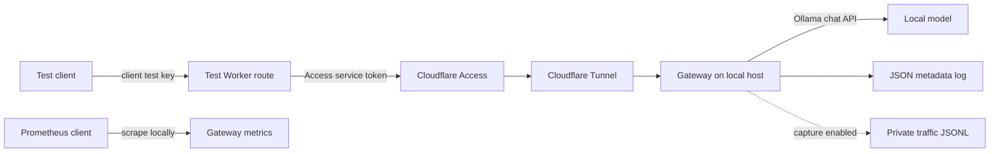
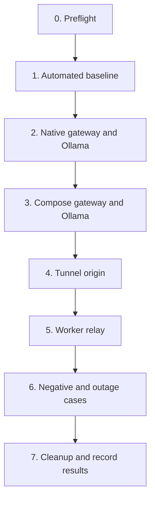

# End-to-end flow testing

## Trigger and scope

Use this runbook to verify the path from a Cloudflare Worker through Access and
a Tunnel to a local gateway and Ollama model. Run it before changing an existing
application route or claiming that the Worker integration is verified.

The first session uses a dedicated test Worker or route, a synthetic app identity,
and synthetic prompts. The gateway currently supports non-streaming text chat, so
the test does not cover streaming, model discovery, or embeddings.



## Prerequisites

- Docker with Compose is enabled for the WSL distribution only for the container
  phase. Native checks can run before Docker is enabled.
- Ollama responds on the host and has the selected test model installed.
- A dedicated gateway app key permits `auto` and the resolved Ollama model.
- A dedicated Access-protected test hostname routes through the Tunnel to the
  gateway. Do not move an established application route for the first test.
- The test Worker has separate caller, gateway, and Access credentials stored as
  secrets. Use the [Worker example](../../examples/cloudflare-worker/README.md).
- Test content contains no personal, confidential, or production data.

Keep secrets in environment variables or ignored local files. Do not paste their
values into commands that will be retained in shell history, test evidence, logs,
or this repository.

## Test variables and evidence

Record only these sanitized values:

| Field | Example |
| --- | --- |
| Gateway commit | Short Git commit ID |
| Test date | UTC date |
| Route | `auto` to `ollama:<test-model>` |
| Request ID | Gateway-generated ID |
| HTTP result | Status and safe error code |
| Log result | Metadata/content absent or present as expected |
| Metric result | Counter change without content or request ID labels |

Use one unique synthetic marker per successful request, such as
`flow-check-001`. The marker makes accidental content capture easy to detect.

## Execution plan

Run the phases in order. Stop after a failed phase because later results would be
ambiguous.



### Phase 0: preflight

1. Record `git rev-parse --short HEAD` and require a clean worktree except for
   the planned validation-document update.
2. Check Docker with `docker version` and `docker compose version` without
   starting the project.
3. Check Ollama with `curl --fail-with-body http://127.0.0.1:11434/api/tags`.
   Confirm that the configured model appears in the response.
4. Confirm the Tunnel process or managed service is healthy. Do not print its
   token or configuration.
5. Confirm the gateway, Worker, and Access credentials are distinct.

Success means each dependency is available and the intended model is installed.
If Docker is unavailable, continue through Phase 2 and defer Phases 3 through 6.
If the model is absent, finish the gateway failure-path check in Phase 2 and
install a model only during a separately approved resource window.

### Phase 1: automated baseline

Run the Docker-independent checks:

```bash
pytest -q
ruff check src tests scripts examples
ruff format --check src tests scripts examples
python scripts/check_docs.py
python -m compileall -q src tests examples/local_test_app
npm test --prefix examples/cloudflare-worker
```

Success means every command exits zero. Fix baseline failures before interpreting
an integration result.

### Phase 2: native gateway and Ollama

Use the [Windows/WSL flow lab](windows-wsl-flow-lab.md) for the browser and relay
path, or start the gateway directly with Ollama configured at the reachable host
URL. Then verify these cases through `http://127.0.0.1:8080`:

| ID | Request | Expected result |
| --- | --- | --- |
| N1 | `GET /health` | 200 and healthy status |
| N2 | `GET /metrics` | 200 and Prometheus text |
| N3 | Chat without gateway app key | 401 and correlated metadata event |
| N4 | Chat with an invalid app key | 401 without credential disclosure |
| N5 | Allowed `model: auto` synthetic chat | 200, resolved Ollama model, request ID |
| N6 | Disallowed concrete model | 403 before a provider attempt |
| N7 | Configured blocklist marker | Safe 400 before a provider attempt |
| N8 | Ollama stopped or model absent | Safe 502/504 and provider-error metric |

Match the `X-Request-ID` from N5 to one metadata event. With content capture off,
search for the synthetic marker and require no match. If content capture is being
tested, enable it globally and for only the test app, repeat N5, and require one
matching private traffic record. Follow the [traffic logging runbook](traffic-logging.md).

### Phase 3: Compose gateway and Ollama

Use the [container deployment runbook](container-deployment.md). In one bounded
Docker session:

1. Run `docker compose config --quiet`.
2. Build and start the gateway.
3. Require the container to remain running and `/health` and `/metrics` to return
   200 on the loopback-published port.
4. Repeat N3, N5, N6, and N7.
5. Confirm the container reaches host Ollama through the configured address.

This phase verifies image contents, configuration mounts, port binding, and
container-to-host networking. A successful native check does not substitute for it.

### Phase 4: Tunnel origin

1. Point a dedicated test hostname at the gateway's local HTTP origin.
2. Request `/health` through Access using the test service token.
3. Require an authorized request to reach the gateway and an unauthorized request
   to stop at the edge.
4. Keep `/metrics` unavailable through the public test hostname.

Success means the edge reaches the intended local service only while the host,
gateway, and Tunnel are available.

### Phase 5: Worker relay

Deploy or configure the test Worker from `examples/cloudflare-worker`. Send one
non-streaming `model: auto` request containing a unique synthetic marker.

Require all of the following:

- The Worker validates its caller key.
- The gateway identifies the dedicated Worker app.
- The response is a chat completion from the expected Ollama model.
- The same `X-Request-ID` appears at the client and in the gateway event.
- The success and provider counters increase once.
- The marker is absent from metadata and metrics. It appears in the private
  traffic file only when both content-capture controls are enabled.

### Phase 6: negative and outage cases

Run one case at a time and restore service before continuing:

| ID | Change | Expected boundary |
| --- | --- | --- |
| E1 | Wrong Worker caller key | Worker rejects; gateway receives nothing |
| E2 | Wrong gateway app key | Gateway returns 401 and metadata-only event |
| E3 | Remove resolved model permission | Gateway returns 403 before Ollama |
| E4 | Stop Ollama | Gateway returns safe 502/504; provider error increases |
| E5 | Stop the gateway | Worker or edge returns a bounded upstream error |
| E6 | Stop the Tunnel | Cloudflare fails without a gateway event |
| E7 | Send `stream: true` | Worker or gateway explicitly rejects the request |

Do not deliberately expose a secret or send sensitive content to test redaction.
Use synthetic credential-shaped strings in unit tests for that behavior.

### Phase 7: cleanup and result recording

1. Restore every changed permission, route, and service.
2. Run `docker compose down` for this project.
3. Disable traffic content capture and apply the configured retention policy.
4. Remove temporary Worker and Access secrets if the test route will not remain.
5. Record pass, fail, or deferred for every phase in `docs/validation.md`, with
   the commit and sanitized evidence.

## Release decision

The local integration can be marked verified after Phases 0 through 3 pass. The
Prayog-style remote flow can be marked verified only after Phases 4 through 6 pass.
Failures remain release blockers only for a release that claims the affected path.

## Recovery

- Restore the previous Worker route and Access policy if edge behavior changes.
- Stop the test Worker route if it sends duplicate or unbounded requests.
- Stop the gateway container and restore its previous ignored configuration if
  authentication or routing differs from the plan.
- Use [provider troubleshooting](provider-troubleshooting.md) for Ollama errors
  and [incident response](incident-response.md) if a real credential or content
  record is exposed.
