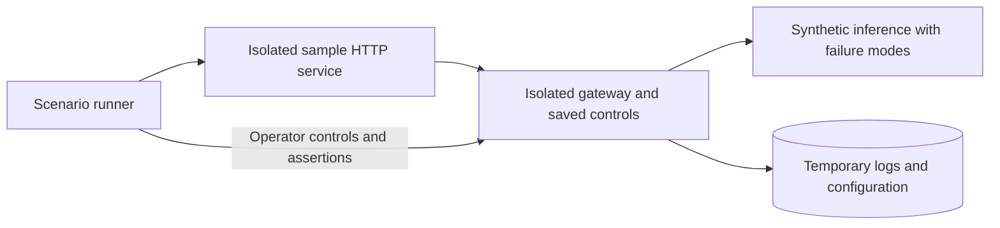

# Gateway controls and sample acceptance

## Trigger and prerequisites

Use this procedure after changes to gateway policies, logging, or the sample relay.
Automated scenarios need the source gateway's Python environment with its runtime
packages installed. Docker, Windows Ollama and cloud credentials are unnecessary.
Manual live checks need the running gateway, sample app, and a reachable installed
Ollama model. Use a dedicated project/application for live tests.

## Automated scenarios

From the repository root:

```bash
. .venv/bin/activate
python -m examples.chat_app.scenarios
pytest -q tests/test_gateway_controls.py
```

The runner reserves temporary loopback listeners and creates a private temporary
store. It starts its own sample, gateway, and synthetic inference service, then
stops them and removes test data. It never changes the running gateway or starts
Docker. The synthetic service uses predictable usage and configurable failures.



| Scenario | Evidence required |
| --- | --- |
| Successful completion | HTTP 200, six synthetic tokens, both input/output stored |
| Caching | MISS then HIT; one inference call; cache hit contributes no new provider tokens; clear produces MISS |
| Rate limiting | Set one request/minute, receive 429 and retry delay, remove cap and recover with same key |
| Concurrency | Hold one inference request, reject overlapping request with 429, release slot and recover |
| Retries/outage | One transient failure succeeds on second attempt; persistent failure stops at two attempts; recovery succeeds |
| Timeout | Short timeout returns 504; restoring provider behavior/timeout succeeds |
| Readiness | Disabled default provider yields `/ready` 503 while `/health` remains 200; enabling restores readiness |
| Request/capture bounds | Policy and body rejections avoid inference; captured input/output report truncation |
| Restart/deletion | Controls, keys and logs survive restart; confirmed deletion removes history while preserving access |

Additional regression tests cover admin authorization, invalid updates, per-app and
global concurrency isolation, cancellation, retention changes, additive migration,
project-scoped deletion and persisted cache initialization. Console DOM tests verify
editing, confirmation, and sample cache/retry feedback. These establish source/local
HTTP behavior; synthetic inference does not establish live provider compatibility.

## Manual console and Ollama checks

1. Start the gateway and sample with their existing scripts. Open **Controls**.
   Check readiness; use **Setup → Discover models** and a real completion to verify
   connectivity/inference. Readiness itself checks configuration and SQLite only.
2. In **Applications**, use a dedicated test application's existing key. Set RPM to
   1. Start a fresh sample conversation and send a short synthetic prompt. The next
   request within the rolling minute should show 429 and a retry delay. Clear the
   RPM field and save to restore unlimited starts.
3. Enable caching in **Controls**. Send a short synthetic prompt, click **New
   conversation**, and send the exact same prompt again. Require MISS then HIT,
   distinct request IDs, and zero provider attempts on the hit's log. The sample
   retains original usage on a cached response; dashboard provider totals exclude
   the hit. Change the prompt or clear the cache to require MISS.
4. Set application concurrency to 1, disable cache, and send simultaneous requests
   from two browser tabs while inference is busy. Require a concurrency 429. When
   admitted work finishes, another request should succeed. If inference completes
   too quickly to overlap, use the deterministic automated scenario instead.
5. Inspect **Setup** provider timeout and **Controls** retry values. Use the isolated
   scenarios for forced outages/timeouts; avoid interrupting an inference service
   used by other applications. Check gateway log status, error, cache and attempts.
6. Enable gateway-wide capture in **Setup** and shorten the capture bound in
   **Controls**. Send a sufficiently long synthetic prompt and inspect the new
   log's truncation notices. Restore the original limit afterward.
7. Confirm Controls edits survive a gateway restart. The response cache and
   rate windows reset; stored controls, keys and retained logs should remain.
8. On a disposable project's **Logs** view, select the project, export history if
   needed, then confirm deletion. Other projects and application keys must remain.
   Selecting **All projects** deletes all SQLite history. Separate JSONL/exported
   copies remain. Do not use this step on history you intend to preserve.

## Retention and recovery

Record original settings before live checks and restore them afterward. Saving
Controls applies to new requests and clears cached responses. Lower concurrency
caps do not cancel admitted requests; existing rate windows remain until expiry.
Shorter SQLite retention removes expired history on save, restart and event writes;
usage reports reflect remaining events. There is no idle background pruning timer.
Logs/usage deletion is logical, not secure erasure or a backup/recovery mechanism.

If readiness fails, read the failed check in Controls and correct Setup or storage
permissions. If a real chat fails while readiness passes, inspect its request ID
and test upstream discovery/inference. Test runs must clean up only their own
services. Live Ollama fault exercises, visual/accessibility browser checks, Docker,
Windows packaging and cloud checks remain recorded separately in
[validation](../validation.md).
