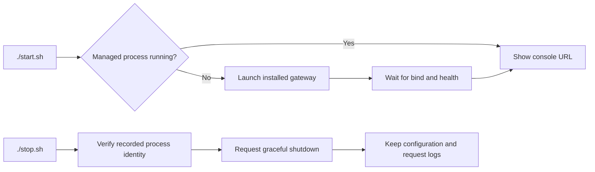

# Guided local setup

## Trigger and prerequisites

Use this procedure to run a gateway with its included configuration console and
embedded SQLite storage. This is a single-process developer preview on Linux/WSL.
An existing Ollama, OpenAI account, or compatible text inference service is required.
The source installation needs Python 3.11+; the experimental Linux executable
bundles Python and dependencies. Docker and external databases are unnecessary.
Windows Ollama can remain on Windows while this gateway runs in WSL.

## Start from source

From the repository root:

```bash
python3 -m venv .venv
. .venv/bin/activate
python -m pip install -e .
m87-gateway
```

Alternatively, run `python -m m87_gateway`. The launcher binds to
`127.0.0.1:8087`, trying 8187, 8287, 8387, and subsequent increments of 100 if
occupied. It prints the selected console URL and admin key and starts without demo
application keys or enabled providers. It uses `$XDG_DATA_HOME/m87-gateway`, or
`~/.local/share/m87-gateway` when that variable is absent. Choose another private
directory or port with `--data-dir` and `--port`. The launcher intentionally does
not load example/YAML configuration; retain the existing Uvicorn entry point for
YAML-managed deployments. Do not run multiple processes against this data directory.

## Everyday start, stop, and status

After installing the source package in `.venv`, use these scripts from the checkout:

```bash
./start.sh
./status.sh
./stop.sh
```

No environment activation is needed. Start runs the gateway in the background,
waits for health, and prints the selected console URL and the operator key.
The official workstation port is 8087, with fallback ports 8187, 8287, 8387,
and so on through 65487. Each listener is reserved before startup; unrelated
services are left running. An explicit `--port` or `GATEWAY_PORT` uses that exact
port and fails if it is occupied. Exhausting the default sequence fails clearly.
It prefers `.venv/bin/python`; if absent, it uses the experimental
`dist/m87-gateway` executable. The scripts also work when invoked by an absolute
path from another directory. They require Linux/WSL, Bash, curl, flock, and standard
Linux utilities. They do not install dependencies or start Ollama or Docker.

The default data directory is unchanged, so saved providers, projects, app keys,
and request logs survive stop/start. The scripts manage one instance per checkout.
Choose an exact port when needed:

```bash
./start.sh --port 8187
```

For isolated storage, use `./start.sh --data-dir /path/to/private/gateway-data`.
Existing data directories must have owner-only permissions. Relative data paths
are resolved from the checkout. `GATEWAY_PORT` and `GATEWAY_DATA_DIR` provide the
same defaults; command options override them. For another installed source runtime,
set `GATEWAY_PYTHON` to its Python executable. Stop and status use the recorded
instance, so you do not need to repeat the port or data directory.

Private process state and startup output live in the ignored
`var/lib/gateway-runner/` directory. The startup log contains the operator key;
keep it private. A new start replaces that startup log. `GATEWAY_RUN_DIR` can
choose a different private runtime directory; use the same setting for all three
scripts. Status reports a matching managed process and returns code 3 when stopped;
it does not prove the inference backend is available.

Repeated start reuses the running managed instance; repeated stop is harmless.
Stop sends a graceful termination signal and preserves application data. If active
requests delay shutdown beyond 30 seconds, it reports that work is finishing;
retry stop after those requests finish. PID identity is checked before signaling.
Instances started manually, the Flow Lab, and unrelated services are not adopted
or stopped. Stop manually launched foreground instances with Ctrl+C.



## Configure the console

1. Open the printed console URL (normally `http://localhost:8087/admin`) and enter the printed admin key.
2. In **Setup**, select Ollama, OpenAI, or OpenAI-compatible server. Enter the full
   base URL: Ollama typically uses `http://127.0.0.1:11434`; compatible servers
   typically use `http://127.0.0.1:8000/v1`. URLs are from the gateway's network
   perspective. Use an accessible Windows host address if WSL loopback is unavailable.
3. Enable and save the connection. Enter provider credentials only here. Local
   endpoints may need no key. Provider keys are encrypted in SQLite; secrets are
   never returned by connection or key-list APIs.
4. Discover models on the saved connection. Discovery calls the model-list API,
   without a completion. Select a model or enter `provider:model` manually.
   Discovery does not prove permission to run a particular model or its readiness.
5. Save defaults. Enable global content capture only if prompts/responses should
   be stored. This gateway-wide setting applies to all authorized applications.
6. In **Applications**, create a key with `auto` and the selected concrete model
   allowed. Set a requests-per-minute limit if needed. Copy the key shown once.
   When changing the default model later, edit the application's Models list and
   click **Save models**. Permissions apply to future requests; the key is preserved.
7. Send an application request to `/v1/chat/completions` using its gateway key.
   The Setup page shows the URL and request shape. Inspect Overview and Logs for
   tokens, outcomes, and opted-in input/output. Unknown provider token counts stay null.


One connection per adapter identifier is supported. Provider updates and the
default route persist across restarts and take effect for new requests. Requests
already running finish against their earlier connection; changing configuration
clears the response cache. YAML routing rules still take precedence for matching
`auto` requests in YAML-managed instances. Editing all traffic policies in the UI,
multiple connections per adapter, and distributed enforcement remain planned.

## Success checks and credential safety

- An authenticated request produces a completion and correlated log event.
- Restart with the same data directory: operator/app keys, connections, and default
  model remain usable. A fresh directory starts a separate instance.
- Changing a credentialed endpoint requires a new key or explicit credential
  removal. This prevents sending an existing secret to a newly entered server.
- The admin key is saved in `admin.key` unless `GATEWAY_ADMIN_API_KEY` supplies it.
  Local files and directories require owner-only POSIX permissions. Provider keys
  depend on `master.key`; protect it separately from database backups.
- Loopback is the default boundary. Exposing `--host 0.0.0.0` requires a protected
  network and TLS termination; this launcher does not configure cloud networking,
  HTTPS, or a production service manager. Keep terminal output containing the admin
  key private. Metrics have no separate authentication; restrict network access.

## Experimental standalone Linux build

Build on the target Linux platform from source:

```bash
python -m pip install -e '.[bundle]'
python scripts/build_standalone.py
python scripts/smoke_standalone.py dist/m87-gateway
./dist/m87-gateway
```

The executable includes the runtime, adapters, console assets, and SQLite support.
It extracts runtime files temporarily at startup; the target needs a writable
temporary directory and compatible OS system libraries. The build inherits the
host's Linux compatibility requirements. This is an experimental artifact,
not a signed public release. Clean Linux workstation compatibility, native Windows
packaging/ACL protection, service installation, and cloud deployment remain
release gates. No native Windows executable is advertised yet.

## Recovery

Use `./stop.sh` for a script-managed instance, or Ctrl+C for a foreground instance.
Correct a connection in Setup and retry discovery or inference.
For a lost application key, revoke and recreate it. For a lost operator key, stop
the gateway and read the private `admin.key`, or supply a new strong
`GATEWAY_ADMIN_API_KEY` before restarting. Removing `master.key` destroys access to
stored credentials. Do not delete it to troubleshoot connectivity. For an isolated
test reset, use a new data directory and preserve the existing one for recovery.
