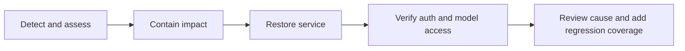

# Incident response

## Trigger and prerequisites

Use this procedure for broad request failures, suspected credential exposure, or
unexpected model usage. Identify the deployment owner, a private incident channel,
the last working artifact/configuration, and provider credential administrators.

## Procedure

1. Record the start time, affected deployment/version, symptoms, and affected apps.
   Keep investigation notes private when they contain operational or security data.
2. Establish impact: check gateway health and one synthetic request for each
   affected route. Review recent configuration/deployment changes.
3. Contain the issue:
   - For exposed app keys, replace them and coordinate caller updates.
   - For exposed provider credentials, revoke/rotate them at the provider and update
     the gateway's secret source.
   - If traffic must stop, restrict ingress or stop the affected instance.
     Provider `enabled: false` is currently ignored and is not a containment control.
4. Preserve relevant logs privately. Do not copy environment dumps, raw credentials,
   or customer prompts into public issues.
5. Restore a known working artifact/configuration, or apply the smallest verified fix.
   Follow the [configuration](configuration-changes.md) and
   [provider troubleshooting](provider-troubleshooting.md) runbooks.

## Verification

- Health and representative authorized chat requests succeed.
- Invalid and revoked credentials are rejected.
- Configured direct-model authorization still rejects disallowed models.
- Provider-side usage and error signals return to the expected range.

The gateway currently lacks a complete audit trail, enforced budgets, and metrics.
Record those investigation limits; use provider-side records where available.

## Recovery follow-up

Document the cause, impact, timeline, corrective change, and a regression check.
Add missing diagnostics or runbook steps to the roadmap. Publish a sanitized
summary only after removing sensitive details. Report vulnerabilities using
[SECURITY.md](../../SECURITY.md).

