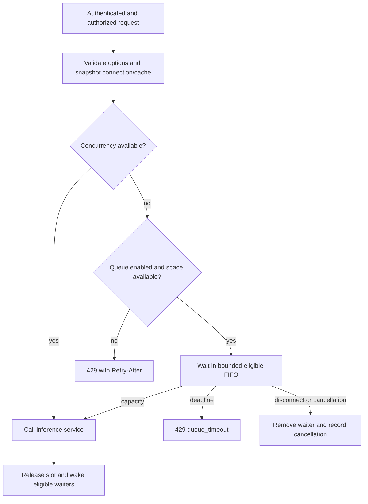

# Inference API and request queueing

Use the native/source gateway for development. These checks require no Docker or
paid provider. They use synthetic input; keep real credentials in the gateway.

## Automated flow checks

From the repository root with the development environment installed:

```bash
python -m pip install -e '.[dev,sdk-tests]'
python -m examples.chat_app.scenarios
pytest -q tests/test_inference_backlog.py tests/test_request_queue.py tests/test_gateway_controls.py
```

The sample suite starts its own sample application, gateway and synthetic inference
service on temporary loopback ports/private storage. It stops them afterward and
leaves existing services and user data intact. Thirteen scenarios cover catalog and
generation fields, streaming/capture, cache, rate/concurrency, queue overflow/recovery, retries,
timeout, disabled connections, bounds, restart/deletion and key replacement.
The optional SDK test uses an actual OpenAI Python client against the local gateway;
CI installs this extra so the test runs. It never calls a cloud provider.

## Model catalog and options

1. In Setup, save an inference endpoint; use Discover models on the saved connection.
2. In Applications, permit the concrete model and auto if needed; copy an app key.
3. With that key, call GET /v1/models. Only the application's approved models appear.
   Manual allowlists work without discovery. Catalog listing makes no inference call.
4. Send a chat request with top_p/stop/seed or response_format using the normal
   authenticated API. Inspect Logs for real reported tokens and the exchange.
5. Ollama requests with presence_penalty, frequency_penalty or an explicit schema
   strict flag must return 422 unsupported_parameter before inference.
6. If user attribution is supplied, log metadata stores client_user_hash only.
   Input/output capture remains controlled by the gateway-level switch.

See [supported fields](../configuration.md#chat-generation-parameters). A catalog
entry and an adapter declaration do not prove model availability or JSON compliance.
Verify real inference and model-specific options separately before production use.

## Enable bounded waiting

In Controls, enable Queue requests while concurrency is full. Start small for a
single local inference worker: concurrency 1, global waiting depth 4, per-app waiting
depth 2 and wait 10 seconds. Adjust to available capacity and client timeout budgets.
Queueing defaults off; depth 0 preserves immediate concurrency rejection.



Global and per-app active caps remain enforced; waiting counts separately. FIFO
applies among callers currently eligible for both caps, so a blocked app does not
prevent another app using spare capacity. There are no priority classes. Rate checks
happen before waiting, so admitted and rejected attempts consume an app's normal
request allowance. Requests keep arrival-time routing, credentials, controls and
cache; later setup changes apply to new arrivals. To cut off already admitted work,
stop that instance; revocation/configuration changes do not cancel existing requests.

A full queue returns 429 queue_full, and an expired wait returns 429 queue_timeout,
with Retry-After: 1. Provider failures retain the normal safe error/retry behavior.
Queue time is additional to provider timeout and retry time; configure clients to
allow the total. The queue is in memory per process and disappears on shutdown.
Multi-worker/shared enforcement and durable jobs remain planned.

## Inspect and recover

- Controls readiness shows active and queued requests; diagnostics exposes both.
- Logs/detail/export contain queue_wait_ms and queue_outcome (immediate, admitted,
  full, timeout or cancelled). Old events have null queue metadata.
- Prometheus exposes m87_gateway_queue_depth and
  m87_gateway_queue_wait_seconds with bounded outcome labels. Queue full/timeout
  also increment concurrency rejection accounting. Contents and user IDs are not
  metric labels.
- After an error/cancellation, queue depth must return to zero and a new request
  must complete. The isolated scenario demonstrates full-queue recovery.
- If waits grow, check the provider endpoint, GPU capacity and provider timeout.
  Reduce bursts or waiting depth rather than treating queued work as extra capacity.

Queued client disconnects remove waiters promptly. Active disconnects cancel the
gateway upstream HTTP request; streaming shares these lifecycle controls. Live
backend generation-stop behavior remains a separate check. See
[streaming and cancellation](streaming-and-cancellation.md).

## Upgrade and deferred evidence

Back up private state before upgrading. Schema 4 adds nullable traffic columns for
queue metadata and hashed attribution; schema-3 keys, policies, usage and identity
audit remain intact. Older binaries reject a schema-4 database; use an encrypted
pre-upgrade backup and a fresh private destination for rollback, following
[backup and recovery](workstation-distribution.md).

Live Ollama/Windows, OpenAI/vLLM JSON mode, cloud/tunnel integration, visual browser
behavior and container packaging are separate operator/release checks. These
synthetic tests do not establish model option support or cloud readiness.
