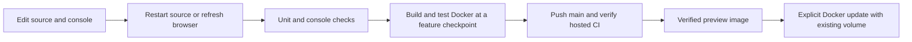

# Local development

## Trigger and prerequisites

Use this procedure to prepare a development checkout. Install Python 3.11+ and
Git. A provider is needed for a real chat request, but not for the unit tests.
Console interaction checks additionally use Node 18+ and npm with isolated test
dependencies; these are not installed by gateway users.
Docker can stay disabled for this procedure. See [validation status](../validation.md)
for the separate checks that require a container runtime.

## Procedure

1. Create a virtual environment and install the project:

   ```bash
   python3 -m venv .venv
   . .venv/bin/activate
   python -m pip install -e '.[dev]'
   ```

2. Run the baseline checks:

   ```bash
   ruff check src tests scripts examples
   ruff format --check src tests scripts examples
   pytest -q
   python scripts/check_docs.py
   ```

   For console changes, also run:

   ```bash
   npm ci --prefix tests/console
   npm test --prefix tests/console
   ```

   These checks parse console CSS and exercise DOM interactions, project-scoped
   requests, charts, application credential isolation, and lock cleanup. They do
   not verify real browser rendering. Hosted CI runs them with the docs checks.

3. Start the included console from this checkout:

   ```bash
   ./start.sh
   ./status.sh
   ```

   Configure inference in Setup, use **Test connection** to probe the entered
   endpoint, then save the connection and discover models. Create an application
   key and use the API tester or chat sample. Native ports start at 8087 and try
   subsequent increments of 100 when occupied. Docker may be using 8087 already;
   use `./start.sh --port 8187` for an explicit development port.

4. For Python changes, restart the source process:

   ```bash
   ./stop.sh
   ./start.sh
   ```

   Console HTML/JavaScript/CSS in the editable source package can be picked up
   with a browser refresh; use a hard refresh if cached assets appear stale.
   Dependency changes require reinstalling `python -m pip install -e '.[dev]'`.
   The root launcher uses the source package in `.venv` when available. See
   [guided setup](guided-setup.md) for private data directories and the separate
   YAML-managed Uvicorn entry point. Example `.env`/YAML files are retained for
   that advanced deployment path; the guided CLI does not load them.

5. Keep development data stable by using the same private data directory.
   Native CLI defaults to `$XDG_DATA_HOME/m87-gateway` or
   `~/.local/share/m87-gateway`. Docker uses its own named volume. Switching
   runtimes does not move applications, keys or logs automatically. Never point
   two running gateways at the same SQLite directory. See
   [moving native data to Docker](container-deployment.md).

6. At a feature checkpoint, verify the container package:

   ```bash
   ./docker-start.sh --build
   ./docker-status.sh
   ```

   Source changes are installed into the image at build time; a container restart
   alone cannot apply them. This checkpoint keeps the same named volume and may
   recreate the gateway service. Local Docker builds are needed for Dockerfile,
   dependencies, packaging/network changes and end-to-end container acceptance;
   they are unnecessary for every source edit.

7. Each push to `main` currently runs CI and builds/tests the container, then
   publishes a verified preview alongside native artifacts. This maintains
   distribution evidence while the inner development loop stays native. To
   consume a published image explicitly, run `./docker-start.sh --update`.
   Plain `docker-start.sh` resumes the existing image/port and does not pull an
   update. Both update/build paths retain the volume; back up before upgrades.



## Success checks

- Tests and lint pass.
- `/health` returns HTTP 200 with `status: ok`.
- An authenticated chat request returns a completion from the chosen provider.
- A request without authorization returns HTTP 401.

The health response does not prove provider readiness. Tests currently mock
provider calls and do not replace the real chat check.

## Recovery

Stop the source gateway with `./stop.sh`. Stop a foreground Uvicorn process with Ctrl-C. Restore the previous ignored configuration if needed.
For chat failures, follow [provider troubleshooting](provider-troubleshooting.md).
Do not paste `.env`, complete prompts, or unredacted logs into an issue.
