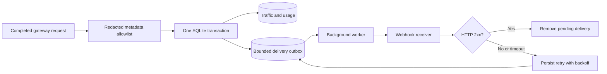

# Metadata webhook export

## Scope

The gateway can send sanitized request metadata to a configured HTTP receiver.
It includes request/project/application IDs, route, tokens, latency and outcome.
Captured input/output, user correlation hashes, credentials and arbitrary new event
fields are excluded by an allowlist. Local captured exchanges remain available in
the [logging showcase](logging-showcase.md).

This optional feature uses the gateway's private SQLite store and one background
worker. It requires no Docker or additional database. Webhook delivery is implemented;
Loki, OTLP, UI configuration and remote content export remain planned.



## Local demonstration

Back up first: startup upgrades the private database to **schema 8**. Existing keys,
logs, captured content, configuration history, usage and audit are preserved. An
older binary rejects the newer store; restore its matching backup into a fresh
directory for rollback. Do not copy individual SQLite files while the gateway runs.

From the repository root, configure the gateway and receiver in the same terminal:

```bash
export M87_LOG_RECEIVER_TOKEN="$(.venv/bin/python -c 'import secrets; print(secrets.token_urlsafe(32))')"
export EXAMPLE_EXPORT_TOKEN="$M87_LOG_RECEIVER_TOKEN"
export GATEWAY_LOG_EXPORT_ENABLED=true
export GATEWAY_LOG_EXPORT_ENDPOINT=http://127.0.0.1:9087/events
export GATEWAY_LOG_EXPORT_API_KEY_ENV=EXAMPLE_EXPORT_TOKEN
./start.sh
.venv/bin/python -m examples.log_receiver.start
```

If the gateway is already running, use `./stop.sh` before this `./start.sh`; a repeated
start does not reconfigure that process. The start script leaves the gateway running
in the background, and the receiver runs in the foreground. Start the existing chat
sample from another terminal or use the gateway's console API tester.

The receiver listens at `http://127.0.0.1:9087/events`. It stores accepted deliveries
in `var/lib/log-receiver/deliveries.db`, keyed by delivery ID to discard duplicates.
The example is a loopback demonstration, without production retention, resource
limits or service management. Stop it with Ctrl+C. Restart in the same shell to reuse
its token. It is included in the source repository, separate from the gateway binary.

These export variables also work with the native binary. The local launcher uses
environment configuration and does not read YAML. Secrets stay in the process
environment, outside the database, manifests and command arguments. Supply them again
in a fresh shell or through the deployment's secret mechanism. Do not commit them.

Send a synthetic message using the chat sample or console API tester. In **Logs**,
find the request ID and check the remote export line: pending, delivered, failed
attempts, dropped, expired and destination-held counts are persistent. Queue storage
health is separate from upstream inference health. Counts cover the whole gateway,
even when Logs has a project filter; they are not project accounting.

Inspect received metadata locally:

```bash
.venv/bin/python - <<'PY'
import json, sqlite3
with sqlite3.connect('var/lib/log-receiver/deliveries.db') as db:
    for delivery_id, payload in db.execute('SELECT delivery_id, payload FROM deliveries'):
        event = json.loads(payload)['event']
        print(delivery_id, event['request_id'], event['total_tokens'], event['status_code'])
PY
```

## Failure and restart showcase

1. Stop the receiver, leaving the gateway running. Send another synthetic request.
2. Inference still completes. Logs shows pending deliveries and failed attempts.
3. Restart the receiver at the same endpoint with the same token. Pending records
   retry automatically; delivered increases and pending decreases.
4. Repeat with a gateway restart during the outage. Pending records and counters
   survive. A delivery interrupted after send may wait for its lease to expire
   (request timeout plus 30 seconds), then retry with the same delivery ID.
5. The receiver deduplicates `delivery_id`; `Idempotency-Key` carries the same value.
   Repeated network delivery does not create repeated receiver rows.

The tests exercise process exit after commit, retry leasing, stale acknowledgements,
schema migration, authentication failure/recovery, total timeouts, unavailable storage,
queue saturation, expiry, redaction and real HTTP delivery. Power loss, filesystem
corruption and disk exhaustion still require separate operational evidence.

## Configuration

For the YAML-configured server entry point:

```yaml
control_plane:
  enabled: true
observability:
  log_export:
    enabled: true
    adapter: webhook
    endpoint: https://collector.example.com/events
    api_key_env: GATEWAY_EXPORT_TOKEN
    max_pending: 5000
    retention_hours: 168
    timeout_seconds: 5
    poll_seconds: 1
    retry_seconds: 2
    max_retry_seconds: 300
```

Every field accepts `GATEWAY_LOG_EXPORT_<FIELD_IN_UPPERCASE>` in either launcher.
Changes take effect on restart. Export is disabled by default. A configured token
variable must contain a non-empty ASCII token without whitespace. Use HTTPS for
remote authenticated collectors; local HTTP is useful for this loopback example.
Endpoints cannot contain embedded credentials, query strings or fragments.
Redirects are rejected, TLS verification is enabled, and proxy environment variables
are ignored. The endpoint is trusted operator configuration and may reach local
services. This is not an arbitrary application-supplied URL.

Only response headers are consumed; the remote response body is not logged or loaded.
HTTP 2xx acknowledges a delivery. All other statuses and transport/timeouts retry
with exponential backoff capped at `max_retry_seconds`, until expiry. There is no
automatic fallback destination. Fix credentials/configuration if rejection persists.
Endpoint/credentials and raw remote errors are excluded from operator health output.

## Delivery and storage boundaries

- Traffic, usage and the pending record commit together. Network calls are outside
  the inference path. An unavailable local disk can prevent the entire log transaction;
  existing recording failure health reports this. Logging remains best effort before
  commit and does not make the inference response fail.
- Delivery is at least once after commit, within queue capacity/expiry policy. A crash
  between receiver acceptance and local acknowledgement can cause a duplicate.
  The receiver must deduplicate; exactly-once network delivery is not promised.
- The queue admits at most `max_pending` rows, each with at most 16 KiB of metadata.
  When full or oversized, the newest export is dropped and counted; the local exchange
  and usage still commit. This is not a size limit on the whole database or its WAL.
- Records expire after `retention_hours`. Expiry pruning runs at startup, enqueue
  and worker activity. Disabled export holds pending records without sending; physical
  pruning is deferred until activity/startup. Status reports records awaiting expiry.
- Destination binding includes adapter and endpoint. Changing either holds old records;
  restoring the original binding resumes them until expiry. Changing only the token
  retries existing records against the same endpoint. Held rows consume capacity.
- Local log/content deletion does not recall remote deliveries or delete queued metadata.
  Local usage and queued metadata have separate lifecycles; retained queue rows contain
  no captured text. Remote retention/deletion belongs to the receiver.
- Encrypted gateway backups include the outbox. Restoring a backup can replay pending
  records to its matching configured destination; preserve receiver deduplication state.

## Framework extensions and verification

Trusted source integrations register `register_log_exporter(name, factory)` from
`m87_gateway.logging.exporters` before startup. Factories receive validated startup
configuration and the resolved token; exporters implement async `send(delivery_id,
event) -> bool` and `close()`. The worker supplies a total deadline. Source adapters
must cooperate with async cancellation, preserve delivery IDs and avoid logging
credentials/content or remote error bodies. Configuration never imports code.

SQLite implements the optional `DeliveryOutbox` contract in `logging/outbox.py`.
Another backend must provide `export_outbox`, enqueue in the same traffic/usage
transaction, and implement atomic claim/lease/ack/retry with persisted counters.
Export-enabled startup fails if the backend lacks that contract. Existing backend
adapters remain usable with export disabled. Adapt the tests before claiming support.

```bash
.venv/bin/python -m pytest -q tests/test_log_export.py
npm test --prefix tests/console
```

Native package smoke also exercises metadata delivery. Live collectors, Loki/OTLP,
Windows workstation interaction and Docker profiles remain deferred; see
[validation](../validation.md) and [logging plan](../logging-plan.md).
