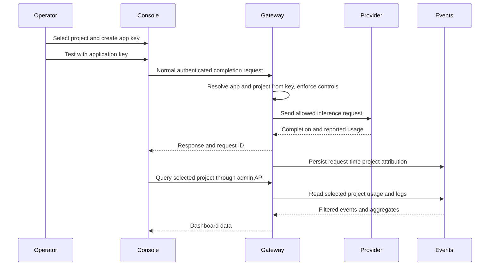

# Projects, usage, and API testing

## Trigger and prerequisites

Use this procedure to group applications, inspect project usage, or test the normal
gateway path from the console. Start the local gateway with its control plane,
connect an inference service, and log in with the operator key. No Docker or external
dashboard is required. Use synthetic prompts and a private application key.

## Create and connect a project

1. In **Projects**, create an ID and display name.
2. In **Applications**, select the project when creating a key. Existing managed
   applications can be moved using their project selector. IDs remain globally unique.
3. Allow the intended concrete model and `auto` if needed. Set the app rate limit.
   Copy the generated key once and keep provider secrets in the gateway.
4. Select the project in the dashboard/log filter, or use **View usage** on its row.

Applications configured through YAML can set `project_id`; their project is added
at startup. Without a project ID, apps use `default`. Existing stored keys and
authenticated legacy events migrate to that project; anonymous events remain
unattributed. The managed-app count lists runtime stored keys, excluding YAML keys.

## Test an application API

1. Open **API tester** and enter the application key, a model, synthetic prompt,
   and output token limit. Provider calls may consume quota.
2. Submit. The browser sends the normal `/v1/chat/completions` request using that
   app key. Authentication, allowlists, guardrails, rate limits, routing, caching,
   retries, and capture rules all apply. The dashboard filter does not select the
   request's project; its key does. Caller-supplied project headers are ignored.
3. Inspect HTTP status, latency, request ID, completion, and nullable usage.
   **Open matching log** shows the correlated event once its audit write finishes.
4. Refresh Overview/Logs to inspect project requests, input/output tokens, cache
   hits, errors, hourly UTC charts, and application/model breakdowns.
5. Export JSON from Logs. The selected project filter also applies to the export.

The app key is cleared after submission. Prompt/result text is held in page memory;
locking the console clears the tester, closes exchange detail, and stops pending
browser test requests. Persistent capture is controlled by the gateway-wide switch.

## Success checks and interpretation

- A request appears under the key's project even if the calling client sends a
  different project header. Invalid keys appear only as unattributed failures.
- Moving an app retains its key and changes future request attribution. Existing
  events stay in their original project; historical usage is not reassigned.
- A cache hit increases request/cache totals without increasing provider-token
  totals. If an app moves projects and receives an earlier cached response, the
  new project's event records a hit with no additional provider token usage.
- The dashboard covers the last 24 hours of retained events; APIs accept `hours`
  from 1 through 2160. First/current hourly buckets are partial. Breakdown tables
  return up to 100 applications/models; total cards and charts cover the full scope.
- Unknown provider usage remains null in events. A separate count shows provider
  requests without reported usage. These totals are not provider billing records.
- Projects are organizational grouping under one operator key. Per-project operator
  roles, isolation, budgets, deletion, and billing are not implemented.

## Recovery and deferred checks

If usage appears empty, check the selected project, application membership, time
window, retention, and provider usage availability. For a changed app assignment,
move it back; this affects future requests only. Do not edit historical events to
make a dashboard match the current membership. Revoke/recreate a lost app key.

Before upgrading, protect the database and separate master key. Additive migration
preserves existing keys and events; operational backup/restore remains a release
check. Optional Grafana/logging/Vault service management is planned in the
[ecosystem design](../ecosystem.md); it is not necessary for this runbook.
