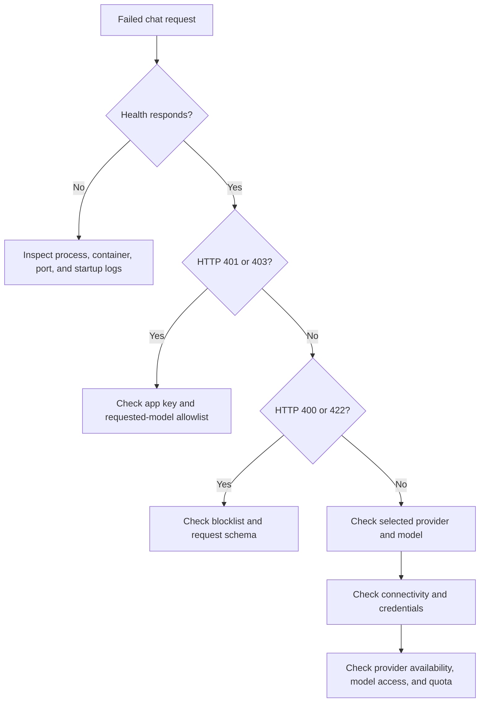

# Provider troubleshooting

## Trigger and prerequisites

Use this procedure when chat fails, times out, or reaches an unexpected model.
Have the gateway version, configured model, provider name, approximate timestamp,
and status code. Keep secrets and prompt content out of shared notes.

## Diagnosis

1. Call `/health`. This checks the gateway process only.
2. Check the client status and request shape:

   | Symptom | Current likely causes / next check |
   | --- | --- |
   | 401 | Missing/malformed bearer header, wrong app key, or wrong config file |
   | 403 | Requested model is absent from the app allowlist |
   | 400 | Hardcoded blocklist matched the prompt |
   | 422 | Request failed Pydantic validation |
   | 500 | Unhandled provider error, missing provider credential, invalid route, or unsupported provider |
   | Slow request | Network/provider latency; adapters currently use a 60-second HTTPX timeout |
   | Wrong provider for `auto` | Default route differs from expectation; routing rules are currently ignored |

   These status meanings describe the current code. Safe normalized upstream
   errors are planned; do not assume upstream HTTP codes are preserved.
3. Confirm the selected route. Configuring an OpenAI key does not change the
   default Ollama route. Use `GATEWAY_DEFAULT_MODEL` or the routing configuration.
4. For OpenAI, check that `OPENAI_API_KEY` is supplied to the gateway process and
   that the provider account can access the configured model. Do not print the key.
5. For Ollama, verify the endpoint is reachable from the same host/container
   network and that the model is installed. See [container deployment](container-deployment.md).
6. Inspect local logs around the timestamp. Request IDs and full outcome logs are
   not yet available. Redact credentials, prompts, and personal data before sharing.

## Recovery and verification

Correct the endpoint, credentials, default model, or allowlist and restart/recreate
the service. Send one short synthetic chat request. Confirm valid auth succeeds
and invalid auth still fails. Avoid repeated billable retries during diagnosis.

If failures affect multiple clients, follow [incident response](incident-response.md).
Report reproducible defects with the version, sanitized configuration shape,
status, and minimal request. Route security findings through [security reporting](../../SECURITY.md).
