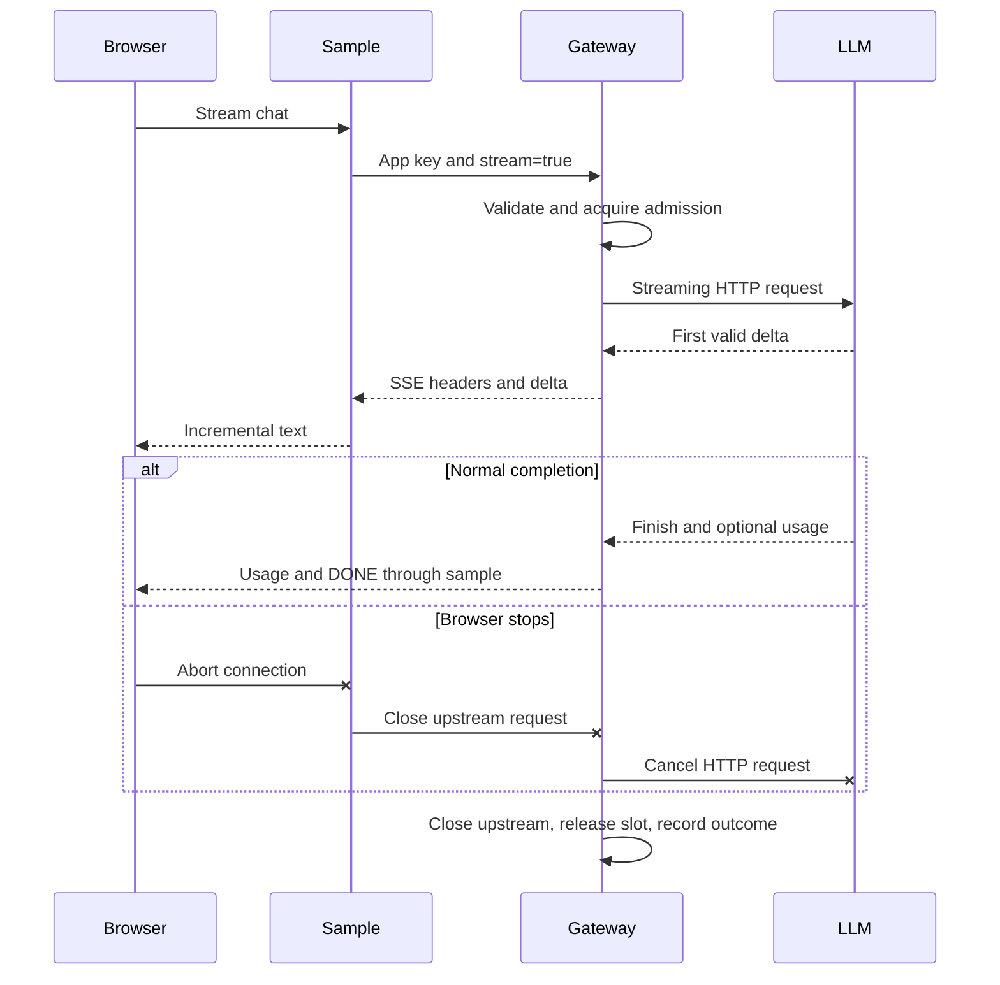

# Streaming and cancellation

## Scope

The gateway streams text chat for Ollama, OpenAI and generic OpenAI-compatible
adapters. Client disconnects cancel the gateway's upstream HTTP request in both
response modes, release admission and record one final outcome. Backend services
control whether closing HTTP stops model generation or billing; verify that with
each live provider. Gateway transport cancellation alone cannot guarantee it.

## Browser flow

Restart the source gateway and sample app after updating Python code, using their
existing stop/start scripts and private data directory. Keep Docker unchanged.
Start the sample with `./examples/chat_app/start.sh` and an application key whose
allowlist includes the concrete model (and auto when used). In the sample page:

1. Enable **Stream response** and send synthetic text. Output appears incrementally.
2. Input/output tokens stay unknown until the provider reports final usage.
3. Use **Stop** during generation. The draft and any visible partial answer remain;
   failed/cancelled turns are excluded from subsequent conversation history.
4. Find the request ID in gateway Logs. Inspect outcome, HTTP status, final status,
   response mode, partial-output flag and captured input/output when enabled.
5. Send a new request to verify that capacity was released. Stop also works with
   streaming disabled. Closing the page cancels a pending browser request.

The sample has no end-user authentication; keep its listener on loopback. Its
server holds the application key, relays SSE and forwards cancellation through to
the gateway. Provider credentials stay entirely in the gateway.

## API contract

Use the usual application bearer key with POST /v1/chat/completions:

```json
{
  "model": "auto",
  "messages": [{"role": "user", "content": "Explain a gateway in three sentences"}],
  "stream": true,
  "stream_options": {"include_usage": true}
}
```

Responses use text/event-stream, chat.completion.chunk objects and a successful
`data: [DONE]` terminator. Text/refusal deltas are supported; tools, images,
embeddings and multiple choices remain unsupported. stream_options is accepted
only with stream true and supports include_usage only. With include_usage true,
a final empty-choices usage chunk is emitted; its usage is null if unavailable.
Missing or interrupted-stream usage is never estimated.

The gateway requests final upstream usage from compatible providers for accounting
even if the client does not request the usage chunk. A server that rejects that
option fails safely; verify model/server support before deployment. Ollama NDJSON
is normalized to the same SSE contract with a stable gateway-generated stream ID.

Streams bypass cache lookups/writes and automatic provider retries. Authentication,
allowlists, input policy, rate limits and bounded queueing still apply. Admission
covers the whole stream, including transfer; queued work retains arrival settings,
endpoint, credential and cache snapshots. Each upstream UTF-8 line/SSE data event
is bounded to 65,536 bytes. Slow clients apply backpressure through awaited sends;
there is no unbounded output queue. Provider HTTP timeout is an inactivity timeout,
not a total generation deadline. Proxy buffering/timeouts need live validation.

## Failure and capture

The gateway fetches and validates the first chunk before committing headers.
Admission, connectivity or malformed-first-chunk failures use normal safe JSON
HTTP errors. Failures after headers use a terminal `event: error` with a safe JSON
error and request ID, then close without DONE. Clients must handle both forms and
must not treat partial text as a completed answer. No automatic replay follows
emitted text; retries can duplicate provider work.

Each request produces one final event after completion/failure/cancellation.
status_code records the final gateway outcome; http_status_code records the wire
status (null when no headers were sent). A mid-stream failure can therefore have
HTTP 200 and final 502/504. A disconnect records 499, outcome cancelled and a null
or already-committed HTTP status. Accepted streams have streaming true.

Capture remains controlled by the gateway-level setting. A bounded prefix plus
credential lookahead is assembled across deltas, redacted, then serialized and
truncated using existing limits. response_content_partial marks captured output
from interrupted streams; response_content_truncated marks incomplete storage.
The finish reason is retained for completed captures. Contents never enter stdout
metadata or metric labels. Usage received before interruption remains recorded;
otherwise counts stay unknown.

Prometheus exposes m87_gateway_streams_total with provider/outcome labels and
m87_gateway_cancellations_total by provider. Client cancellations do not increment
provider-error counts; retries/provider failures retain existing accounting.



## Automated and live verification

```bash
python -m pip install -e '.[dev,sdk-tests]'
python -m examples.chat_app.scenarios
pytest -q tests/test_streaming.py tests/test_disconnect_lifecycle.py tests/test_request_queue.py
```

The sample suite includes streaming, final usage and
captured output. Additional tests cover all built-in adapter streams, byte-boundary
framing, initial/terminal errors, missing DONE, invalid identities/oversized events,
cache bypass, missing usage, strict options, credential redaction across deltas,
truncation and real OpenAI SDK streaming. Real TCP tests close clients in both
response modes, directly and through the sample, and require upstream closure,
slot release and exactly one cancellation event within a bounded interval.
Native bundle CI smoke also exercises streaming and SQLite capture.

On 2026-10-06 local Ollama discovery at loopback port 11434 timed out; no live
inference was attempted. Once Ollama is reachable, run the browser flow, compare
reported token usage with the provider response, stop during generation and verify
backend GPU work stops. Repeat with paid providers/compatible servers and the
Worker/tunnel/proxy path. Record exact provider/model versions and results in
[validation](../validation.md). Docker and clean-host packaging remain separate gates.

Schema 5 adds nullable outcome/wire-status metadata and default-off streaming/partial
flags. Schema-3/4 upgrade tests preserve keys, usage and identity audit. Back up
before upgrading; older binaries reject newer databases. Restore a pre-upgrade
backup to a fresh private destination for rollback using the
[workstation recovery procedure](workstation-distribution.md).
