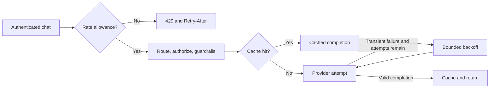

# Traffic controls

Use one gateway process for these controls. Cache contents and rate-limit windows
live in memory and reset on restart; multiple workers or replicas each have their
own allowance and cache.

## Configure and verify

Set an application's `rate_limit_per_minute` in YAML, or choose a limit when
creating its key in the console. An omitted limit permits unlimited request
starts. The gateway counts authenticated, valid chat requests before routing,
policy, and cache lookup in a rolling 60-second window. Requests beyond the
allowance return 429 with `Retry-After`; rejected requests do not extend the window.

Enable exact-response caching with `GATEWAY_CACHE_ENABLED=true`. Identical
messages and generation options for the same app and resolved model can reuse a
validated completion. Authorization, provider-enabled checks, and guardrails run
on every request. TTL defaults to 300 seconds; `GATEWAY_CACHE_TTL_SECONDS` and
`GATEWAY_CACHE_MAX_ENTRIES` control expiry and entry count. Cache values contain
response text even when audit content capture is disabled. Enable only when
reusing responses is appropriate, including for stochastic generation.

Send an identical synthetic request twice. Require `X-Gateway-Cache: MISS` then
`HIT`, different request IDs, and no second provider invocation. Change the prompt
or generation options to require a miss. Inspect cache status and attempt count
in the console. Provider token totals exclude cache hits; the cached response
retains the original provider usage and completion identity.

Set `GATEWAY_PROVIDER_MAX_ATTEMPTS` from 1 to 5 to enable retries. The default is
one attempt. `GATEWAY_PROVIDER_RETRY_BACKOFF_MS` sets the initial exponential
backoff. Only network failures, timeouts, upstream 429, 408, 409, and server errors
are retried. Provider credential rejection, missing credentials, malformed
responses, and policy errors are not retried. Cancellation stops the request.
Each attempt uses the configured provider timeout; the total duration can span
all attempts and backoffs. A timed-out upstream call may already have generated
billable work, so retries can duplicate charges. Usage from failed attempts is
unknown and is not estimated.

## Recovery and limits

Disable caching and restart to discard all retained responses. Revert retry
attempts to one when repeated upstream work or latency is undesirable. Update a
configured app limit and restart; recreate a managed key to change its limit.
Monthly budgets, shared enforcement, fallback routes, and remote exporters remain
planned. Docker and live providers are unnecessary for automated policy tests;
verify a real model during the next intentional local test session.
