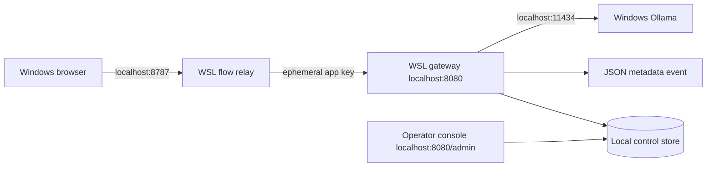

# Windows and WSL flow lab

## Trigger and scope

Use this procedure to exercise the application-to-gateway-to-model path without
Docker or a public tunnel. A browser on Windows calls a test relay in WSL, which
calls a second WSL process running the gateway. The gateway calls Ollama on the
Windows loopback interface.



This is a disposable local integration fixture. It supports non-streaming text
chat and does not replace the Cloudflare Worker, Access, and Tunnel checks.

## Prerequisites

- Python 3.11 or newer and the project development dependencies are installed in
  a WSL virtual environment.
- Windows Ollama is running and reachable from WSL at
  `http://127.0.0.1:11434` or another explicitly configured private address.
- A test model is installed for a successful completion. The safe failure path
  remains testable when the model list is empty.
- Ports 8080 and 8787 are available in WSL.
- Prompts contain only synthetic test content.

## Procedure

1. From the repository root, activate the virtual environment and check Ollama:

   ```bash
   . .venv/bin/activate
   curl --fail-with-body http://127.0.0.1:11434/api/tags
   ```

2. Start the flow lab:

   ```bash
   python -m examples.local_test_app.start
   ```

   The launcher discovers installed models, selects the first one, generates an
   ephemeral gateway and admin keys, enables the local control plane, and starts
   both WSL services. It does not download a model or write either generated key
   to disk.

3. To select a repeatable route, restart with the exact installed model name:

   ```bash
   LOCAL_TEST_MODEL='ollama:<installed-model>' python -m examples.local_test_app.start
   ```

4. Open `http://localhost:8787` in the Windows browser. The status card must show
   that the gateway is reachable.
5. Send a synthetic prompt with `model: auto`. Record the resolved model, request
   ID, HTTP outcome, and whether token usage is available.
6. Find the same request ID in the WSL gateway metadata event. Require the app ID
   to be `local-flow-lab`, the resolved route to match, and the provider attempt
   and status to match the browser result.
7. Open the printed console URL, enter the one-time admin key, and inspect the
   matching request. Confirm token counts and opted-in input/output are present.
8. Confirm the synthetic prompt remains absent from stdout metadata and metrics.
9. Press Ctrl+C in the launcher terminal and require both services to stop cleanly.

## Success checks

| Check | Expected evidence |
| --- | --- |
| Page and assets | HTTP 200 from the Windows browser |
| Gateway status | Relay reports gateway reachable |
| Ephemeral authentication | Browser never receives the gateway key |
| Automatic route | Response names the selected `ollama:<model>` |
| Correlation | Browser and metadata event have the same request ID |
| Metadata privacy | Prompt and completion remain absent from stdout metadata and metrics |
| Control plane | Matching event, usage, input, and output appear in the console |
| Ollama unavailable or model absent | Safe 502/504 with correlated metadata |
| Cleanup | Ports 8080 and 8787 are released after Ctrl+C |

## Networking fallback

Windows normally forwards `localhost` to WSL. If the browser cannot reach the
relay, set `LOCAL_TEST_HOST=0.0.0.0` and use the WSL address from `hostname -I`.
Use this fallback only on a trusted private workstation with the Windows firewall
enabled. Return to the loopback bind after testing.

If WSL cannot reach Windows Ollama through loopback, first confirm WSL networking
mode and the Ollama listener. Set `OLLAMA_BASE_URL` only to an address intentionally
reachable from WSL. Do not expose Ollama directly through a public tunnel.

## Recovery

- Press Ctrl+C once in the launcher terminal. The launcher sends a clean shutdown
  signal to the relay and gateway.
- If a process remains, inspect port ownership before restarting. Do not terminate
  unrelated processes using the same ports.
- If Ollama reports a missing model, install it from Windows during an intentional
  resource window and rerun the same command.
- Use [provider troubleshooting](provider-troubleshooting.md) if the gateway is
  healthy but the provider request fails unexpectedly.

Implementation details and environment overrides are documented with the
[local test application](../../examples/local_test_app/README.md).
