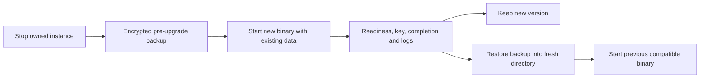

# Portable workstation preview

## Status and prerequisites

The portable preview bundles Python, the gateway, UI and SQLite. Download the ZIP
for your native OS/architecture and its matching `.sha256` file from the successful
CI run's artifacts. These are development artifacts retained for 14 days, not a
signed public release. Build natively; the Linux executable is not a Windows app.
Current targets are Windows x64 and Ubuntu 24.04 x64. Linux distributions with
older system libraries, macOS, ARM, clean workstations, browser accessibility and
public release signing remain separate verification gates.

Users supply an existing inference service or cloud access. Ollama on Windows can
use `http://127.0.0.1:11434` when the gateway also runs natively on Windows.
No Python, Node, Docker, Grafana or external database installation is needed to
run the portable gateway. Container ecosystem profiles are still planned.

## Verify, unpack and start

1. Verify the archive's SHA-256 against the matching checksum file. Checksums detect
   changed bytes; obtain artifacts through the trusted repository CI account.
2. Unpack into a user-controlled folder. Keep the binary and helper scripts together.
3. On Windows, double-click `start.cmd`. A console remains open and the browser
   opens after startup. On Linux, run `./start.sh` from the unpacked folder.
4. Enter the printed admin key in the console. Keep the terminal/private logs out
   of shared recordings. Connect inference in Setup, choose a default model, create
   an application key, and use the API tester to send a synthetic completion.
5. Inspect Logs and tokens. Enable gateway-wide input/output capture in Setup if
   desired. Use Controls for limits, caching, retries, retention and readiness.

Windows checksum example, from PowerShell:

```powershell
Get-FileHash .\m87-gateway-0.1.1.dev0-windows-amd64.zip -Algorithm SHA256
```

Linux checksum example, in the download directory before unpacking:

```bash
sha256sum --ignore-missing -c m87-gateway-0.1.1.dev0-linux-x86_64.sha256
```

Native commands can be used directly:

```powershell
.\m87-gateway.exe --open-browser
.\m87-gateway.exe --status
.\m87-gateway.exe --stop
.\m87-gateway.exe --version
```

Linux uses `./m87-gateway` with the same flags. Default startup selects 8087,
8187, 8287, and subsequent increments of 100. Explicit `--port` is exact. Stop
and status identify the instance by its private state record before sending any
operator credential. They never kill a process by port or adopt another gateway.
`--stop` waits up to 30 seconds for graceful shutdown; admitted long requests can
keep draining beyond that window. Check status rather than forcing termination.

## Data and permissions

Windows data defaults to `%LOCALAPPDATA%\M87Gateway`; Linux uses
`$XDG_DATA_HOME/m87-gateway` or `~/.local/share/m87-gateway`. `--data-dir` selects
another private directory; use the same option for start, stop, status and backup.
One portable instance owns a data directory through an OS file lock.

POSIX data uses private 0700 directories/0600 files. Windows applies protected ACLs
allowing the current user, and rejects existing files/directories granting others
access. Windows administrators and a compromised OS remain outside this boundary.
Private ACLs use native Win32 security descriptors; see
[Microsoft SDDL documentation](https://learn.microsoft.com/en-us/windows/win32/secauthz/security-descriptor-string-format).
Symlinks/reparse points in the private storage leaf are rejected. Do not use shared
or redirected data directories until their filesystem/ACL semantics are tested.

Provider secrets are encrypted with the local master key. Application keys remain
hashed; they cannot be shown again. Configuration, projects and retained logs live
in SQLite. The portable application does not bundle models or GPU drivers.

## Backup and restore

Stop the gateway before backup. Use a new output path inside a private backup folder:

```powershell
.\m87-gateway.exe --stop
.\m87-gateway.exe --backup .\backups\gateway.m87backup
.\m87-gateway.exe --data-dir .\recovered-data --restore .\backups\gateway.m87backup
.\m87-gateway.exe --data-dir .\recovered-data --open-browser
```

The command prompts for a password of at least 12 characters, with confirmation
when creating a backup. Keep the password separately; a lost password cannot be
recovered. Automation may supply `GATEWAY_BACKUP_PASSWORD` privately in the process
environment. Never put the password in command arguments, Git or shared logs.

The versioned archive encrypts a consistent SQLite snapshot, master key and saved
admin key with a password-derived Fernet key (PBKDF2-HMAC-SHA256, 600,000 iterations,
random salt). It includes projects, keys, connections, controls and retained event
content. It excludes environment variables, upstream services, external JSONL
files, exports, inference models and arbitrary YAML files. Environment-provided
operator/provider credentials must be supplied separately after restore.

Restore requires a fresh directory and rejects wrong passwords, tampering, newer
schemas, invalid databases/credentials, or existing contents. It preserves the
original directory and does not overwrite backups. Supported local backups are
bounded to 256 MiB encoded archives and 128 MiB database snapshots. Source extension
registrations must be present to restore configuration referencing those adapters.

After restore, verify readiness, projects, retained logs, and a synthetic completion
using an existing application key. Keep the original directory until verification
passes. Stored operator keys are restored; external operator-key overrides remain
external. Backups contain sensitive data even though encrypted.

## Upgrade and rollback

1. Stop the instance. Create and verify an encrypted backup with the current binary.
2. Keep the current binary/ZIP and checksums. Unpack the new version in a separate
   folder; do not mix binary versions in one unpacked folder.
3. Start the new binary with the existing private data directory. Verify readiness,
   app authentication, completion, logs and saved controls.
4. For rollback, stop the new version. Use the previous binary with a fresh private
   directory restored from the pre-upgrade backup. Verify the same checks before
   returning calling apps to that listener.



A database newer than the binary's schema fails closed before migration. Current
migration is additive and accepts the earlier schema-zero database. The automated
smoke test exercises stop, backup, restore and inference with the current binary;
rollback between distinct released binaries requires a retained compatible release
and remains a release gate. There is no automatic updater or OS service installer.

## Building and validation

Maintainers build on each target OS with Python and the optional bundle dependency:

```bash
python -m pip install -e '.[bundle]'
python scripts/build_standalone.py
python scripts/smoke_standalone.py dist/m87-gateway
```

Windows smoke uses `dist/m87-gateway.exe`. The ZIP includes the executable, scripts,
this guide, license/notice, and a manifest recording dependency versions and the
binary digest. Build records do not guarantee identical bytes across rebuilds.
CI runs platform storage/backup tests and the native executable smoke. A CI runner
has development tools installed, so it is not clean-workstation evidence. Record
manual Windows Ollama and clean-host checks in validation before expanding claims.
