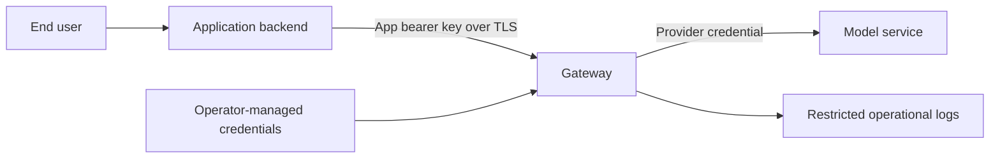

# Security

## Trust boundaries

The app key authenticates a calling backend. Keep it out of public browser code.
Provider credentials remain server-side. Operators own TLS, network access, secret
delivery, and credential rotation for their deployment.

## Current controls and limits

- Bearer app-key authentication rejects missing and unknown keys.
- Requested-model allowlists reject disallowed concrete requests.
- `auto` does not yet re-authorize its resolved target.
- The prompt blocklist is hardcoded; YAML policy settings are not connected.
- Blocklist errors currently include the matched term.
- Audit redaction checks top-level names only.
- Rate limits, budgets, size limits, JWT, and response policies are not implemented.
- Provider enable flags are ignored; they cannot disable access during an incident.

A keyword blocklist does not provide comprehensive prompt-injection protection.
Configured controls must be verified before relying on them.

## Operator practices

Use private app keys, keep credentials in an ignored local environment or managed
secret source, and restrict ingress. The development Compose port binds to
loopback; a shared service needs deliberate TLS and access configuration.
Use synthetic prompts for diagnostics and sanitize shared logs.

See [configuration changes](runbooks/configuration-changes.md) for rotation and
[incident response](runbooks/incident-response.md) for containment.

## Product requirements

The [design](design.md) and [roadmap](roadmap.md) require final-target authorization,
safe errors, startup validation, bounded input, enforced resource controls, and
tested provider identity mechanisms before advertising those capabilities.

Report vulnerabilities through [SECURITY.md](../SECURITY.md). Public release also
requires a review of content, history, release assets, and commit metadata.
