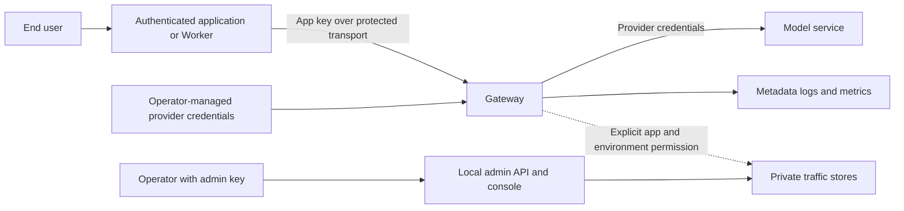

# Security

## Trust boundaries

Keep gateway app keys out of public browser code. Provider credentials stay
server-side. Operators own TLS, tunnel/edge policy, network access, and credential
rotation. A tunnel does not replace gateway authentication.

## Implemented controls

- App bearer keys use constant-time comparison; missing/unknown keys fail closed.
- Both the requested alias and resolved model require allowlist permission.
- Disabled providers cannot be invoked.
- Configuration is validated at startup, including explicit missing-file failures.
- Body bytes, message count, and individual message sizes are bounded.
- Configured blocklist matches return safe errors without the matched term.
- Upstream bodies, credentials, and exception details stay out of client errors.
- Metadata logs omit headers and content. Captured text requires the explicit
  gateway-wide switch and a private store with known-credential redaction.
- Runtime app keys are stored as keyed digests. Stored provider credentials use
  Fernet encryption with a separate owner-only master-key file.
- The admin API uses a distinct environment-supplied bearer key. The console does
  not persist it in HTML, browser storage, or SQLite.

Blocklists are limited policy checks, not comprehensive prompt-injection defenses.
Captured free text can contain sensitive material that the redactor does not
recognize. Use synthetic data for initial capture; define access and retention
before collecting other content.

## Current limits

Per-process rate/concurrency limits and bounded queues are implemented. Budgets,
JWT, response policies, distributed coordination and remote log export remain planned. Preserve existing
application/origin controls when testing this gateway alongside another service.
The metrics endpoint has no app-key auth and belongs on a private operator network.

## Operations

The development Compose port binds to loopback. A shared service needs deliberate
TLS and access configuration. Mount traffic storage privately if persistence is
needed; never expose it via a static server or public tunnel.

See [configuration changes](runbooks/configuration-changes.md),
[traffic logging](runbooks/traffic-logging.md), and
[incident response](runbooks/incident-response.md). Report vulnerabilities through
[SECURITY.md](../SECURITY.md). Public release also requires the existing history
and artifact privacy review.

Captured text now uses a separate SQLite table and independent retention. Operator
search/detail/export APIs remain privileged. Exports omit content by default and
explicit content/log deletion is audited; independent usage remains. Logical deletion
does not securely erase WAL/free pages/backups/downloaded files. See [logging showcase](runbooks/logging-showcase.md).
