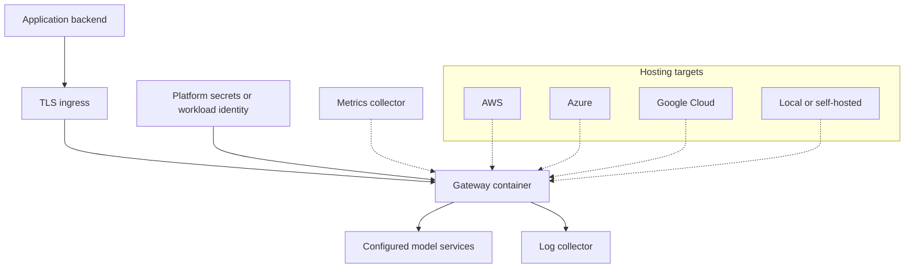

# Stack

## Current runtime and tooling

| Layer | Choice | Status and rationale |
| --- | --- | --- |
| Language | Python 3.11+ | Declared in `pyproject.toml`; keeps adapter development accessible |
| HTTP service | FastAPI and Uvicorn | Implemented API routing and ASGI runtime |
| Validation | Pydantic v2 | Request/response and configuration models |
| Configuration | YAML, PyYAML, environment variables | Implemented loader; some settings are not connected to runtime behavior |
| Provider HTTP | HTTPX | Async OpenAI and Ollama requests; currently creates a client per request |
| Logging | JSON stdout and an optional rotating JSONL file | Correlated metadata plus explicitly enabled bounded content capture |
| Metrics | Prometheus client | Per-process `/metrics` with bounded labels |
| Tests | pytest, FastAPI TestClient, HTTPX MockTransport | Automated core checks plus a verified native Ollama flow; OpenAI/cloud live checks deferred |
| Lint | Ruff | Explicit syntax/error and undefined-name rules in CI |
| Packaging | Python package from `pyproject.toml` | Build/install checks are required before release |
| Containers | Docker and Docker Compose | Loopback publishing and host mapping configured; live container validation is pending |
| Automation | GitHub Actions | Lint and test workflow |
| Documentation | Markdown and Mermaid | Renderable in repository pages; no separate site required |

Dependencies currently use minimum versions. A release needs a reproducible
dependency/build strategy and recorded validation; broad version ranges alone do
not establish compatibility with every future dependency release.

## Planned infrastructure

| Concern | Direction | Adoption condition |
| --- | --- | --- |
| Durable configuration/usage | Evaluate SQLite locally and PostgreSQL for shared deployments | A feature requires persistence and migration/backup semantics are defined |
| Shared rate limiting | Evaluate shared state or an external limiter | Limits must remain correct across replicas |
| Distributed tracing | OpenTelemetry integration | Stable request IDs and a documented trace schema exist |
| Dashboards | Prometheus and Grafana examples | Metrics names/labels are implemented and documented |
| Log aggregation | JSON stdout suitable for common collectors | Safe, consistent outcome logging exists |
| Deployment automation | Kubernetes and Terraform examples | A concrete, tested deployment and owner exist |

Avoid adding all of these dependencies to the default runtime. Each needs a
specific use case, operational cost assessment, and lifecycle documentation.

## Cloud deployment targets

These are planning assumptions, not supported deployment recipes.

| Platform | Initial path to evaluate | Shared requirements |
| --- | --- | --- |
| AWS | Managed container service, with Kubernetes as an optional path | TLS ingress, managed secrets/identity, outbound provider access, health probes, logs |
| Azure | Managed container service, with Kubernetes as an optional path | Same requirements, using platform-native identity and secret delivery |
| Google Cloud | Managed container service, with Kubernetes as an optional path | Same requirements, using platform-native identity and secret delivery |
| Local / self-hosted | Docker Compose or a Python virtual environment | Reachable provider, private app key, explicit configuration |

Cloud-specific infrastructure files remain placeholders until validated. A
provider adapter and a hosting target each receive their own support evidence.

## Adding a dependency

Document the problem, why existing dependencies are insufficient, license and
maintenance considerations, configuration/secrets impact, and how to remove or
upgrade it. Keep provider-specific SDKs optional when practical. Update tests,
support claims, and relevant runbooks together.
