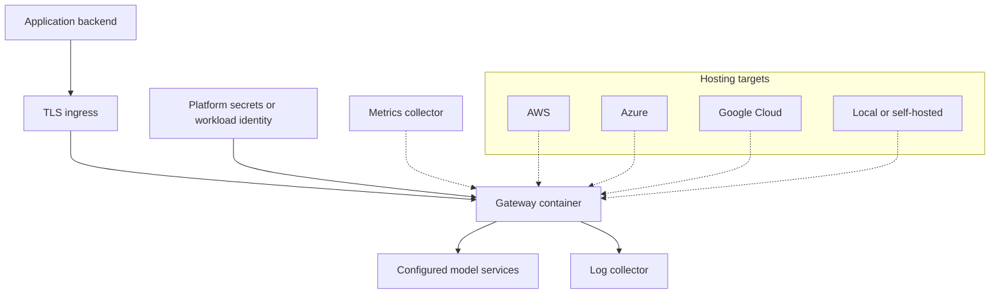

# Stack

## Current runtime and tooling

| Layer | Choice | Status and rationale |
| --- | --- | --- |
| Language | Python 3.11+ | Declared in `pyproject.toml`; keeps adapter development accessible |
| HTTP service | FastAPI and Uvicorn | Implemented API routing and ASGI runtime |
| Validation | Pydantic v2 | Request/response and configuration models |
| Configuration | YAML, PyYAML, environment variables | Implemented loader; some settings are not connected to runtime behavior |
| Provider HTTP | HTTPX | Async registered-provider requests; currently creates a client per request |
| Logging | JSON stdout and an optional rotating JSONL file | Correlated metadata plus explicitly enabled bounded content capture |
| Metrics | Prometheus client | Per-process `/metrics` with bounded labels |
| Local persistence | SQLite WAL | Optional single-instance event and key-metadata store |
| Credential encryption | `cryptography` Fernet | Encrypts stored provider keys with a separate local master key |
| Operator UI | Packaged HTML, CSS, and JavaScript | Connection/model setup, local analytics, exchange inspection, and key operations |
| Console interaction tests | Node test runner and jsdom | Isolated development dependency with a lockfile; tests DOM events, scoped requests, key isolation, charts, and lock cleanup |
| Tests | pytest, FastAPI TestClient, HTTPX MockTransport | Automated core checks plus a verified native Ollama flow; OpenAI/cloud live checks deferred |
| Lint | Ruff | Explicit syntax/error and undefined-name rules in CI |
| Packaging | Python package from `pyproject.toml` | Build/install checks are required before release |
| Standalone build | Optional PyInstaller build dependency | Native Windows/Linux CI builds and recovery smoke passed; clean-host/release checks pending |
| Containers | Docker and Docker Compose | Non-root single-app image, persistent volume, 8087 and prebuilt Compose; exact validation in validation.md |
| Automation | GitHub Actions | Lint and test workflow |
| Documentation | Markdown and Mermaid | Renderable in repository pages; no separate site required |

Dependencies currently use minimum versions. A release needs a reproducible
dependency/build strategy and recorded validation; broad version ranges alone do
not establish compatibility with every future dependency release.

PyInstaller bundles the runtime and UI for users without a Python installation.
It is an optional build dependency and is absent from normal gateway requirements.
Removing it removes the standalone build path while preserving source/container
operation. Native builds must be checked on their target OS and architecture;
see [workstation distribution](runbooks/workstation-distribution.md) for current limits.

The console test dependency provides a DOM without downloading a full browser.
It is isolated under `tests/console` and absent from gateway requirements and
standalone artifacts. Removing it removes those interaction checks while leaving
the console implementation intact. Actual browser rendering and accessibility
review are separate checks. The planned ecosystem service stack and lifecycle
adapters are described in [ecosystem design](ecosystem.md); companion services
are not runtime dependencies today.

## Planned infrastructure

| Concern | Direction | Adoption condition |
| --- | --- | --- |
| Shared configuration/usage | PostgreSQL or another coordinated store | Multi-instance persistence and migration/backup semantics are defined |
| Shared rate limiting | Evaluate shared state or an external limiter | Limits must remain correct across replicas |
| Distributed tracing | OpenTelemetry integration | Stable request IDs and a documented trace schema exist |
| Dashboards | Prometheus and Grafana examples | Metrics names/labels are implemented and documented |
| Log aggregation | JSON stdout suitable for common collectors | Safe, consistent outcome logging exists |
| Deployment automation | Kubernetes and Terraform examples | A concrete, tested deployment and owner exist |

Avoid adding all of these dependencies to the default runtime. Each needs a
specific use case, operational cost assessment, and lifecycle documentation.

## Cloud deployment targets

These are planning assumptions, not supported deployment recipes.

| Platform | Initial path to evaluate | Shared requirements |
| --- | --- | --- |
| AWS | Managed container service, with Kubernetes as an optional path | TLS ingress, managed secrets/identity, outbound provider access, health probes, logs |
| Azure | Managed container service, with Kubernetes as an optional path | Same requirements, using platform-native identity and secret delivery |
| Google Cloud | Managed container service, with Kubernetes as an optional path | Same requirements, using platform-native identity and secret delivery |
| Local / self-hosted | Docker Compose or a Python virtual environment | Included setup UI, reachable provider and private application key |

Cloud-specific infrastructure files remain placeholders until validated. A
provider adapter and a hosting target each receive their own support evidence.

## Adding a dependency

Document the problem, why existing dependencies are insufficient, license and
maintenance considerations, configuration/secrets impact, and how to remove or
upgrade it. Keep provider-specific SDKs optional when practical. Update tests,
support claims, and relevant runbooks together.

## Workstation storage and recovery

Portable data uses POSIX private modes or current-user Windows ACLs through Win32
APIs. File locks prevent overlapping portable instances/maintenance in one directory.
The native lifecycle uses instance identity followed by operator-authenticated
shutdown rather than PID/port-based termination. Offline backup uses SQLite snapshot
backup, a versioned encrypted envelope and password-derived keys; restore validates
integrity, configuration, schema and provider ciphertext before writing a fresh
private destination. See [workstation runbook](runbooks/workstation-distribution.md).

## Embedded backend extension boundary

Five repositories share one private SQLite database. Traffic and content-free usage
records are written atomically with separate retention. Backend factories are
registered explicitly in trusted source; configuration selects an identifier.
Only SQLite is bundled. External database/secret stores require the shared
[backend contracts](backend-adapters.md) and service-specific acceptance tests.
