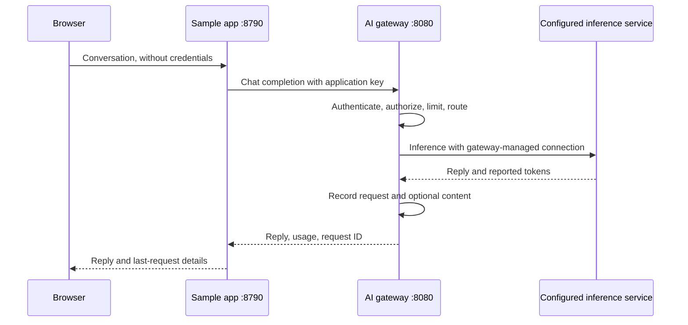

# Gateway chat sample

A small conversation application that uses an **already-running** gateway. It
does not create another gateway or change its configuration. The browser calls
this application's server, which calls the gateway with an application key.
Any inference adapter supported and configured in the gateway can serve the chat.



## Run

This sample runs in Linux/WSL with the gateway's source environment. Install once
if `.venv` is not already prepared:

```bash
python3 -m venv .venv
.venv/bin/python -m pip install -e .
```

1. Start the gateway with `./start.sh` from the repository root.
2. Open `http://localhost:8080/admin`. In **Setup**, save an inference connection
   and default model. Local Windows Ollama can remain on Windows.
3. Optionally create a project called `sample-chat`. In **Applications**, create
   an app in that project, allowing `auto` **and** the selected concrete model.
   Copy its application key shown once. Do not use the operator/admin key here.
4. Start the sample from the repository root:

   ```bash
   ./examples/chat_app/start.sh
   ```

   Paste the application key at the hidden terminal prompt. It stays in the sample
   server's environment for this run; it is not saved to a file or sent to the browser.
5. Open **http://localhost:8790** and send a synthetic question. Try a follow-up:
   conversation history is sent with each request. The page shows the last request's
   input/output/total tokens, round-trip latency, model, and request ID.
6. In the gateway console, select the project's dashboard/logs and match that
   request ID. Enable both global content capture and the app's capture permission
   to inspect input/output there; metadata and usage do not require content capture.
7. Press **Ctrl+C** to stop the sample. The gateway stays running. Use `./stop.sh`
   separately when you want to stop the gateway.

No Docker, extra database, Node installation, or browser credential storage is
needed. This is a source example; the standalone gateway executable does not
include a sample-app runtime.

## Options

```bash
./examples/chat_app/start.sh --gateway-url http://127.0.0.1:8081 --port 8791
./examples/chat_app/start.sh --model 'ollama:gemma3:1b'
```

`SAMPLE_GATEWAY_URL` and `SAMPLE_MODEL` can also set the gateway URL/model.
Without an explicit URL, the sample detects a live gateway started by this checkout's
`./start.sh`, including custom ports. It verifies the private process record against
the running process; missing or stale records fall back to `http://127.0.0.1:8080`.
The selected gateway URL appears in the terminal and page. A custom `GATEWAY_RUN_DIR`
must match the setting used to start the gateway. Explicit `--gateway-url` takes
precedence over `SAMPLE_GATEWAY_URL`, which takes precedence over detection.
`SAMPLE_APP_KEY` can supply the app key from an existing private environment instead
of prompting. Avoid putting real keys in shell command history. `GATEWAY_PYTHON`
selects another installed Python executable. Revoke the sample key in Applications
when testing is finished.

## What to check

- A question and follow-up succeed, and matching requests appear under the app/project.
- Tokens reflect provider-reported usage; unavailable values read **Unknown**.
- Revoking the app key causes a safe authentication error with a request ID.
  For an unexpected key rejection, compare the sample's displayed gateway URL with
  the console URL where the key was created. An older Flow Lab may occupy 8080
  while your managed gateway runs on a different port. Stop the sample with Ctrl+C
  and restart with `--gateway-url` set to the intended gateway; keep that gateway's
  application key. Each gateway data directory has its own application keys.
- A disallowed model causes an authorization error. A low app rate limit produces
  a rate-limit error after repeated requests; wait for the window before retrying.
- A disconnected gateway produces a clear connectivity error. Gateway health alone
  does not verify inference connectivity, the app key, or model access.

Conversation history lives only in the current page's memory; **New conversation**
clears it. Gateway retention and opted-in capture are separate. Requests are
non-streaming, have a 512-token output limit, and support up to 31 messages with
32,768 total characters. Round-trip latency includes the application-to-gateway
call; it differs from gateway processing latency. Usage is for the last request,
including its conversation context, rather than the session total.

The server binds to loopback and rejects cross-origin browser submissions. It has
no end-user login and is a local sample, not a public chat deployment. Configure
authentication, authorization, TLS, and resource controls before adapting it for
remote users. Gateway provider secrets belong only in the gateway console.
