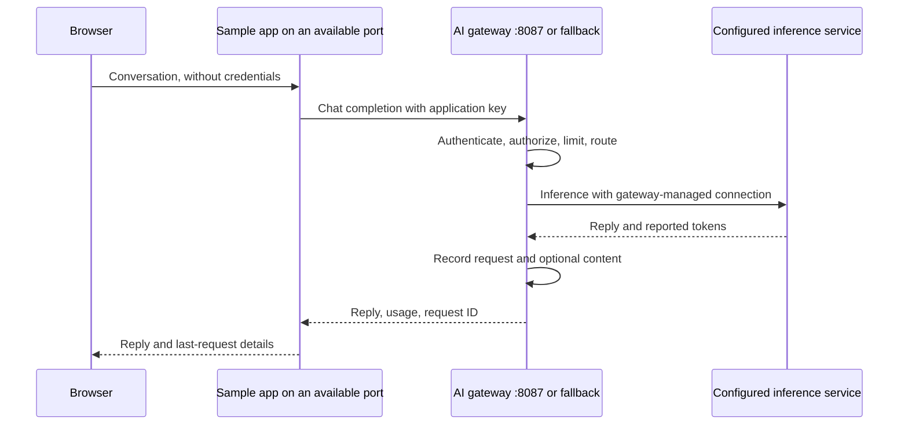

# Gateway chat sample

A small conversation application that uses an **already-running** gateway. It
does not create another gateway or change its configuration. The browser calls
this application's server, which calls the gateway with an application key.
Any inference adapter supported and configured in the gateway can serve the chat.



## Run

This sample runs in Linux/WSL with the gateway's source environment. Install once
if `.venv` is not already prepared:

```bash
python3 -m venv .venv
.venv/bin/python -m pip install -e .
```

1. Start the gateway with `./start.sh` from the repository root.
2. Open the gateway's printed console URL (normally `http://localhost:8087/admin`). In **Setup**, save an inference connection
   and default model. Local Windows Ollama can remain on Windows.
3. Optionally create a project called `sample-chat`. In **Applications**, create
   an app in that project, allowing `auto` **and** the selected concrete model.
   Copy its application key shown once. Do not use the operator/admin key here.
4. Start the sample from the repository root:

   ```bash
   ./examples/chat_app/start.sh
   ```

   Paste the application key at the hidden terminal prompt. It stays in the sample
   server's environment for this run; it is not saved to a file or sent to the browser.
   Input is hidden, including pasted characters. Paste the full key, then press
   Enter; omit any `Bearer` or `Authorization:` prefix. An empty key or whitespace
   is rejected before launch. The abbreviated key prefix in the application list
   cannot be used as the key. If the full key was lost, create another application
   key and copy its one-time value; do not replace it with the operator/admin key.
5. Open the sample's printed URL and send a synthetic question. Try a follow-up:
   conversation history is sent with each request. The page shows the last request's
   input/output/total tokens, round-trip latency, model, and request ID.
6. In the gateway console, select the project's dashboard/logs and match that
   request ID. Enable gateway-wide content capture in Setup to inspect input/output
   there; metadata and usage do not require content capture.
7. Run `./examples/chat_app/stop.sh` to stop the sample. The gateway stays running. Use `./stop.sh`
   separately when you want to stop the gateway.

No Docker, extra database, Node installation, or browser credential storage is
needed. This is a source example; the standalone gateway executable does not
include a sample-app runtime.

## Everyday lifecycle

```bash
./examples/chat_app/start.sh
./examples/chat_app/status.sh
./examples/chat_app/stop.sh
```

Start runs in the background and selects an available loopback port. Status prints
the selected URL; stop sends a graceful termination signal to that recorded sample
process only. Repeated start reuses the managed process without another key prompt;
repeated stop is harmless. You do not need to remember its port. Use `--port` or
`SAMPLE_PORT` for an exact port, or `--port 0` for automatic selection. Existing
foreground sample processes must be stopped with Ctrl+C; the scripts do not adopt
them. For a foreground run, set `SAMPLE_APP_KEY` privately and run
`python -m examples.chat_app`.

Private process state and startup output are stored under the ignored
`var/lib/chat-app-runner/`. `SAMPLE_RUN_DIR` selects another private directory;
use the same setting for start, stop, and status. Keys remain in process memory/
environment, not process-state files, browser storage, or startup output. A stopped
sample needs its application key again when started. Stopping the sample does not
stop the gateway or Ollama. Status returns 3 when no managed sample is running.

## Options

```bash
./examples/chat_app/start.sh --gateway-url http://127.0.0.1:8081 --port 8791
./examples/chat_app/start.sh --model 'ollama:gemma3:1b'
```

`SAMPLE_GATEWAY_URL` and `SAMPLE_MODEL` can also set the gateway URL/model.
Without an explicit URL, the sample detects a live gateway started by this checkout's
`./start.sh`, including custom ports. It verifies the private process record against
the running process; missing or stale records fall back to `http://127.0.0.1:8087`.
The selected gateway URL appears in the terminal and page. A custom `GATEWAY_RUN_DIR`
must match the setting used to start the gateway. Explicit `--gateway-url` takes
precedence over `SAMPLE_GATEWAY_URL`, which takes precedence over detection.
`SAMPLE_APP_KEY` can supply the app key from an existing private environment instead
of prompting. Avoid putting real keys in shell command history. `GATEWAY_PYTHON`
selects another installed Python executable. Revoke the sample key in Applications
when testing is finished.

## What to check

- A question and follow-up succeed, and matching requests appear under the app/project.
- Tokens reflect provider-reported usage; unavailable values read **Unknown**.
- Revoking the app key causes a safe authentication error with a request ID.
  For an unexpected key rejection, compare the sample's displayed gateway URL with
  the console URL where the key was created. An older Flow Lab may occupy 8080
  while your managed gateway runs on a different port. Stop the sample with its stop script
  and restart with `--gateway-url` set to the intended gateway; keep that gateway's
  application key. Each gateway data directory has its own application keys.
- A disallowed model causes an authorization error. A low app rate limit produces
  a rate-limit error after repeated requests; wait for the window before retrying.
- A disconnected gateway produces a clear connectivity error. Gateway health alone
  does not verify inference connectivity, the app key, or model access.

If the provider is disabled, enable it in **Setup** and save the connection before
discovering models. Choose an installed model as the gateway default. In
**Applications**, edit the existing app's **Models** list and click **Save models**;
include `auto` and the selected concrete route, such as `ollama:gemma3:1b`.
This changes access for subsequent requests and preserves the existing key.
An example route such as `ollama:llama3` does not install that model.

Conversation history lives only in the current page's memory; **New conversation**
clears it. Gateway retention and opted-in capture are separate. Requests are
non-streaming, have a 512-token output limit, and support up to 31 messages with
32,768 total characters. Round-trip latency includes the application-to-gateway
call; it differs from gateway processing latency. Usage is for the last request,
including its conversation context, rather than the session total.

The server binds to loopback and rejects cross-origin browser submissions. It has
no end-user login and is a local sample, not a public chat deployment. Configure
authentication, authorization, TLS, and resource controls before adapting it for
remote users. Gateway provider secrets belong only in the gateway console.

## Gateway control scenarios

From the repository root with the gateway virtual environment active:

```bash
python -m examples.chat_app.scenarios
```

This starts an isolated sample app, gateway, and synthetic OpenAI-compatible
inference service on reserved, temporary loopback ports. It exercises 16 scenarios
and reports PASS for each. It uses a private temporary database and generated keys;
all test services/data are cleaned up afterward. Your running gateway, existing
keys/logs, Windows Ollama, and Docker are unaffected. No cloud calls are made.

The scenarios cover streamed text/final usage/capture, application model listing, generation parameters, bounded queue
overflow/recovery, successful input/output capture, cache hits and token accounting,
rate limits, concurrency limits, retries/outages, timeouts, readiness, request bounds,
truncation, restart persistence, log deletion preserving usage, and replacement-key overlap/revocation. These same scenarios run in pytest.
The sample UI displays cache status and retry delay; retries/provider attempts are
visible in gateway log details. For live Ollama/manual UI checks, follow the
[acceptance runbook](../../docs/runbooks/gateway-controls-testing.md).


## Streaming and Stop

Enable Stream response in the chat page for incremental text and final provider
usage. Stop cancels a pending request in either response mode; the sample closes
its gateway request, and the gateway closes the inference request and releases
capacity. Draft and partial text remain visible, but partial/failed turns are
excluded from conversation history. Look up the request ID in gateway Logs for
completed/cancelled/failed outcome and partial capture. Restart the source gateway
and sample after updating code. See [streaming checks](../../docs/runbooks/streaming-and-cancellation.md).


The acceptance suite also restores gateway settings, rejects stale restore attempts,
then verifies sample inference still succeeds. Storage verification preserves keys,
usage and audit. For manual settings review/recovery, use the gateway console's
Configuration history and Storage health pages; see [recovery runbook](../../docs/runbooks/configuration-recovery.md).


**Open gateway log** links the latest request ID to operator-authenticated console
search. Records appear after completion/Stop; refresh if the final write is still
finishing. The logging scenario verifies input/output/tokens, exports, content deletion
and recording health. See [logging showcase](../../docs/runbooks/logging-showcase.md).
