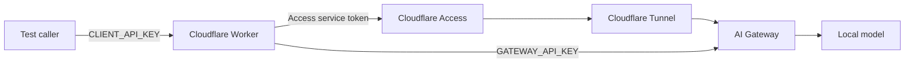

# Cloudflare Worker chat relay

This example is a small test client for a gateway exposed through Cloudflare
Access and a Tunnel. It accepts one authenticated, non-streaming chat route,
attaches separate origin credentials, and forwards the gateway's request ID.

It is intentionally narrower than a complete application integration. It does
not provide browser login, model discovery, embeddings, streaming, CORS, or a UI.
Use it on a separate test route before changing an existing application's origin.



## Configuration

Set a non-secret gateway URL in the Worker's configuration:

```toml
[vars]
GATEWAY_URL = "https://gateway.example.invalid"
```

Set secrets with your deployment tooling:

```bash
wrangler secret put CLIENT_API_KEY
wrangler secret put GATEWAY_API_KEY
wrangler secret put GATEWAY_ACCESS_CLIENT_ID
wrangler secret put GATEWAY_ACCESS_CLIENT_SECRET
```

- `CLIENT_API_KEY` authenticates the test caller to this Worker.
- `GATEWAY_API_KEY` identifies this Worker as an app at the gateway.
- The Access credentials authenticate the Worker at Cloudflare's edge. Omit both
  Access secrets only when the test origin does not use Access.

Use independent random values of at least 32 characters. Do not put them in
`wrangler.toml`, browser code, logs, or this repository. The relay does not log
request or response content.

## Request

Send an OpenAI-shaped non-streaming request. The model must be allowed for the
Worker app at the gateway:

```bash
read -r -s -p "Worker test key: " WORKER_TEST_KEY
printf '\n'
curl --fail-with-body https://worker.example.invalid \
  -H "Authorization: Bearer ${WORKER_TEST_KEY}" \
  -H "Content-Type: application/json" \
  -d '{"model":"auto","stream":false,"messages":[{"role":"user","content":"Reply with one synthetic sentence."}]}'
unset WORKER_TEST_KEY
```

The response preserves `Content-Type` and `X-Request-ID`, allowing correlation
with the gateway's metadata or private traffic record. Request bodies are capped
at 256 KiB and unknown fields or streaming requests are rejected.

See [the full Worker/local inference guide](../../docs/integrations/worker-local-inference.md)
for deployment boundaries, acceptance checks, and rollback.
