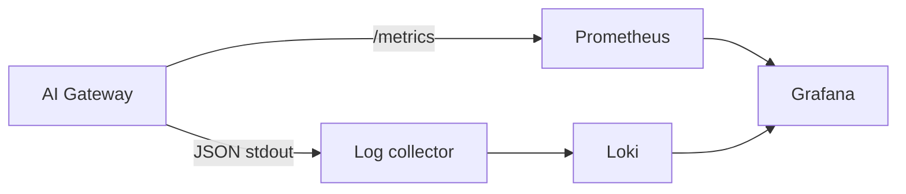

# Grafana observability example

The gateway now exposes Prometheus metrics and JSON outcome events. A packaged
dashboard and collector configuration remain part of the observability milestone.

For a local evaluation:

1. Keep `/metrics` on the operator network and configure Prometheus to scrape it.
2. Collect metadata-only JSON stdout with the existing container/host collector.
3. Send logs to Loki and add both Prometheus and Loki as Grafana data sources.
4. Correlate a response's `X-Request-ID` with the `request_id` field in Loki.
5. Build panels for request rate, latency, status, provider failures, guardrail
   blocks, token usage, and traffic-sink failures.

Prometheus stores aggregate time series; Loki stores searchable log events.
Grafana queries both. The gateway does not push directly to either service.

Captured prompt/response content belongs in the private traffic sink described
in the [observability guide](../../docs/observability.md). Do not export that file
until the destination's access, encryption, redaction, and retention policy is
defined. Metric labels and metadata logs intentionally exclude message text.
